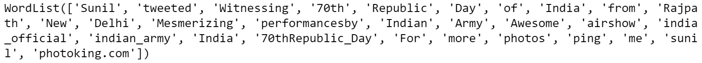

Lab 2. Feature Extraction Methods
=============================


#### Introduction

In this lab, we will learn a about
preprocessing steps and how to extract features from the preprocessed
text and convert them into vectors. We will also explore two popular
methods for feature extraction (Bag of Words and Term Frequency-Inverse
Document Frequency), as well as various methods for finding similarity
between different texts. By the end of this lab, you will have
gained an in-depth understanding of how text data can be visualized.


#### Categorizing Data Based on Structure

Data can be divided on the basis of structure into three categories,
namely, structured, semi-structured, and unstructured data, as shown in
the following diagram:


These three categories are as follows:

-   **Structured data**: This is the most organized form of data. It is
    represented in tabular formats such as Excel files and
    **Comma-Separated Value** (**CSV**) files. The following image shows
    what structured data usually looks like:


-   **Semi-structured data**: This type of data is not presented in a
    tabular structure, but it can be transformed into a table.


-   **Unstructured data**: Text corpora and images are examples of unstructured data. The following
    image shows what unstructured data looks like:


#### Categorizing Data Based on Content

Data can be divided into four categories based on content, as shown in
the following diagram:


Cleaning Text Data
==================


Let's get acquainted with some basic NLP libraries that we will be using here:

-   `Re`: This is used for basic
    string matching, searching, replacing, and more, using regular
    expressions.
-   `textblob`: It is built on the top of `nltk` and is much
    simpler as it has an easier to use interface and excellent
    documentation.
-   `keras`: In addition to neural network
    functionality, it also provides methods for basic text processing
    and NLP tasks.


Exercise 2.01: Text Cleaning and Tokenization
---------------------------------------------

In this exercise, we will clean some text and extract the tokens from
it. Follow these steps to complete this exercise:

1.  Open a Jupyter Notebook.

2.  Import the `re` package:


    ```
    import re
    ```

3.  Create a method called `clean_text()` that will delete all
    characters other than digits, alphabetical characters, and
    whitespaces from the text and split the text into tokens. For this,
    we will use the text which matches with all non-alphanumeric
    characters, and we will replace all of them with an empty string:


    ```
    def clean_text(sentence):
        return re.sub(r'([^\s\w]|_)+', ' ', sentence).split()
    ```

4.  Store the sentence to be cleaned in a variable named
    `sentence` and pass it through the preceding function. Add
    the following code to this: implement

    ```
    sentence = 'Sunil tweeted, "Witnessing 70th Republic Day "\
                "of India from Rajpath, New Delhi. "\
                "Mesmerizing performance by Indian Army! "\
                "Awesome airshow! @india_official "\
                "@indian_army #India #70thRepublic_Day. "\
                "For more photos ping me sunil@photoking.com :)"'
    clean_text(sentence)
    ```

    The preceding command fragments the string wherever any blank space
    is present. The output should be as follows:


Exercise 2.02: Extracting n-grams
---------------------------------

In this exercise, we will extract n-grams using three different methods.
First, we will use custom-defined functions, and then the
`nltk` and `textblob` libraries. Follow these steps
to complete this exercise:

1.  Open a Jupyter Notebook.

2.  Import the `re` package and create a custom-defined
    function, which we can use to extract `n`-grams. Add the
    following code to do this:

    ```
    import re
    def n_gram_extractor(sentence, n):
        tokens = re.sub(r'([^\s\w]|_)+', ' ', sentence).split()
        for i in range(len(tokens)-n+1):
            print(tokens[i:i+n])
    ```

    In the preceding function, we are splitting the sentence into tokens
    using regex, then looping over the tokens, taking `n`
    consecutive tokens at a time.

3.  If `n` is 2, two consecutive tokens will be taken,
    resulting in bigrams. To check the bigrams, we pass the function the
    text and with `n`=2. Add the following code to do this:

    ```
    n_gram_extractor('The cute little boy is playing with the kitten.', \
                     2)
    ```

    
The preceding code generates the following output:

    ```
    ['The', 'cute']
    ['cute', 'little']
    ['little', 'boy']
    ['boy', 'is']
    ['is', 'playing']
    ['playing', 'with']
    ['with', 'the']
    ['the', 'kitten']
    ```

4.  To check the trigrams, we pass the function with the text and with
    `n`=3. Add the following code to do this:

    ```
    n_gram_extractor('The cute little boy is playing with the kitten.', \
                     3)
    ```

    
The preceding code generates the following output:

    ```
    ['The', 'cute', 'little']
    ['cute', 'little', 'boy']
    ['little', 'boy', 'is']
    ['boy', 'is', 'playing']
    ['is', 'playing', 'with']
    ['playing', 'with', 'the']
    ['with', 'the', 'kitten']
    ```

5.  To check the bigrams using the `nltk` library, add the
    following code:

    ```
    from nltk import ngrams
    list(ngrams('The cute little boy is playing with the kitten.'\
                .split(), 2))
    ```

    
The preceding code generates the following output:

    ```
    [('The', 'cute'),
     ('cute', 'little'),
     ('little', 'boy'),
     ('boy', 'is'),
     ('is', 'playing'),
     ('playing', 'with'),
     ('with', 'the'),
     ('the', 'kitten')]
    ```

6.  To check the trigrams using the `nltk` library, add the
    following code:

    ```
    list(ngrams('The cute little boy is playing with the kitten.'.split(), 3))
    ```

    
The preceding code generates the following output:

    ```
    [('The', 'cute', 'little'),
     ('cute', 'little', 'boy'),
     ('little', 'boy', 'is'),
     ('boy', 'is', 'playing'),
     ('playing', 'with', 'the'),
     ('with', 'the', 'kitten.')]
    ```

7.  To check the bigrams using the `textblob` library, add the
    following code:

    ```
    !pip install -U textblob
    from textblob import TextBlob
    blob = TextBlob("The cute little boy is playing with the kitten.")
    blob.ngrams(n=2)
    ```

    
The preceding code generates the following output:

    ```
    [WordList(['The', 'cute']),
     WordList(['cute', 'little']),
     WordList(['little', 'boy']),
     WordList(['boy', 'is']),
     WordList(['is', 'playing']),
     WordList(['playing', 'with']),
     WordList(['with', 'the']),
     WordList(['the', 'kitten'])]
    ```

8.  To check the trigrams using the `textblob` library, add
    the following code:

    ```
    blob.ngrams(n=3)
    ```

    
The preceding code generates the following output:

    ```
    [WordList(['The', 'cute', 'little']),
     WordList(['cute', 'little', 'boy']),
     WordList(['little', 'boy', 'is']),
     WordList(['boy', 'is' 'playing']),
     WordList(['is', 'playing' 'with']),
     WordList(['playing', 'with' 'the']),
     WordList(['with', 'the' 'kitten'])]
    ```

In this exercise, we learned how to generate n-grams using various
methods.


Exercise 2.03: Tokenizing Text with Keras and TextBlob
------------------------------------------------------

In this exercise, we will use `keras` and `textblob`
to tokenize texts. Follow these steps to complete this exercise:

1.  Open a Jupyter Notebook and insert a new cell.

2.  Import the `keras` and `textblob` libraries and
    declare a variable named `sentence`, as follows.


    ```
    from keras.preprocessing.text import text_to_word_sequence
    from textblob import TextBlob
    sentence = 'Sunil tweeted, "Witnessing 70th Republic Day "\
                "of India from Rajpath, New Delhi. "\
                "Mesmerizing performance by Indian Army! "\
                "Awesome airshow! @india_official "\
                "@indian_army #India #70thRepublic_Day. "\
                "For more photos ping me sunil@photoking.com :)"'
    ```

3.  To tokenize using the `keras` library, add the following
    code:

    ```
    def get_keras_tokens(text):
        return text_to_word_sequence(text)
    get_keras_tokens(sentence)
    ```

    
The preceding code generates the following output:


4.  To tokenize using the `textblob` library, add the
    following code:

    ```
    def get_textblob_tokens(text):
        blob = TextBlob(text)
        return blob.words
    get_textblob_tokens(sentence)
    ```

    
The preceding code generates the following output:



With that, we have learned how to tokenize texts using the
`keras` and `textblob` libraries.


Exercise 2.04: Tokenizing Text Using Various Tokenizers
-------------------------------------------------------

In this exercise, we will use different tokenizers to tokenize text.
Perform the following steps to implement this exercise:

1.  Open a Jupyter Notebook.

2.  Insert a new cell and the following code to import all the
    tokenizers and declare a variable sentence:


    ```
    from nltk.tokenize import TweetTokenizer
    from nltk.tokenize import MWETokenizer
    from nltk.tokenize import RegexpTokenizer
    from nltk.tokenize import WhitespaceTokenizer
    from nltk.tokenize import WordPunctTokenizer
    sentence = 'Sunil tweeted, "Witnessing 70th Republic Day "\
                "of India from Rajpath, New Delhi. "\
                "Mesmerizing performance by Indian Army! "\
                "Awesome airshow! @india_official "\
                "@indian_army #India #70thRepublic_Day. "\
                "For more photos ping me sunil@photoking.com :)"'
    ```

3.  To tokenize the text using `TweetTokenizer`, add the
    following code:

    ```
    def tokenize_with_tweet_tokenizer(text):
        # Here will create an object of tweetTokenizer
        tweet_tokenizer = TweetTokenizer() 
        """
        Then we will call the tokenize method of 
        tweetTokenizer which will return token list of sentences.
        """
        return tweet_tokenizer.tokenize(text) 
    tokenize_with_tweet_tokenizer(sentence)
    ```

    
The preceding code generates the following output:


4.  To tokenize the text using `MWETokenizer`, add the
    following code:

    ```
    def tokenize_with_mwe(text):
        mwe_tokenizer = MWETokenizer([('Republic', 'Day')])
        mwe_tokenizer.add_mwe(('Indian', 'Army'))
        return mwe_tokenizer.tokenize(text.split())
    tokenize_with_mwe(sentence)
    ```

    
The preceding code generates the following output:


    In the preceding screenshot, the words \"Indian\" and \"Army!\",
    which should have been treated as a single identity, were treated
    separately. This is because \"Army!\" (not \"Army\") is treated as a
    token. Let\'s see how this can be fixed in the next step.

5.  Add the following code to fix the issues in the previous step:

    ```
    tokenize_with_mwe(sentence.replace('!',''))
    ```

    
The preceding code generates the following output:


    Here, we can see that instead of being treated as separate tokens,
    \"Indian\" and \"Army\" are treated as a single entity.

6.  To tokenize the text using the regular expression tokenizer, add the
    following code:

    ```
    def tokenize_with_regex_tokenizer(text):
        reg_tokenizer = RegexpTokenizer('\w+|\$[\d\.]+|\S+')
        return reg_tokenizer.tokenize(text)
    tokenize_with_regex_tokenizer(sentence)
    ```

    
The preceding code generates the following output:


7.  To tokenize the text using the whitespace tokenizer, add the
    following code:

    ```
    def tokenize_with_wst(text):
        wh_tokenizer = WhitespaceTokenizer()
        return wh_tokenizer.tokenize(text)
    tokenize_with_wst(sentence)
    ```

    
The preceding code generates the following output:


8.  To tokenize the text using the Word Punct tokenizer, add the
    following code:

    ```
    def tokenize_with_wordpunct_tokenizer(text):
        wp_tokenizer = WordPunctTokenizer()
        return wp_tokenizer.tokenize(text)
    tokenize_with_wordpunct_tokenizer(sentence)
    ```

    
The preceding code generates the following output:


In this section, we have learned about different tokenization techniques
and their `nltk` implementation.

**Note**

Now, we\'re ready to use them in our programs.


RegexpStemmer
-------------

`RegexpStemmer` uses regular expressions to check whether
morphological or structural prefixes or suffixes are present. For
instance, in many cases, verbs in the present continuous tense (the
present tense form ending with \"ing\") can be restored to their base
form simply by removing \"ing\" from the end; for example, \"playing\"
becomes \"play\".

Let\'s complete the following exercise to get some hands-on experience
with `RegexpStemmer`.

Exercise 2.05: Converting Words in the Present Continuous Tense into Base Words with RegexpStemmer
--------------------------------------------------------------------------------------------------

In this exercise, we will use `RegexpStemmer` on text to
convert words into their basic form by removing some generic suffixes
such as \"ing\" and \"ed\". To use `nltk`\'s
`regex_stemmer`, we have to create an object of
`RegexpStemmer` by passing the regex of the suffix or prefix
and an integer, `min`, which indicates the minimum length of
the stemmed string. Follow these steps to complete this exercise:

1.  Open a Jupyter Notebook.

2.  Insert a new cell and import `RegexpStemmer`:


    ```
    from nltk.stem import RegexpStemmer
    ```

3.  Use `regex_stemmer` to stem each word of the
    `sentence` variable. Add the following code to do this:

    ```
    def get_stems(text):
        """
        Creating an object of RegexpStemmer, any string ending 
        with the given regex 'ing$' will be removed.
        """
        regex_stemmer = RegexpStemmer('ing$', min=4) 
        """
        The below code line will convert every word into its 
        stem using regex stemmer and then join them with space.
        """
        return ' '.join([regex_stemmer.stem(wd) for \
                         wd in text.split()])
    sentence = "I love playing football"
    get_stems(sentence)
    ```

    
The preceding code generates the following output:

    ```
    'I love play football'
    ```

As we can see, the word `playing` has been changed into its
base form, `play`. In this exercise, we learned how we can
perform stemming using `nltk`\'s `RegexpStemmer`.


The Porter Stemmer
------------------

The Porter stemmer is the most common stemmer for dealing with English
words. It removes various morphological and inflectional endings (such
as suffixes, prefixes, and the plural \"s\") from English words.


Exercise 2.06: Using the Porter Stemmer
---------------------------------------

In this exercise, we will apply the Porter stemmer to some text. Follow
these steps to complete this exercise:

1.  Open a Jupyter Notebook.

2.  Import `nltk` and any related packages and declare a
    `sentence` variable. Add the following code to do this:


    ```
    from nltk.stem.porter import *
    sentence = "Before eating, it would be nice to "\
               "sanitize your hands with a sanitizer"
    ```

3.  Now, we\'ll make use of the Porter stemmer to stem each word of the
    `sentence` variables:

    ```
    def get_stems(text):
        ps_stemmer = PorterStemmer()
        return ' '.join([ps_stemmer.stem(wd) for \
                         wd in text.split()])
    get_stems(sentence)
    ```

    
The preceding code generates the following output:

    ```
    'befor eating, it would be nice to sanit your hand wash with a sanit'
    ```

`PorterStemmer` is a generic rule-based stemmer that tries to
convert a word into its basic form by removing common suffixes and
prefixes of the English language.


Lemmatization
-------------

As we saw in the previous section, there is a problem with stemming. It
often generates meaningless words. Lemmatization deals with such cases
by using vocabulary and analyzing the words\' morphologies. It returns
the base forms of words that can be found in dictionaries. Let\'s walk
through a simple exercise to understand this better.

Exercise 2.07: Performing Lemmatization
---------------------------------------

In this exercise, we will perform lemmatization on some text. Follow
these steps to complete this exercise:

1.  Open a Jupyter Notebook.

2.  Import `nltk` and its related packages, and then declare a
    `sentence` variable. Add the following code to implement
    this:


    ```
    import nltk
    from nltk.stem import WordNetLemmatizer
    from nltk import word_tokenize
    nltk.download('wordnet')
    nltk.download('punkt')
    sentence = "The products produced by the process today are "\
               "far better than what it produces generally."
    ```

3.  To lemmatize the tokens, we extracted from the sentence, add the
    following code:

    ```
    lemmatizer = WordNetLemmatizer()
    def get_lemmas(text):
        lemmatizer = WordNetLemmatizer()
        return ' '.join([lemmatizer.lemmatize(word) for \
                         word in word_tokenize(text)])
    get_lemmas(sentence)
    ```

    
The preceding code generates the following output:

    ```
    'The product produced by the process today are far better than what it produce generally.'
    ```

With that, we learned how to generate the lemma of a word. The lemma is
the correct grammatical base form. They use the vocabulary to match the
word to its correct nearest grammatical form.

**Note**

In the next section, we will deal with other kinds of word variations by
looking at singularizing and pluralizing words using
`textblob`.

Exercise 2.08: Singularizing and Pluralizing Words
--------------------------------------------------

In this exercise, we will make use of the `textblob` library
to singularize and pluralize words in the given text. Follow these steps
to complete this exercise:

1.  Open a Jupyter Notebook.

2.  Import `TextBlob` and declare a `sentence`
    variable. Add the following code to implement this:

    ```
    from textblob import TextBlob
    sentence = TextBlob('She sells seashells on the seashore')
    ```

    To check the list of words in the sentence, type the following code:

    ```
    sentence.words
    ```

    
The preceding code generates the following output:

    ```
    WordList(['She', 'sells', 'seashells', 'on', 'the', 'seashore'])
    ```

3.  To singularize the third word in the sentence, type the following
    code:

    ```
    def singularize(word):
        return word.singularize()
    singularize(sentence.words[2])
    ```

    
The preceding code generates the following output:

    ```
    'seashell'
    ```

4.  To pluralize the fifth word in the given sentence, type the
    following code:

    ```
    def pluralize(word):
        return word.pluralize()
    pluralize(sentence.words[5])
    ```

    
The preceding code generates the following output:

    ```
    'seashores'
    ```

Now, in the next section, we will learn about another preprocessing
task: language translation.

Language Translation
--------------------

You might have used Google Translate before, which gives the exact
translation of a word in another language; this is an example of
language translation or machine translation. In Python, we can use
`TextBlob` to translate text from one language into another.
`TextBlob` provides a method called `translate()`,
in which you have to pass text in the source language. The method will
return the translated word in the destination language. Let\'s look at
how this is done.

Exercise 2.09: Language Translation
-----------------------------------

In this exercise, we will make use of the `TextBlob` library
to translate a sentence from Spanish into English. Follow these steps to
implement this exercise:

1.  Open a Jupyter Notebook.

2.  Import `TextBlob`, as follows:


    ```
    from textblob import TextBlob
    ```

3.  Make use of the `translate()` function of
    `TextBlob` to translate the input text from Spanish to
    English. Add the following code to do this:

    ```
    def translate(text,from_l,to_l):
        en_blob = TextBlob(text)
        return en_blob.translate(from_lang=from_l, to=to_l)
    translate(text='muy bien',from_l='es',to_l='en')
    ```

    
The preceding code generates the following output:

    ```
    TextBlob("very well")
    ```

With that, we have seen how we can use `TextBlob` to translate
from one language to another.

**Note**

In the next section, we will look at another preprocessing task:
stop-word removal.

Stop-Word Removal
-----------------

Stop words, such as \"am,\" \"the,\" and \"are,\" occur frequently in
text data. Although they help us construct sentences properly, we can
find the meaning even if we remove them. This means that the meaning of
text can be inferred even without them. So, removing stop words from
text is one of the preprocessing steps in NLP tasks. In Python,
`nltk`, and `textblob`, text can be used to remove
stop words from text. To get a better understanding of this, let\'s look
at an exercise.

Exercise 2.10: Removing Stop Words from Text
--------------------------------------------

In this exercise, we will remove the stop words from a given text.
Follow these steps to complete this exercise:

1.  Open a Jupyter Notebook.

2.  Import `nltk` and declare a `sentence` variable
    with the text in question:


    ```
    from nltk import word_tokenize
    sentence = "She sells seashells on the seashore"
    ```

3.  Define a `remove_stop_words` method and remove the custom
    list of stop words from the sentence by using the following lines of
    code:

    ```
    def remove_stop_words(text,stop_word_list):
        return ' '.join([word for word in word_tokenize(text) \
                         if word.lower() not in stop_word_list])
    custom_stop_word_list = ['she', 'on', 'the', 'am', 'is', 'not']
    remove_stop_words(sentence,custom_stop_word_list)
    ```

    
The preceding code generates the following output:

    ```
    'sells seashells seashore'
    ```

Thus, we\'ve seen how stop words can be removed from a sentence.

**Note**

In the next activity, we\'ll put our knowledge of preprocessing steps
into practice.

Activity 2.01: Extracting Top Keywords from the News Article
------------------------------------------------------------

In this activity, you will extract the most frequently occurring
keywords from a sample news article.

**Note**

The new article that\'s being used for this activity can be found at


The following steps will help you implement this activity:

1.  Open a Jupyter Notebook.

2.  Import `nltk` and any other necessary libraries.

3.  Define some functions to help you load the text file, convert the
    string into lowercase, tokenize the text, remove the stop words, and
    perform stemming on all the remaining tokens. Finally, define a
    function to calculate the frequency of all these words.

4.  Load `news_article.txt` using a Python file reader into a
    single string.

5.  Convert the text string into lowercase.

6.  Split the string into tokens using a white space tokenizer.

7.  Remove any stop words.

8.  Perform stemming on all the tokens.

9.  Calculate the frequency of all the words after stemming.

    Note:

    The solution to this activity in the current directory.

With that, we have learned about the various ways we can clean
unstructured data. Now, let\'s examine the concept of extracting
features from texts.


Feature Extraction from Texts
=============================

Features can be classified into two different categories:

-   **General features**: These features are statistical calculations
    and do not depend on the content of the text.
-   **Specific features**: These features are dependent on the inherent
    meaning of the text and represent the semantics of the text.


Exercise 2.11: Extracting General Features from Raw Text
--------------------------------------------------------

In this exercise, we will extract general features from input text.
These general features include detecting the number of words, the
presence of \"wh\" words (words beginning with \"wh\", such as \"what\"
and \"why\") and the language in which the text is written. Follow these
steps to implement this exercise:

1.  Open a Jupyter Notebook.

2.  Import the `pandas` library and create a DataFrame with
    four sentences. Add the following code to implement this:

    ```
    import pandas as pd
    from textblob import TextBlob
    df = pd.DataFrame([['The interim budget for 2019 will '\
                        'be announced on 1st February.'], \
                       ['Do you know how much expectation '\
                        'the middle-class working population '\
                        'is having from this budget?'], \
                       ['February is the shortest month '\
                        'in a year.'], \
                       ['This financial year will end on '\
                        '31st March.']])
    df.columns = ['text']
    df.head()
    ```

    
The preceding code generates the following output:


3.  Use the `apply()` function to iterate through each row of
    the column text, convert them into `TextBlob` objects, and
    extract words from them. Add the following code to implement this:

    ```
    def add_num_words(df):
        df['number_of_words'] = df['text'].apply(lambda x : \
                                len(TextBlob(str(x)).words))
        return df
    add_num_words(df)['number_of_words']
    ```

    
The preceding code generates the following output:

    ```
    0     11
    1     15
    2      8
    3      8
    Name:  number_of_words, dtype: int64
    ```

    The preceding code line will print the `number_of_words`
    column of the DataFrame to represent the number of words in each
    row.

4.  Use the `apply()` function to iterate through each row of
    the column text, convert the text into `TextBlob` objects,
    and extract the words from them to check whether any of them belong
    to the list of \"wh\" words that has been declared. Add the
    following code to do so:

    ```
    def is_present(wh_words, df):
        """
        The below line of code will find the intersection 
        between set of tokens of every sentence and the 
        wh_words and will return true if the length of 
        intersection set is non-zero.
        """
        df['is_wh_words_present'] = df['text'].apply(lambda x : \
                                    True if \
                                    len(set(TextBlob(str(x)).\
                                    words).intersection(wh_words))\
                                    >0 else False)
        return df
    wh_words = set(['why', 'who', 'which', 'what', \
                    'where', 'when', 'how'])
    is_present(wh_words, df)['is_wh_words_present']
    ```

    
The preceding code generates the following output:

    ```
    0     False
    1     True
    2     False
    3     False
    Name:  is_wh_words_present, dtype: bool
    ```

    The preceding code line will print the
    `is_wh_words_present` column that was added by the
    `is_present` method to `df`, which means for
    every row, we will see whether `wh_word` is present.

5.  Use the `apply()` function to iterate through each row of
    the column text, convert them into `TextBlob` objects, and
    detect their languages:

    ```
    def get_language(df):
        df['language'] = df['text'].apply(lambda x : \
                         TextBlob(str(x)).detect_language())
        return df
    get_language(df)['language']
    ```

    
The preceding code generates the following output:

    ```
    0     en
    1     en
    2     en
    3     en
    Name:  language, dtype: object
    ```

With that, we have learned how to extract general features from text
data.

**Note** Let\'s perform another exercise to get a better understanding of this.

Exercise 2.12: Extracting General Features from Text
----------------------------------------------------

In this exercise, we will extract various general features from
documents. The dataset that we will be using here consists of random
statements. Our objective is to find the frequency of various general
features such as punctuation, uppercase and lowercase words, letters,
digits, words, and whitespaces.

1.  Open a Jupyter Notebook.

2.  Insert a new cell and add the following code to import the necessary
    libraries:


    ```
    import pandas as pd
    from string import punctuation
    import nltk
    nltk.download('tagsets')
    from nltk.data import load
    nltk.download('averaged_perceptron_tagger')
    from nltk import pos_tag
    from nltk import word_tokenize
    from collections import Counter
    ```

3.  To see what different kinds of parts of speech `nltk`
    provides, add the following code:

    ```
    def get_tagsets():
        tagdict = load('help/tagsets/upenn_tagset.pickle')
        return list(tagdict.keys())
    tag_list = get_tagsets()
    print(tag_list)
    ```

    
The preceding code generates the following output:


4.  Calculate the number of occurrences of each PoS by iterating through
    each document and annotating each word with the corresponding
    `pos` tag. Add the following code to implement this:

    ```
    """
    This method will count the occurrence of pos 
    tags in each sentence.
    """
    def get_pos_occurrence_freq(data, tag_list):
        # Get list of sentences in text_list
        text_list = data.text
        
        # create empty dataframe
        feature_df = pd.DataFrame(columns=tag_list)
        for text_line in text_list:
            
            # get pos tags of each word.
            pos_tags = [j for i, j in \
                        pos_tag(word_tokenize(text_line))]
            
            """
            create a dict of pos tags and their frequency 
            in given sentence.
            """
            row = dict(Counter(pos_tags))
            feature_df = feature_df.append(row, ignore_index=True)
        feature_df.fillna(0, inplace=True)
        return feature_df
    tag_list = get_tagsets()
    data = pd.read_csv('../data/data.csv', header=0)
    feature_df = get_pos_occurrence_freq(data, tag_list)
    feature_df.head()
    ```

    
The preceding code generates the following output:


5.  To calculate the number of punctuation marks, add the following
    code:

    ```
    def add_punctuation_count(feature_df, data):
        
        feature_df['num_of_unique_punctuations'] = data['text'].\
            apply(lambda x: len(set(x).intersection\
            (set(punctuation))))
        return feature_df
    feature_df = add_punctuation_count(feature_df, data)
    feature_df['num_of_unique_punctuations'].head()
    ```

    The `add_punctuation_count()` method will find the
    intersection of the set of punctuation marks in the text and
    punctuation sets that were imported from the `string`
    module. Then, it will find the length of the intersection set in
    each row and add it to the `num_of_unique_punctuations`
    column of the DataFrame. The preceding code generates the following
    output:

    ```
    0      0
    1      0
    2      1
    3      1
    4      0
    Name:  num_of_unique_punctuations, dtype: int64
    ```

6.  To calculate the number of capitalized words, add the following
    code:

    ```
    def get_capitalized_word_count(feature_df, data):
        """
        The below code line will tokenize text in every row and 
        create a set of only capital words, ten find the length of 
        this set and add it to the column 'number_of_capital_words' 
        of dataframe.
        """
        feature_df['number_of_capital_words'] = data['text'].\
            apply(lambda x: len([word for word in \
            word_tokenize(str(x)) if word[0].isupper()]))
        return feature_df
    feature_df = get_capitalized_word_count(feature_df, data)
    feature_df['number_of_capital_words'].head()
    ```

    The preceding code will tokenize the text in every row and create a
    set of words consisting of only capital words. It will then find the
    length of this set and add it to the
    `number_of_capital_words` column of the DataFrame. The
    preceding code generates the following output:

    ```
    0      1
    1      1
    2      1
    3      1
    4      1
    Name:  number_of_capital_words, dtype: int64
    ```

    The last line of the preceding code will print the
    `number_of_capital_words` column, which represents the
    count of the number of capital letter words in each row.

7.  To calculate the number of lowercase words, add the following code:

    ```
    def get_small_word_count(feature_df, data):
        """
        The below code line will tokenize text in every row and 
        create a set of only small words, then find the length of 
        this set and add it to the column 'number_of_small_words' 
        of dataframe.
        """
        feature_df['number_of_small_words'] = data['text'].\
            apply(lambda x: len([word for word in \
            word_tokenize(str(x)) if word[0].islower()]))
        return feature_df
    feature_df = get_small_word_count(feature_df, data)
    feature_df['number_of_small_words'].head()
    ```

    The preceding code will tokenize the text in every row and create a
    set of only small words, then find the length of this set and add it
    to the `number_of_small_words` column of the DataFrame.
    
The preceding code generates the following output:

    ```
    0      4
    1      3
    2      7
    3      3
    4      2
    Name:  number_of_small_words, dtype: int64
    ```

    The last line of the preceding code will print the
    `number_of_small_words` column, which represents the
    number of small letter words in each row.

8.  To calculate the number of letters in the DataFrame, use the
    following code:

    ```
    def get_number_of_alphabets(feature_df, data):
        feature_df['number_of_alphabets'] = data['text']. \
            apply(lambda x: len([ch for ch in str(x) \
            if ch.isalpha()]))
        return feature_df
    feature_df = get_number_of_alphabets(feature_df, data)
    feature_df['number_of_alphabets'].head()
    ```

    The preceding code will break the text line into a list of
    characters in each row and add the count of that list to the
    `number_of_alphabets` columns. This will produce the
    following output:

    ```
    0     19
    1     18
    2     28
    3     14
    4     13
    Name:  number_of_alphabets, dtype: int64
    ```

    The last line of the preceding code will print the
    `number_of_columns` column, which represents the count of
    the number of alphabets in each row.

9.  To calculate the number of digits in the DataFrame, add the
    following code:

    ```
    def get_number_of_digit_count(feature_df, data):
        """
        The below code line will break the text line in a list of 
        digits in each row and add the count of that list into 
        the columns 'number_of_digits'
        """
        feature_df['number_of_digits'] = data['text']. \
            apply(lambda x: len([ch for ch in str(x) \
            if ch.isdigit()]))
        return feature_df
    feature_df = get_number_of_digit_count(feature_df, data)
    feature_df['number_of_digits'].head()
    ```

    The preceding code will get the digit count from each row and add
    the count of that list to the `number_of_digits` columns.
    
The preceding code generates the following output:

    ```
    0      0
    1      0
    2      0
    3      0
    4      0
    Name:  number_of_digits, dtype: int64
    ```

10. To calculate the number of words in the DataFrame, add the following
    code:

    ```
    def get_number_of_words(feature_df, data):
        """
        The below code line will break the text line in a list of 
        words in each row and add the count of that list into 
        the columns 'number_of_digits'
        """
        feature_df['number_of_words'] = data['text'].\
            apply(lambda x : len(word_tokenize(str(x))))
        return feature_df
    feature_df = get_number_of_words(feature_df, data)
    feature_df['number_of_words'].head()
    ```

    The preceding code will split the text line into a list of words in
    each row and add the count of that list to the
    `number_of_digits` columns. We will get the following
    output:

    ```
    0      5
    1      4
    2      9
    3      5
    4      3
    Name:  number_of_words, dtype: int64
    ```

11. To calculate the number of whitespaces in the DataFrame, add the
    following code:

    ```
    def get_number_of_whitespaces(feature_df, data):
        """
        The below code line will generate list of white spaces 
        in each row and add the length of that list into 
        the columns 'number_of_white_spaces
        """
        feature_df['number_of_white_spaces'] = data['text']. \
            apply(lambda x: len([ch for ch in str(x) \
            if ch.isspace()]))
        return feature_df
    feature_df = get_number_of_whitespaces(feature_df, data)
    feature_df['number_of_white_spaces'].head()
    ```

    The preceding code will generate a list of whitespaces in each row
    and add the length of that list to the
    `number_of_white_spaces` columns. The preceding code
    generates the following output:

    ```
    0      4
    1      3
    2      7
    3      3
    4      2
    Name:  number_of_white_spaces, dtype: int64
    ```

12. To view the full feature set we have just created, add the following
    code:

    ```
    feature_df.head()
    ```

    We will be printing the head of the final DataFrame, which means we
    will print five rows of all the columns. We will get the following
    output:


#### Bag of Words (BoW)

In this technique, we convert each sentence into a vector. This is done in two steps:

1.  The vocabulary or dictionary of all the words is generated.
2.  The document is represented in terms of the presence or absence of
    all words.


Exercise 2.13: Creating a Bag of Words
--------------------------------------

In this exercise, we will use the `CountVectorizer` module from
`sklearn`, which performs the following tasks:

-   Tokenizes the collection of documents, also called a corpus
-   Builds the vocabulary of unique words
-   Converts a document into vectors using the previously built
    vocabulary

Follow these steps to implement this exercise:

1.  Open a Jupyter Notebook.

2.  Import the necessary libraries and declare a list corpus. Add the
    following code to implement this:


    ```
    import pandas as pd
    from sklearn.feature_extraction.text import CountVectorizer
    ```

3.  Use the `CountVectorizer` function to create the BoW
    model. Add the following code to do this:

    ```
    def vectorize_text(corpus):
        """
        Will return a dataframe in which every row will ,be
        vector representation of a document in corpus
        :param corpus: input text corpus
        :return: dataframe of vectors
        """
        bag_of_words_model = CountVectorizer()
        """
        performs the above described three tasks on 
        the given data corpus.
        """
        dense_vec_matrix = bag_of_words_model.\
                           fit_transform(corpus).todense()
        bag_of_word_df = pd.DataFrame(dense_vec_matrix)
        bag_of_word_df.columns = sorted(bag_of_words_model.\
                                        vocabulary_)
        return bag_of_word_df
    corpus = ['Data Science is an overlap between Arts and Science',\
              'Generally, Arts graduates are right-brained and '\
              'Science graduates are left-brained',\
              'Excelling in both Arts and Science at a time '\
              'becomes difficult',\
              'Natural Language Processing is a part of Data Science']
    df = vectorize_text(corpus)
    df.head()
    ```

    The `vectorize_text` method will take a document corpus as
    an argument and return a DataFrame in which every row will be a
    vector representation of a document in the corpus.

    
The preceding code generates the following output:


4.  Create a BoW model for the 10 most frequent terms. Add the following
    code to implement this:

    ```
    def bow_top_n(corpus, n):
        """
        Will return a dataframe in which every row 
        will be represented by presence or absence of top 10 most 
        frequently occurring words in data corpus
        :param corpus: input text corpus
        :return: dataframe of vectors
        """
        bag_of_words_model_small = CountVectorizer(max_features=n)
        bag_of_word_df_small = pd.DataFrame\
        (bag_of_words_model_small.fit_transform\
        (corpus).todense())
        bag_of_word_df_small.columns = \
        sorted(bag_of_words_model_small.vocabulary_)
        return bag_of_word_df_small
    df_2 = bow_top_n(corpus, 10)
    df_2.head()
    ```

    In the preceding code, we are checking the occurrence of the top 10
    most frequent words in each sentence and creating a DataFrame out of
    it.

    
The preceding code generates the following output:


Zipf\'s Law
-----------

According to Zipf\'s law, the number of times a word occurs in a corpus
is inversely proportional to its rank in the frequency table. In simple
terms, if the words in a corpus are arranged in descending order of
their frequency of occurrence, then the frequency of the word at the
*i*[th] rank will be proportional to *1/i*:


Exercise 2.14: Zipf\'s Law
--------------------------

In this exercise, we will plot both the expected and actual ranks and
frequencies of tokens with the help of Zipf\'s law. We will be using the
`20newsgroups` dataset provided by the `sklearn`
library, which is a collection of newsgroup documents. Follow these
steps to implement this exercise:

1.  Open a Jupyter Notebook.

2.  Import the necessary libraries:

    ```
    from pylab import *
    import nltk
    nltk.download('stopwords')
    from sklearn.datasets import fetch_20newsgroups
    from nltk import word_tokenize
    from nltk.corpus import stopwords
    import matplotlib.pyplot as plt
    import re
    import string
    from collections import Counter
    ```

    Add two methods for loading stop words and the data from the
    `newsgroups_data_sample` variable:

    ```
    def get_stop_words():
        stop_words = stopwords.words('english')
        stop_words = stop_words + list(string.printable)
        return stop_words
    def get_and_prepare_data(stop_words):
        """
        This method will load 20newsgroups data and 
        and remove stop words from it using given stop word list.
        :param stop_words: 
        :return: 
        """
        newsgroups_data_sample = \
        fetch_20newsgroups(subset='train')
        tokenized_corpus = [word.lower() for sentence in \
                            newsgroups_data_sample['data'] \
                            for word in word_tokenize\
                            (re.sub(r'([^\s\w]|_)+', ' ', sentence)) \
                            if word.lower() not in stop_words]
        return tokenized_corpus
    ```

    In the preceding code, there are two methods;
    `get_stop_words()` will load stop word list from
    `nltk` data, while `get_and_prepare_data()` will
    load the `20newsgroups` data and remove stop words from it
    using the given stop word list.

3.  Add the following method to calculate the frequency of each token:

    ```
    def get_frequency(corpus, n):
        token_count_di = Counter(corpus)
        return token_count_di.most_common(n)
    ```

    The preceding method uses the `Counter` class to count the
    frequency of tokens in the corpus and then return the most common
    `n` tokens.

4.  Now, call all the preceding methods to calculate the frequency of
    the top 50 most frequent tokens:

    ```
    stop_word_list = get_stop_words()
    corpus = get_and_prepare_data(stop_word_list)
    get_frequency(corpus, 50)
    ```

    
The preceding code generates the following output:


5.  Plot the actual ranks of words that we got from frequency dictionary
    and the ranks expected as per Zipf\'s law. Calculate the frequencies
    of the top 10,000 words using the preceding
    `get_frequency()` method and the expected frequencies of
    the same list using Zipf\'s law. For this, create two lists---an
    `actual_frequencies` and an
    `expected_frequencies` list. Use the log of actual
    frequencies to downscale the numbers. After getting the actual and
    expected frequencies, plot them using matplotlib:

    ```
    def get_actual_and_expected_frequencies(corpus):
        freq_dict = get_frequency(corpus, 1000)
        actual_frequencies = []
        expected_frequencies = []
        for rank, tup in enumerate(freq_dict):
            actual_frequencies.append(log(tup[1]))
            rank = 1 if rank == 0 else rank
            # expected frequency 1/rank as per zipf's law
            expected_frequencies.append(1 / rank)
        return actual_frequencies, expected_frequencies
    def plot(actual_frequencies, expected_frequencies):
        plt.plot(actual_frequencies, 'g*', \
                 expected_frequencies, 'ro')
        plt.show()
    # We will plot the actual and expected frequencies
    actual_frequencies, expected_frequencies = \
    get_actual_and_expected_frequencies(corpus)
    plot(actual_frequencies, expected_frequencies)
    ```

    
The preceding code generates the following output:


**Term Frequency-Inverse Document Frequency** (**TFIDF**) is another method of representing text data in a vector format.


Exercise 2.15: TFIDF Representation
-----------------------------------

In this exercise, we will represent the input texts with their TFIDF
vectors. We will use a `sklearn` module named
`TfidfVectorizer`, which converts text into TFIDF vectors.
Follow these steps to implement this exercise:

1.  Open a Jupyter Notebook.

2.  Import all the necessary libraries and create a method to calculate
    the TFIDF of the corpus. Add the following code to implement this:


    ```
    from sklearn.feature_extraction.text import TfidfVectorizer
    def get_tf_idf_vectors(corpus):
        tfidf_model = TfidfVectorizer()
        vector_list = tfidf_model.fit_transform(corpus).todense()
        return vector_list
    ```

3.  To create a TFIDF model, write the following code:

    ```
    corpus = ['Data Science is an overlap between Arts and Science',\
              'Generally, Arts graduates are right-brained and '\
              'Science graduates are left-brained',\
              'Excelling in both Arts and Science at a '\
              'time becomes difficult',\
              'Natural Language Processing is a part of Data Science']
    vector_list = get_tf_idf_vectors(corpus)
    print(vector_list)
    ```

    In the preceding code, the `get_tf_idf_vectors()` method
    will generate TFIDF vectors from the corpus. You will then call this
    method on a given corpus. The preceding code generates the following
    output:


#### Finding Text Similarity -- Application of Feature Extraction

There are different techniques for finding the similarity between two
strings or texts. They are explained one by one here:

-   **Cosine similarity**: The cosine similarity is a technique to find
    the similarity between the two vectors by calculating the cosine of
    the angle between them.


Exercise 2.16: Calculating Text Similarity Using Jaccard and Cosine Similarity
------------------------------------------------------------------------------

In this exercise, we will calculate the Jaccard and cosine similarity
for a given pair of texts. Follow these steps to complete this exercise:

1.  Open a Jupyter Notebook.

2.  Insert a new cell and add the following code to import the necessary
    packages:


    ```
    from nltk import word_tokenize
    from nltk.stem import WordNetLemmatizer
    from sklearn.feature_extraction.text import TfidfVectorizer
    from sklearn.metrics.pairwise import cosine_similarity
    lemmatizer = WordNetLemmatizer()
    ```

3.  Create a function to extract the Jaccard similarity between a pair
    of sentences by adding the following code:


    ```
    def extract_text_similarity_jaccard(text1, text2):
        """
        This method will return Jaccard similarity between two texts
        after lemmatizing them.
        :param text1: text1
        :param text2: text2
        :return: similarity measure
        """
        lemmatizer = WordNetLemmatizer()
        words_text1 = [lemmatizer.lemmatize(word.lower()) \
                       for word in word_tokenize(text1)]
        words_text2 = [lemmatizer.lemmatize(word.lower()) \
                       for word in word_tokenize(text2)]
        nr = len(set(words_text1).intersection(set(words_text2)))
        dr = len(set(words_text1).union(set(words_text2)))
        jaccard_sim = nr / dr
        return jaccard_sim
    ```

4.  Declare three variables named `pair1`, `pair2`,
    and `pair3`, as follows.


    ```
    pair1 = ["What you do defines you", "Your deeds define you"]
    pair2 = ["Once upon a time there lived a king.", \
             "Who is your queen?"]
    pair3 = ["He is desperate", "Is he not desperate?"]
    ```

5.  To check the Jaccard similarity between the statements in
    `pair1`, write the following code:

    ```
    extract_text_similarity_jaccard(pair1[0],pair1[1])
    ```

    
The preceding code generates the following output:

    ```
    0.14285714285714285
    ```

6.  To check the Jaccard similarity between the statements in
    `pair2`, write the following code:

    ```
    extract_text_similarity_jaccard(pair2[0],pair2[1])
    ```

    
The preceding code generates the following output:

    ```
    0.0
    ```

7.  To check the Jaccard similarity between the statements in
    `pair3`, write the following code:

    ```
    extract_text_similarity_jaccard(pair3[0],pair3[1])
    ```

    
The preceding code generates the following output:

    ```
    0.6
    ```

8.  To check the cosine similarity, use the
    `TfidfVectorizer()` method to get the vectors of each
    text:


    ```
    def get_tf_idf_vectors(corpus):
        tfidf_vectorizer = TfidfVectorizer()
        tfidf_results = tfidf_vectorizer.fit_transform(corpus).\
                        todense()
        return tfidf_results
    ```

9.  Create a corpus as a list of texts and get the TFIDF vectors of each
    text document. Add the following code to do this:


    ```
    corpus = [pair1[0], pair1[1], pair2[0], \
              pair2[1], pair3[0], pair3[1]]
    tf_idf_vectors = get_tf_idf_vectors(corpus)
    ```

10. To check the cosine similarity between the initial two texts, write
    the following code:

    ```
    cosine_similarity(tf_idf_vectors[0],tf_idf_vectors[1])
    ```

    
The preceding code generates the following output:

    ```
    array([[0.3082764]])
    ```

11. To check the cosine similarity between the third and fourth texts,
    write the following code:

    ```
    cosine_similarity(tf_idf_vectors[2],tf_idf_vectors[3])
    ```

    
The preceding code generates the following output:

    ```
    array([[0.]])
    ```

12. To check the cosine similarity between the fifth and sixth texts,
    write the following code:

    ```
    cosine_similarity(tf_idf_vectors[4],tf_idf_vectors[5])
    ```

    
The preceding code generates the following output:

    ```
    array([[0.80368547]])
    ```

So, in this exercise, we learned how to check the similarity between
texts. As you can see, the texts `"He is desperate"` and
`"Is he not desperate?"` returned similarity results of 0.80
(meaning they are highly similar), whereas sentences such as
`"Once upon a time there lived a king."` and
`"Who is your queen?"` returned zero as their similarity
measure.

**Note**

Word Sense Disambiguation Using the Lesk Algorithm
--------------------------------------------------

The Lesk algorithm is used for resolving word sense disambiguation.
Suppose we have a sentence such as \"On the bank of river Ganga, there
lies the scent of spirituality\" and another sentence, \"I\'m going to
withdraw some cash from the bank\". Here, the same word that is,
\"bank\" is used in two different contexts. For text processing
results to be accurate, the context of the words needs to be considered.


Exercise 2.17: Implementing the Lesk Algorithm Using String Similarity and Text Vectorization
---------------------------------------------------------------------------------------------

In this exercise, we are going to implement the Lesk algorithm step by
step using the techniques we have learned so far. We will find the
meaning of the word \"bank\" in the sentence, \"On the banks of river
Ganga, there lies the scent of spirituality.\" We will use cosine
similarity as well as Jaccard similarity here. Follow these steps to
complete this exercise:

1.  Open a Jupyter Notebook.

2.  Insert a new cell and add the following code to import the necessary
    libraries:


    ```
    import pandas as pd
    from sklearn.metrics.pairwise import cosine_similarity
    from nltk import word_tokenize
    from sklearn.feature_extraction.text import TfidfVectorizer
    from sklearn.datasets import fetch_20newsgroups
    import numpy as np
    ```

3.  Define a method for getting the TFIDF vectors of a corpus:


    ```
    def get_tf_idf_vectors(corpus):
        tfidf_vectorizer = TfidfVectorizer()
        tfidf_results = tfidf_vectorizer.fit_transform\
                        (corpus).todense()
        return tfidf_results
    ```

4.  Define a method to convert the corpus into lowercase:


    ```
    def to_lower_case(corpus):
        lowercase_corpus = [x.lower() for x in corpus]
        return lowercase_corpus
    ```

5.  Define a method to find the similarity between the sentence and the
    possible definitions and return the definition with the highest
    similarity score:


    ```
    def find_sentence_definition(sent_vector,defnition_vectors):
        """
        This method will find cosine similarity of sentence with
        the possible definitions and return the one with 
        highest similarity score along with the similarity score.
        """
        result_dict = {}
        for definition_id,def_vector in definition_vectors.items():
            sim = cosine_similarity(sent_vector,def_vector)
            result_dict[definition_id] = sim[0][0]
        definition  = sorted(result_dict.items(), \
                             key=lambda x: x[1], \
                             reverse=True)[0]
        return definition[0],definition[1]
    ```

6.  Define a corpus with random sentences with the sentence and the two
    definitions as the top three sentences:


    ```
    corpus = ["On the banks of river Ganga, there lies the scent "\
              "of spirituality",\
              "An institute where people can store extra "\
              "cash or money.",\
              "The land alongside or sloping down to a river or lake"
              "What you do defines you",\
              "Your deeds define you",\
              "Once upon a time there lived a king.",\
              "Who is your queen?",\
              "He is desperate",\
              "Is he not desperate?"]
    ```

7.  Use the previously defined methods to find the definition of the
    word bank:

    ```
    lower_case_corpus  = to_lower_case(corpus)
    corpus_tf_idf  = get_tf_idf_vectors(lower_case_corpus)
    sent_vector = corpus_tf_idf[0]
    definition_vectors = {'def1':corpus_tf_idf[1],\
                          'def2':corpus_tf_idf[2]}
    definition_id, score = \
    find_sentence_definition(sent_vector,definition_vectors)
    print("The definition of word {} is {} with similarity of {}".\
          format('bank',definition_id,score))
    ```

    You will get the following output:

    ```
    The definition of word bank is def2 with similarity of 0.14419130686278897
    ```

As we already know, `def2` represents a riverbank. So, we have
found the correct definition of the word here. In this exercise, we have
learned how to use text vectorization and text similarity to find the
right definition of ambiguous words.

**Note**

Word Clouds
-----------

Unlike numeric data, there are very few ways in which text data can be
represented visually. The most popular way of visualizing text data is
by using word clouds. A word cloud is a visualization of a text corpus
in which the sizes of the tokens (words) represent the number of times
they have occurred, as shown in the following image:


In the following exercise, we will be using a Python library called
`wordcloud` to build a word cloud from the
`20newsgroups` dataset.

Let\'s go through an exercise to understand this better.

Exercise 2.18: Generating Word Clouds
-------------------------------------

In this exercise, we will visualize the most frequently occurring words
in the first 1,000 articles from `sklearn`\'s
`fetch_20newsgroups` text dataset using a word cloud. Follow
these steps to complete this exercise:

1.  Open a Jupyter Notebook.

2.  Import the necessary libraries and dataset. Add the following code
    to do this:


    ```
    import nltk
    nltk.download('stopwords')
    import matplotlib.pyplot as plt
    plt.rcParams['figure.dpi'] = 200
    from sklearn.datasets import fetch_20newsgroups
    from nltk.corpus import stopwords
    from wordcloud import WordCloud
    import matplotlib as mpl
    mpl.rcParams['figure.dpi'] = 200
    ```

3.  Write the `get_data()` method to fetch the data:


    ```
    def get_data(n):
        newsgroups_data_sample = fetch_20newsgroups(subset='train')
        text = str(newsgroups_data_sample['data'][:n])
        return text
    ```

4.  Add a method to remove stop words:


    ```
    def load_stop_words():
        other_stopwords_to_remove = ['\\n', 'n', '\\', '>', \
                                     'nLines', 'nI',"n'"]
        stop_words = stopwords.words('english')
        stop_words.extend(other_stopwords_to_remove)
        stop_words = set(stop_words)
        return stop_words
    ```

5.  Add the `generate_word_cloud()` method to generate a word
    cloud object:


    ```
    def generate_word_cloud(text, stopwords):
        """
        This method generates word cloud object
        with given corpus, stop words and dimensions
        """
        wordcloud = WordCloud(width = 800, height = 800, \
                              background_color ='white', \
                              max_words=200, \
                              stopwords = stopwords, \
                              min_font_size = 10).generate(text)
        return wordcloud
    ```

6.  Get 1,000 documents from the `20newsgroup` data, get the
    stop word list, generate a word cloud object, and finally plot the
    word cloud with matplotlib:

    ```
    text = get_data(1000)
    stop_words = load_stop_words()
    wordcloud = generate_word_cloud(text, stop_words)
    plt.imshow(wordcloud, interpolation='bilinear')
    plt.axis("off")
    plt.show()
    ```

    
The preceding code generates the following output:


So, in this exercise, we learned what word clouds are and how to
generate word clouds with Python\'s `wordcloud` library and
visualize this with matplotlib.

**Note**

In the next section, we will explore other visualizations, such as
dependency parse trees and named entities.

Other Visualizations
--------------------

Apart from word clouds, there are various other ways of visualizing
texts. Some of the most popular ways are listed here:

-   **Visualizing sentences using a dependency parse tree**: Generally,
    the phrases constituting a sentence depend on each other. We depict
    these dependencies by using a tree structure known as a dependency
    parse tree.
-   **Visualizing named entities in a text corpus**: In this case, we
    extract the named entities from texts and highlight them by using
    different colors.

Let\'s go through the following exercise to understand this better.

Exercise 2.19: Other Visualizations Dependency Parse Trees and Named Entities
-----------------------------------------------------------------------------

In this exercise, we will look at two of the most popular visualization
methods, after word clouds, which are dependency parse trees and using
named entities. Follow these steps to complete this exercise:

1.  Open a Jupyter Notebook.

2.  Insert a new cell and add the following code to import the necessary
    libraries:


    ```
    import spacy
    from spacy import displacy
    !python -m spacy download
    en_core_web_sm
    import en_core_web_sm
    nlp = en_core_web_sm.load()
    ```

3.  Depict the sentence \"God helps those who help themselves\" using a
    dependency parse tree with the following code:

    ```
    doc = nlp('God helps those who help themselves')
    displacy.render(doc, style='dep', jupyter=True)
    ```

    
The preceding code generates the following output:


4.  Visualize the named entities of the text corpus by adding the
    following code:

    ```
    text = 'Once upon a time there lived a saint named '\
           'Ramakrishna Paramahansa. His chief disciple '\
           'Narendranath Dutta also known as Swami Vivekananda '\
           'is the founder of Ramakrishna Mission and '\
           'Ramakrishna Math.'
    doc2 = nlp(text)
    displacy.render(doc2, style='ent', jupyter=True)
    ```

    
The preceding code generates the following output:


**Note**

Now that you have learned about visualizations, we will solve an
activity based on them to gain an even better understanding.

Activity 2.02: Text Visualization
---------------------------------

In this activity, you will create a word cloud for the 50 most frequent
words in a dataset. The dataset we will use consists of random sentences
that are not clean. First, we need to clean them and create a unique set
of frequently occurring words.

**Note**

The text\_corpus.txt file that\'s being used in this activity can be
found at `~/work/natural-language-processing-workshop/Lab02/data`

Follow these steps to implement this activity:

1.  Import the necessary libraries.
2.  Fetch the dataset.
3.  Perform the preprocessing steps, such as text cleaning,
    tokenization, and lemmatization, on the fetched data.
4.  Create a set of unique words along with their frequencies for the 50
    most frequently occurring words.
5.  Create a word cloud for these top 50 words.
6.  Justify the word cloud by comparing it with the word frequency that
    you calculated.

    Note: The solution to this activity in the current directory.


Summary
=======


In this lab, you have learned about various types of data and ways
to deal with unstructured text data. Text data is usually extremely
noisy and needs to be cleaned and preprocessed, which mainly consists of
tokenization, stemming, lemmatization, and stop-word removal. After
preprocessing, features are extracted from texts using various methods,
such as BoW and TFIDF. These methods convert unstructured text data into
structured numeric data. New features are created from existing features
using a technique called feature engineering. In the last part of this
lab, we explored various ways of visualizing text data, such as word
clouds.
