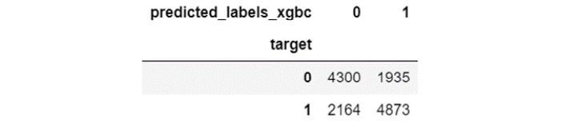
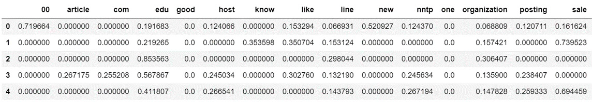

Lab 3. Developing a Text Classifier
===============================

Introduction
============

In this lab, you will learn how to use these extracted features to
develop machine learning models. These models are capable of solving
real-world problems, such as detecting whether sentiments carried by
texts are positive or negative, predicting whether emails are spam or
not, and so on. We will also cover concepts such as supervised and
unsupervised learning, classifications and regressions, sampling and
splitting data, along with evaluating the performance of a model in
depth. This lab also discusses how to load and save these models for
future use.


Machine Learning
================

Machine learning is the scientific study of algorithms and statistical
models that computer systems use to perform a specific task without
using explicit instructions, relying on patterns and inference instead.

#### Unsupervised Learning

Unsupervised learning is the method by which algorithms learn patterns
within data that is not labeled. You provide the algorithm with the feature data and it learns patterns
from the data on its own.

Unsupervised learning is further classified into clustering and association:

- Clustering
- Association

The most common distance metric is Euclidean, which is calculated as follows:


Hierarchical Clustering
-----------------------

Hierarchical clustering algorithms group similar objects together to
create a cluster with the help of a **dendrogram**.

Let\'s assume that we have a dataset
containing the features of the 10 documents. Firstly, the distances
between each pair of documents from the set of 10 documents are
calculated. After that, we construct a **dendrogram** and truncate it at
a suitable position to get a suitable number of clusters:


In the preceding graph, we can perform a truncation at distance 3.5 to
get two clusters or at 2.5 to get three clusters, depending on the
requirements. To create a dendrogram using scikit-learn, we can use the
following code:

```
import scipy.cluster.hierarchy as sch
dendrogram = sch.dendrogram(sch.linkage(X, method='ward'))
plt.title('Dendrogram')
plt.show()
```


Here, `X` is the dataset that we want to perform hierarchical
clustering with. Let\'s perform an exercise to understand how we can
implement this.

Exercise 3.01: Performing Hierarchical Clustering
-------------------------------------------------

In this exercise, we will analyze the text documents in sklearn\'s
`fetch_20newsgroups` dataset. The 20 newsgroups dataset
contains news articles on 20 different topics. We will make use of
hierarchical clustering to classify the documents into different groups.
Once the clusters have been created, we will compare them with their
actual categories. Follow these steps to implement this exercise:

1.  Open a Jupyter Notebook.

2.  Insert a new cell and add the following code to import the necessary
    libraries:

    ```
    from sklearn.datasets import fetch_20newsgroups
    from scipy.cluster.hierarchy import ward, dendrogram
    import matplotlib as mpl
    from scipy.cluster.hierarchy import fcluster
    from sklearn.metrics.pairwise import cosine_similarity
    import pandas as pd
    import numpy as np
    import matplotlib.pyplot as plt
    %matplotlib inline
    import re
    import string
    from nltk import word_tokenize
    from nltk.corpus import stopwords
    from nltk.stem import WordNetLemmatizer
    from sklearn.feature_extraction.text import TfidfVectorizer
    from collections import Counter
    from pylab import *
    import nltk
    import warnings
    warnings.filterwarnings('ignore')
    ```

3.  Download a list of stop words and the `Wordnet` corpus
    from `nltk`. Insert a new cell and add the following code
    to implement this:


    ```
    nltk.download('stopwords')
    stop_words=stopwords.words('english')
    stop_words=stop_words+list(string.printable)
    nltk.download('wordnet')
    lemmatizer=WordNetLemmatizer()
    ```

4.  Specify the categories of news articles we want to fetch to perform
    our clustering task. We will use three categories: \"For sale\",
    \"Electronics\", and \"Religion\". Add the following code to do
    this:


    ```
    categories= ['misc.forsale', 'sci.electronics', \
                 'talk.religion.misc']
    ```

5.  To fetch the dataset, add the following lines of code:


    ```
    news_data = fetch_20newsgroups(subset='train', \
                                   categories=categories, \
                                   shuffle=True, random_state=42, \
                                   download_if_missing=True)
    ```

6.  To view the data of the fetched content, add the following code:

    ```
    news_data['data'][:5]
    ```


    
The preceding code generates the following output:


7.  To check the categories of news articles, insert a new cell and add
    the following code:

    ```
    print(news_data.target)
    ```

    The target is the variable that we predict by making use of the rest
    of the variables in a dataset. The preceding code generates the
    following output:

    ```
    [0 0 1 … 0 1 0]
    ```

    Here, `0` refers to `misc.forsale`,
    `1` refers to `sci.electronics`, and
    `2` refers to `talk.religion.misc`.

8.  To store `news_data` and the corresponding categories in a
    pandas `DataFrame` and view it, write the following code:

    ```
    news_data_df = pd.DataFrame({'text' : news_data['data'], \
                                 'category': news_data.target})
    news_data_df.head()
    ```

    
The preceding code generates the following output:


9.  To count the number of occurrences of each category appearing in
    this dataset, write the following code:

    ```
    news_data_df['category'].value_counts()
    ```

    
The preceding code generates the following output:

    ```
    1        591
    0        585
    2        377
    Name:  category, dtype: int64
    ```

10. Use a lambda function to extract tokens from each \"text\" of the
    `news_data_df` DataFrame. Check whether any of these
    tokens is a stop word, lemmatize the ones that are not stop words,
    and then concatenate them to recreate the sentence. Make use of the
    `join` function to concatenate a list of words into a
    single sentence. To replace anything other than letters, digits, and
    whitespaces with blank space, use a regular expression
    (`re`). Add the following code to do this:


    ```
    news_data_df['cleaned_text'] = news_data_df['text']\
                                   .apply(lambda x : ' '.join\
                                   ([lemmatizer.lemmatize\
                                     (word.lower())\
                                   for word in word_tokenize\
                                   (re.sub(r'([^\s\w]|_)+', ' ',\
                                    str(x))) if word.lower() \
                                    not in stop_words]))
    ```

11. Create a TFIDF matrix and transform it into a DataFrame. Add the
    following code to do this:

    ```
    tfidf_model = TfidfVectorizer(max_features=200)
    tfidf_df = pd.DataFrame(tfidf_model.fit_transform\
               (news_data_df['cleaned_text']).todense())
    tfidf_df.columns = sorted(tfidf_model.vocabulary_)
    tfidf_df.head()
    ```

    
The preceding code generates the following output:


12. Calculate the distance using the sklearn library:


    ```
    from sklearn.metrics.pairwise import \
    euclidean_distances as euclidean
    dist = 1 - euclidean(tfidf_df)
    ```

13. Now, create a dendrogram for the TFIDF representation of documents:

    ```
    import scipy.cluster.hierarchy as sch
    dendrogram = sch.dendrogram(sch.linkage(dist, method='ward'))
    plt.xlabel('Data Points')
    plt.ylabel('Euclidean Distance')
    plt.title('Dendrogram')
    plt.show()
    ```

    
The preceding code generates the following output:


    Here, you can see that a cluster count of four seems optimal.

14. Use the `fcluster()` function to obtain the cluster labels
    of the clusters that were obtained by hierarchical clustering:

    ```
    k=4
    clusters = fcluster(sch.linkage(dist, method='ward'), k, \
                        criterion='maxclust')
    clusters
    ```


    
The preceding code generates the following output:

    ```
    array([3, 3, 3, …, 4, 4, 1], dtype=int32)
    ```


15. Make use of the `crosstab` function of pandas to compare
    the clusters we have obtained with the actual categories of news
    articles. Add the following code to implement this:

    ```
    news_data_df['obtained_clusters'] = clusters
    pd.crosstab(news_data_df['category']\
                .replace({0:'misc.forsale', \
                          1:'sci.electronics', \
                          2:'talk.religion.misc'}),\
                news_data_df['obtained_clusters']\
                .replace({1 : 'cluster_1', 2 : 'cluster_2', \
                          3 : 'cluster_3', 4: 'cluster_4'}))
    ```


    
The preceding code generates the following output:


k-means Clustering
------------------

In this algorithm, we segregate the given instances (data points) into
\"k\" number of groups (here, k is a natural number). First, we choose k
centroids. We assign each instance to its nearest centroid, thereby
creating k groups. This is the assignment phase, which is followed by
the update phase.

The scikit-learn library can be used to perform k-means in Python using
the following code:

```
from sklearn.cluster import KMeans
kmeans = KMeans(n_clusters=4)
kmeans.fit(X)
clusters = kmeans.predict(X)
```

Exercise 3.02: Implementing k-means Clustering
----------------------------------------------

In this exercise, we will create four clusters from text documents in
sklearn\'s `fetch_20newsgroups` text dataset using k-means
clustering. We will compare these clusters with the actual categories
and use the elbow method to obtain the optimal number of clusters.
Follow these steps to implement this exercise:

1.  Open a Jupyter Notebook.

2.  Insert a new cell and add the following code to import the necessary
    packages:


    ```
    import pandas as pd
    from sklearn.datasets import fetch_20newsgroups
    import matplotlib.pyplot as plt
    %matplotlib inline
    import re
    import string
    from nltk import word_tokenize
    from nltk.corpus import stopwords
    from nltk.stem import WordNetLemmatizer
    from sklearn.feature_extraction.text import TfidfVectorizer
    from collections import Counter
    from pylab import *
    import nltk
    nltk.download('stopwords')
    nltk.download('punkt')
    nltk.download('wordnet')
    import warnings
    warnings.filterwarnings('ignore')
    import seaborn as sns 
    sns.set()
    import numpy as np
    from scipy.spatial.distance import cdist
    from sklearn.cluster import KMeans
    ```

3.  To use stop words for the English language and the
    `WordNet` corpus for lemmatization, add the following
    code:


    ```
    stop_words = stopwords.words('english')
    stop_words = stop_words + list(string.printable)
    lemmatizer = WordNetLemmatizer()
    ```

4.  To specify the categories of news articles, add the following code:


    ```
    categories= ['misc.forsale', 'sci.electronics', \
                 'talk.religion.misc']
    ```

5.  Use the following lines of code to fetch the dataset and store it in
    a pandas DataFrame:


    ```
    news_data = fetch_20newsgroups(subset='train', \
                                   categories=categories, \
                                   shuffle=True, \
                                   random_state=42, \
                                   download_if_missing=True)
    news_data_df = pd.DataFrame({'text' : news_data['data'], \
                                 'category': news_data.target})
    ```

6.  Use the lambda function to extract tokens from each
    \"`text`\" of the `news_data_df` DataFrame.
    Discard the tokens if they\'re stop words, lemmatize them if
    they\'re not, and then concatenate them to recreate the sentence.
    Use the join function to concatenate a list of words into a single
    sentence and use the regular expression method (`re`) to
    replace anything other than alphabets, digits, and whitespaces with
    a blank space. Add the following code to do this:


    ```
    news_data_df['cleaned_text'] = news_data_df['text']\
                                   .apply(lambda x : ' '.join\
                                   ([lemmatizer.lemmatize(word.lower()) \
                                   for word in word_tokenize\
                                   (re.sub(r'([^\s\w]|_)+', ' ', \
                                           str(x))) \
                                    if word.lower() not in stop_words]))
    ```

7.  Use the following lines of code to create a TFIDF matrix and
    transform it into a DataFrame:

    ```
    tfidf_model = TfidfVectorizer(max_features=200)
    tfidf_df = pd.DataFrame(tfidf_model\
                            .fit_transform\
                            (news_data_df['cleaned_text']).todense())
    tfidf_df.columns = sorted(tfidf_model.vocabulary_)
    tfidf_df.head()
    ```

    
The preceding code generates the following output:


8.  Use the `KMeans` function of sklearn to create four
    clusters from a TFIDF representation of news articles. Add the
    following code to do this:


    ```
    kmeans = KMeans(n_clusters=4)
    kmeans.fit(tfidf_df)
    y_kmeans = kmeans.predict(tfidf_df)
    news_data_df['obtained_clusters'] = y_kmeans
    ```

9.  Use pandas\' `crosstab` function to compare the clusters
    we have obtained with the actual categories of the news articles.
    Add the following code to do this:

    ```
    pd.crosstab(news_data_df['category']\
                .replace({0:'misc.forsale', \
                          1:'sci.electronics', \
                          2:'talk.religion.misc'}),\
                news_data_df['obtained_clusters']\
                .replace({0 : 'cluster_1',\
                          1 : 'cluster_2', 2 : 'cluster_3', \
                          3: 'cluster_4'}))
    ```

    
The preceding code generates the following output:


    From the figure above, you can see, cluster 2 has majorly religion
    related articles and cluster 4 has mostly for sale related articles.
    The other two clusters do now have a proper distinction but cluster
    3 has majority of the electronic articles.

10. Finally, to obtain the optimal value of k (that is, the number of
    clusters), execute the k-means algorithm for values of k ranging
    from `1` to `6`. For each value of
    `k`, store the distortion---that is, the mean of the
    distances of the documents from their nearest cluster center. Look
    for the value of k where the slope of the plot changes rapidly. Add
    the following code to implement this:

    ```
    distortions = []
    K = range(1,6)
    for k in K:
        kmeanModel = KMeans(n_clusters=k)
        kmeanModel.fit(tfidf_df)
        distortions.append(sum(np.min(cdist\
        (tfidf_df, kmeanModel.cluster_centers_, \
         'euclidean'), axis=1)) / tfidf_df.shape[0])
    plt.plot(K, distortions, 'bx-')
    plt.xlabel('k')
    plt.ylabel('Distortion')
    plt.title('The Elbow Method showing the optimal number '\
              'of clusters')
    plt.show()
    ```

    
The preceding code generates the following output:


From the preceding graph, we can conclude that the optimal number of
clusters is 2.


Supervised Learning
===================


Unlike unsupervised learning, supervised learning algorithms need
labeled data. They learn how to automatically generate labels or predict
values by analyzing various features of the data provided. For example,
say you have already starred important text messages on your phone, and
you want to automate the task of going through all your messages daily
(considering they are important and marked already). This is a use case
for supervised learning. Here, messages that have been starred
previously can be used as labeled data. Using this data, you can create
two types of models that are capable of the following:

-   Classifying whether new messages are important
-   Predicting the probability of new messages being important

The first type is called classification, while the second type is called
regression. Let\'s learn about classification first.

Classification
--------------

Some of the most widely used classification algorithms are logistic regression, Naive
Bayes, k-nearest neighbor, and tree methods. Let\'s learn about each of
them.

Logistic Regression
-------------------

Despite having the term \"regression\" in it, logistic regression is
used for probabilistic classification. In this case, the dependent
variable (the outcome) is binary, which means that the values can be
represented by 0 or 1.


The scikit-learn library can be used to perform logistic regression in
Python using the following code:

```
from sklearn.linear_model import LogisticRegression
log_reg = LogisticRegression()
log_reg.fit(X,y)
predicted_labels = log_reg.predict(X)
predicted_probability = log_reg.predict_proba(X)[:,1]
```


Here, we create the base model using the `LogisticRegression`
class of scikit-learn. Then, we train the model using the
`fit` function. The trained model can then be used to make
predictions, and we can also get probability estimates for each class
using the `predict_proba` function. Here, `X`
represents a DataFrame of independent variables, whereas `y`
represents a DataFrame of dependent variables.

Exercise 3.03: Text Classification -- Logistic Regression
---------------------------------------------------------

In this exercise, we will classify reviews of musical instruments on
Amazon with the help of the logistic regression classification
algorithm.


Follow these steps to implement this exercise:

1.  Open a Jupyter Notebook.

2.  Insert a new cell and add the following code to import the necessary
    packages:


    ```
    import pandas as pd
    import matplotlib.pyplot as plt
    %matplotlib inline
    import re
    import string
    from nltk import word_tokenize
    from nltk.stem import WordNetLemmatizer
    from sklearn.feature_extraction.text import TfidfVectorizer
    from collections import Counter
    from pylab import *
    import nltk 
    nltk.download('punkt')
    nltk.download('wordnet')
    import warnings
    warnings.filterwarnings('ignore')
    ```

3.  Read the data file in JSON format using pandas. Add the following
    code to implement this:

    ```
    review_data = pd.read_json\
                  ('data/reviews_Musical_Instruments_5.json', \
                   lines=True)
    review_data[['reviewText', 'overall']].head()
    ```

    
The preceding code generates the following output:


4.  Use a `lambda` function to extract tokens from each
    `'reviewText'` of this DataFrame, lemmatize them, and
    concatenate them side by side. Use the `join` function to
    concatenate a list of words into a single sentence. Use the regular
    expression method (`re`) to replace anything other than
    alphabetical characters, digits, and whitespaces with blank space.
    Add the following code to implement this:


    ```
    lemmatizer = WordNetLemmatizer()
    review_data['cleaned_review_text'] = review_data['reviewText']\
                                         .apply(lambda x : ' '.join\
                                         ([lemmatizer.lemmatize\
                                          (word.lower()) \
                                          for word in word_tokenize\
                                          (re.sub(r'([^\s\w]|_)+', ' ',\
                                           str(x)))]))
    ```

5.  Create a DataFrame from the TFIDF matrix representation of the
    cleaned version of `reviewText`. Add the following code to
    implement this:

    ```
    review_data[['cleaned_review_text', 'reviewText', \
                 'overall']].head()
    ```

    
The preceding code generates the following output:


    their overall scores

6.  Create a TFIDF matrix and transform it into a `DataFrame`.
    Add the following code to do this:

    ```
    tfidf_model = TfidfVectorizer(max_features=500)
    tfidf_df = pd.DataFrame(tfidf_model.fit_transform\
               (review_data['cleaned_review_text']).todense())
    tfidf_df.columns = sorted(tfidf_model.vocabulary_)
    tfidf_df.head()
    ```

    
The preceding code generates the following output:


7.  The following lines of code are used to create a new column target,
    which will have `0` if the `overall` parameter
    is less than `4`, and 1 otherwise. Add the following code
    to implement this:

    ```
    review_data['target'] = review_data['overall'].apply\
                            (lambda x : 0 if x<=4 else 1)
    review_data['target'].value_counts()
    ```

    
The preceding code generates the following output:

    ```
    1     6938
    0     3323
    Name: target, dtype: int64
    ```

8.  Use sklearn\'s `LogisticRegression()` function to fit a
    logistic regression model on the TFIDF representation of these
    reviews after cleaning them. Add the following code to implement
    this:

    ```
    from sklearn.linear_model import LogisticRegression
    logreg = LogisticRegression()
    logreg.fit(tfidf_df,review_data['target'])
    predicted_labels = logreg.predict(tfidf_df)
    logreg.predict_proba(tfidf_df)[:,1]
    ```

    
The preceding code generates the following output:

    ```
    array([0.57146961, 0.68579907, 0.56068939, …, 0.65979968, \
           0.5495679 , 0.21186011])
    ```

9.  Use the `crosstab` function of pandas to compare the
    results of our classification model with the actual classes
    (`'target'`, in this case) of the reviews. Add the
    following code to do this:

    ```
    review_data['predicted_labels'] = predicted_labels
    pd.crosstab(review_data['target'], \
                review_data['predicted_labels'])
    ```

    
The preceding code generates the following output:


Here, we can see `1543` instances with the target label 0 that
are correctly classified and `1780` such instances that are
wrongly classified. Furthermore, `6312` instances with the
target label 1 are correctly classified, whereas `626` such
instances are wrongly classified.

**Note**

We\'ve seen how to implement logistic regression; now, let\'s look at
Naïve Bayes classification.

Naive Bayes Classifiers
-----------------------

Just like logistic regression, a Naive Bayes classifier is another kind
of probabilistic classifier. It is based on Bayes\' theorem, which is
shown here:


In the preceding formula, A and B are events and P(B) is not equal to 0.
P(A/B) is the probability of event A occurring, given that event B is
true. Similarly, P(B/A) is the probability of event B occurring, given
that event A is true. P(B) is the probability of the occurrence of event
B.

Say there is an online platform where hotel customers can provide a
review for the service provided to them. The hotel now wants to figure
out whether new reviews on the platform are appreciative in nature or
not. Here, P(A) = the probability of the review being an appreciative
one, while P(B) = the probability of the review being long. Now, we\'ve
come across a review that is long and want to figure out the probability
of it being appreciative. To do that, we need to calculate P(A/B).
P(B/A) will be the probability of appreciative reviews being long. From
the training dataset, we can easily calculate P(B/A), P(A), and P(B) and
then use Bayes\' theorem to calculate P(A/B).

Similar to logistic regression, the scikit-learn library can be used to
perform naïve Bayes classification and can be implemented in Python
using the following code:

```
from sklearn.naive_bayes import GaussianNB
nb = GaussianNB()
nb.fit(X,y)
predicted_labels = nb.predict(X)
predicted_probability = nb.predict_proba(X)[:,1]
```


Here, we created the base model using the `GaussianNB` class
of scikit-learn. Then, we trained the model using the `fit`
function. The trained model can then be used to make predictions; we can
also get probability estimates for each class using the
`predict_proba` function. Here, `X` represents a
DataFrame of independent variables, whereas `y` represents a
DataFrame of dependent variables.

Exercise 3.04: Text Classification -- Naive Bayes
-------------------------------------------------

In this exercise, we will classify reviews of musical instruments on
Amazon with the help of the Naïve Bayes classification algorithm. Follow
these steps to implement this exercise:

**Note**

To download the dataset for this exercise, visit


1.  Open a Jupyter Notebook.

2.  Insert a new cell and add the following code to import the necessary
    packages:


    ```
    import pandas as pd
    import matplotlib.pyplot as plt
    %matplotlib inline
    import re
    import string
    from nltk import word_tokenize
    from nltk.stem import WordNetLemmatizer
    from sklearn.feature_extraction.text import TfidfVectorizer
    from collections import Counter
    from pylab import *
    import nltk
    nltk.download('punkt')
    nltk.download('wordnet')
    import warnings
    warnings.filterwarnings('ignore')
    ```

3.  Read the data file in JSON format using pandas. Add the following
    code to implement this:

    ```
    review_data = pd.read_json\
                  ('data/reviews_Musical_Instruments_5.json', \
                   lines=True)
    review_data[['reviewText', 'overall']].head()
    ```

    
The preceding code generates the following output:


4.  Use a `lambda` function to extract tokens from each
    `'reviewText'` of this DataFrame, lemmatize them, and
    concatenate them side by side. Use the `join` function to
    concatenate a list of words into a single sentence. Use the regular
    expression method (`re`) to replace anything other than
    alphabets, digits, and whitespaces with blank space. Add the
    following code to implement this:


    ```
    lemmatizer = WordNetLemmatizer()
    review_data['cleaned_review_text'] = review_data['reviewText']\
                                         .apply(lambda x : ' '.join\
                                         ([lemmatizer.lemmatize\
                                          (word.lower()) \
                                         for word in word_tokenize\
                                         (re.sub(r'([^\s\w]|_)+', ' ',\
                                          str(x)))]))
    ```

5.  Create a DataFrame from the TFIDF matrix representation of the
    cleaned version of `reviewText`. Add the following code to
    implement this:

    ```
    review_data[['cleaned_review_text', 'reviewText', \
                 'overall']].head()
    ```

    
The preceding code generates the following output:


6.  Create a TFIDF matrix and transform it into a DataFrame. Add the
    following code to do this:

    ```
    tfidf_model = TfidfVectorizer(max_features=500)
    tfidf_df = pd.DataFrame(tfidf_model.fit_transform\
               (review_data['cleaned_review_text']).todense())
    tfidf_df.columns = sorted(tfidf_model.vocabulary_)
    tfidf_df.head()
    ```

    
The preceding code generates the following output:


7.  The following lines of code are used to create a new column target,
    which will have the value `0` if the `'overall'`
    parameter is less than `4`, and 1 otherwise. Add the
    following code to implement this:

    ```
    review_data['target'] = review_data['overall']\
                            .apply(lambda x : 0 if x<=4 else 1)
    review_data['target'].value_counts()
    ```

    
The preceding code generates the following output:

    ```
    1    6938
    0    3323
    Name: target, dtype: int64
    ```

8.  Use sklearn\'s `GaussianNB()` function to fit a Gaussian
    Naive Bayes model on the TFIDF representation of these reviews after
    cleaning them. Add the following code to do this:

    ```
    from sklearn.naive_bayes import GaussianNB
    nb = GaussianNB()
    nb.fit(tfidf_df,review_data['target'])
    predicted_labels = nb.predict(tfidf_df)
    nb.predict_proba(tfidf_df)[:,1]
    ```

    
The preceding code generates the following output:

    ```
    array([9.97730158e-01, 3.63599675e-09, 9.45692105e-07, …,
           2.46001047e-02, 3.43660991e-08, 1.72767906e-27])
    ```

    The preceding screenshot shows the predicted probabilities of the
    input `tfidf_df` dataset.

9.  Use the `crosstab` function of pandas to compare the
    results of our classification model with the actual classes
    (`'target'`, in this case) of the reviews. Add the
    following code to do this:

    ```
    review_data['predicted_labels'] = predicted_labels
    pd.crosstab(review_data['target'], \
                review_data['predicted_labels'])
    ```

    
The preceding code generates the following output:


Here, we can see `2333` instances with the target label 0 that
are correctly classified and `990` such instances that have
been wrongly classified. Furthermore, `4558` instances with
the target label 1 have been correctly classified, whereas
`2380` such instances have been wrongly classified.

**Note**

We\'ll explore k-nearest neighbors in the next section.

k-nearest Neighbors
-------------------

k-nearest neighbors is an algorithm that can be used to solve both
regression and classification. In this lab, we will focus on the
classification aspect of the algorithm as it is used for NLP
applications. Consider, for instance, the saying \"birds of a feather
flock together.\" This means that people who have similar interests
prefer to stay close to each other and form groups. This characteristic
is called **homophily**. This characteristic is the main idea behind the
k-nearest neighbors classification algorithm.

To classify an unknown object, k number of other objects located nearest
to it with class labels will be looked into. The class that occurs the
most among them will be assigned to it---that is, the object with an
unknown class. The value of k is chosen by running experiments on the
training dataset to find the most optimal value. When dealing with text
data for a given document, we interpret \"nearest neighbors\" as other
documents that are the most similar to the unknown document.

We can make use of the scikit-learn library to implement the k-nearest
neighbors algorithm in Python using the following code:

```
from sklearn.neighbors import KNeighborsClassifier
knn = KNeighborsClassifier(n_neighbors=3)
knn.fit(X,y)
prediction = knn.predict(X)
```


Here, we created the base model using the
`KNeighborsClassifier` class of scikit-learn and pass it the
value of k, which in this case is 3. Then, we trained the model using
the `fit` function. The trained model can then be used to make
predictions using the `predict` function. `X`
represents a DataFrame of independent variables, whereas `y`
represents a DataFrame of dependent variables.

Now that we have an understanding of different types of classification,
let\'s see how we can implement them.

Exercise 3.05: Text Classification Using the k-nearest Neighbors Method
-----------------------------------------------------------------------

In this exercise, we will classify reviews of musical instruments on
Amazon with the help of the k-nearest neighbors classification
algorithm. Follow these steps to implement this exercise:

**Note**

To download the dataset for this exercise, visit


1.  Open a Jupyter Notebook.

2.  Insert a new cell and add the following code to import the necessary
    packages:


    ```
    import pandas as pd
    import matplotlib.pyplot as plt
    %matplotlib inline
    import re
    import string
    from nltk import word_tokenize
    from nltk.stem import WordNetLemmatizer
    from sklearn.feature_extraction.text import TfidfVectorizer
    from collections import Counter
    from pylab import *
    import nltk
    nltk.download('punkt')
    nltk.download('wordnet')
    import warnings
    warnings.filterwarnings('ignore')
    ```

3.  Read the data file in JSON format using pandas. Add the following
    code to implement this:

    ```
    review_data = pd.read_json\
                  ('data/reviews_Musical_Instruments_5.json',\
                   lines=True)
    review_data[['reviewText', 'overall']].head()
    ```

    
The preceding code generates the following output:


4.  Use a `lambda` function to extract tokens from each
    `reviewText` of this DataFrame, lemmatize them, and
    concatenate them side by side. Use the `join` function to
    concatenate a list of words into a single sentence. Use the regular
    expression method (`re`) to replace anything other than
    alphabets, digits, and whitespaces with blank space. Add the
    following code to implement this:


    ```
    lemmatizer = WordNetLemmatizer()
    review_data['cleaned_review_text'] = review_data['reviewText']\
                                         .apply(lambda x : ' '.join\
                                         ([lemmatizer.lemmatize\
                                           (word.lower()) \
                                         for word in word_tokenize\
                                         (re.sub(r'([^\s\w]|_)+', ' ',\
                                          str(x)))]))
    ```

5.  Create a DataFrame from the TFIDF matrix representation of the
    cleaned version of `reviewText`. Add the following code to
    implement this:

    ```
    review_data[['cleaned_review_text', 'reviewText', \
                 'overall']].head()
    ```

    
The preceding code generates the following output:


    their overall scores

6.  Create a TFIDF matrix and transform it into a DataFrame. Add the
    following code to do this:

    ```
    tfidf_model = TfidfVectorizer(max_features=500)
    tfidf_df = pd.DataFrame(tfidf_model.fit_transform\
               (review_data['cleaned_review_text']).todense())
    tfidf_df.columns = sorted(tfidf_model.vocabulary_)
    tfidf_df.head()
    ```

    
The preceding code generates the following output:


7.  The following lines of code are used to create a new column target,
    which will have `0` if the `overall` parameter
    is less than `4`, and 1 otherwise. Add the following code
    to implement this:

    ```
    review_data['target'] = review_data['overall']\
                            .apply(lambda x : 0 if x<=4 else 1)
    review_data['target'].value_counts()
    ```

    
The preceding code generates the following output:

    ```
    1     6938
    0     3323
    Name:  target, dtype: int64
    ```

8.  Use sklearn\'s `KNeighborsClassifier()` function to fit a
    three-nearest neighbor model on the TFIDF representation of these
    reviews after cleaning them. Use the `crosstab` function
    of pandas to compare the results of our classification model with
    the actual classes (`'target'`, in this case) of the
    reviews:

    ```
    from sklearn.neighbors import KNeighborsClassifier
    knn = KNeighborsClassifier(n_neighbors=3)
    knn.fit(tfidf_df,review_data['target'])
    review_data['predicted_labels_knn'] = knn.predict(tfidf_df)
    pd.crosstab(review_data['target'], \
                review_data['predicted_labels_knn'])
    ```

    
The preceding code generates the following output:


    labels by k-nearest neighbors

    Here, we can see `2594` instances with the target label as
    0 correctly classified and `729` such instances wrongly
    classified. Furthermore, `6563` instances with the target
    label as 1 are correctly classified, whereas `375` such
    instances are wrongly classified. You have just learned how to
    perform text classification with the help of various classification
    algorithms.

    Note:

    

    In the next section, you will learn about regression, which is
    another type of supervised learning.

    

    Regression
    ----------

    To better understand regression, consider a practical example. For
    example, say you have photos of several people, along with a list of
    their respective ages, and you need to predict the ages of some
    other people from their photos. This is a use case for regression.

    In the case of regression, the dependent variable (age, in this
    example) is continuous. The independent variables---that is,
    features---consist of the attributes of the images, such as the
    color intensity of each pixel. Formally, regression analysis refers
    to the process of learning a mapping function, which relates
    features or predictors (inputs) to the dependent variable (output).

    There are various types of regression: **univariate**,
    **multivariate**, **simple**, **multiple**, **linear**,
    **non-linear**, **polynomial** **regression**, **stepwise**
    **regression**, **ridge** **regression**, **lasso** **regression**,
    and **elastic** **net** **regression**. If there is just one
    dependent variable, then it is referred to as univariate regression.
    On the other hand, two or more dependent variables constitute
    multivariate regression. Simple regression has only one predictor or
    target variable, while multivariate regression has more than one
    predictor variable.

    Since linear regression in the base algorithm for all the different
    types of regression mentioned previously, in the next section, we
    will cover linear regression in detail.

    

    Linear Regression
    -----------------

    The term \"linear\" refers to the linearity of parameters.
    Parameters are the coefficients of predictor variables in the linear
    regression equation. The following formula represents the linear
    regression equation:


    Here, y is termed a dependent variable (output); it is continuous. X
    is an independent variable or feature (input). β0 and β1 are
    parameters. Є is the error component, which is the difference
    between the actual and predicted values of y. Since linear
    regression requires the variable to be linear, it is not used much
    in the real world. However, it is useful for high-level predictions,
    such as the sales revenue of a product given the price and
    advertising cost.

    We can use the scikit-learn library to implement the linear
    regression algorithm in Python with the following code:

    ```
    from sklearn.linear_model import LinearRegression
    linreg = LinearRegression()
    linreg.fit(X,y)
    coefficient = linreg.coef_
    intercept = linreg.intercept_
    linreg.predict(X)
    ```

    In the next section, we will solve an exercise to get a better
    understanding of regression analysis.

    
    Exercise 3.06: Regression Analysis Using Textual Data
    -----------------------------------------------------

    In this exercise, we will make use of linear regression to predict
    the overall ratings from the reviews of musical instruments on
    Amazon. Follow these steps to implement this exercise:

9.  Open a Jupyter Notebook.

10. Insert a new cell and add the following code to import the necessary
    packages:


    ```
    import pandas as pd
    import matplotlib.pyplot as plt
    %matplotlib inline
    import re
    import string
    from nltk import word_tokenize
    from nltk.stem import WordNetLemmatizer
    from sklearn.feature_extraction.text import TfidfVectorizer
    from collections import Counter
    from pylab import *
    import nltk
    nltk.download('punkt')
    nltk.download('wordnet')
    import warnings
    warnings.filterwarnings('ignore')
    ```

11. Read the given data file in `JSON` format using
    `pandas`. Add the following code to implement this:

    ```
    review_data = pd.read_json\
                  ('data/reviews_Musical_Instruments_5.json', \
                   lines=True)
    review_data[['reviewText', 'overall']].head()
    ```

    
The preceding code generates the following output:


12. Use a `lambda` function to extract tokens from each
    `'reviewText'` of this DataFrame, lemmatize them, and
    concatenate them side by side. Then, use the `join`
    function to concatenate a list of words into a single sentence. In
    order to replace anything other than alphabets, digits, and
    whitespaces with blank space, use the regular expression method
    (`re`). Add the following code to implement this:

    ```
    lemmatizer = WordNetLemmatizer()
    review_data['cleaned_review_text'] = review_data['reviewText']\
                                         .apply(lambda x : ' '.join\
                                         ([lemmatizer.lemmatize\
                                           (word.lower()) \
                                         for word in word_tokenize\
                                         (re.sub(r'([^\s\w]|_)+', ' ',\
                                          str(x)))]))
    review_data[['cleaned_review_text', 'reviewText', 'overall']].head()
    ```

    
The preceding code generates the following output:


    their overall scores

13. Create a `DataFrame` from the TFIDF matrix representation
    of cleaned `reviewText`. Add the following code to do
    this:

    ```
    tfidf_model = TfidfVectorizer(max_features=500)
    tfidf_df = pd.DataFrame(tfidf_model.fit_transform\
               (review_data['cleaned_review_text']).todense())
    tfidf_df.columns = sorted(tfidf_model.vocabulary_)
    tfidf_df.head()
    ```

    
The preceding code generates the following output:


14. Use sklearn\'s `LinearRegression()` function to fit a
    linear regression model on this TFIDF DataFrame. Add the following
    code to do this:

    ```
    from sklearn.linear_model import LinearRegression
    linreg = LinearRegression()
    linreg.fit(tfidf_df,review_data['overall'])
    linreg.coef_
    ```

    
The preceding code generates the following output:


    The preceding output shows the coefficients of the different
    features of the trained model.


15. To check the intercept or the error term of the linear regression
    model, type the following code:

    ```
    linreg.intercept_
    ```

    
The preceding code generates the following output:

    ```
    4.218882428983381
    ```

16. To check the prediction in a TFIDF DataFrame, write the following
    code:

    ```
    linreg.predict(tfidf_df)
    ```

    
The preceding code generates the following output:

    ```
    array([4.19200071, 4.25771652, 4.23084868, …, 4.40384767, 
           4.49036403, 4.14791976])
    ```

17. Finally, use this model to predict the `'overall'` score
    and store it in a column called
    `'predicted_score_from_linear_regression'`. Add the
    following code to implement this:

    ```
    review_data['predicted_score_from_linear_regression'] = \
    linreg.predict(tfidf_df)
    review_data[['overall', \
                 'predicted_score_from_linear_regression']].head(10)
    ```

    
The preceding code generates the following output:


From the preceding table, we can see how the actual and predicted score
varies for different instances. We will use this table later to evaluate
the performance of the model.

**Note**

You have just learned how to perform regression analysis on given data.
In the next section, you will learn about tree methods.

Tree Methods
------------

Let us use the example of a hotel trying to identify if the reviews
provided by their patrons have a positive sentiment or a negative one.
So, the reviews needed to be classified into two classes, namely,
positive sentiments and negative sentiments. A data scientist working
for the hotel can create a dataset of all online reviews of their hotel
and create a decision tree, as shown in the following diagram:


We can make use of the scikit-learn library to implement the decision
tree algorithm in Python using the following code:

```
from sklearn import tree
dtc = tree.DecisionTreeClassifier()
dtc = dtc.fit(X, y)
predicted_labels = dtc.predict(X)
```


Here, we created the base model using the
`DecisionTreeClassifier` class of scikit-learn. Then, we
trained the model using the `fit` function. The trained model
can then be used to make predictions using the `predict`
function. Here, `X` represents a DataFrame of independent
variables, whereas `y` represents a DataFrame of dependent
variables.

Exercise 3.07: Tree-Based Methods -- Decision Tree
--------------------------------------------------

In this exercise, we will use the tree-based method known as decision
trees to predict the overall scores and labels of reviews of patio,
lawn, and garden products on Amazon. Follow these steps to implement
this exercise:

**Note**

To download the dataset for this exercise, visit


1.  Open a Jupyter Notebook.

2.  Insert a new cell and add the following code to import the necessary
    packages:


    ```
    import pandas as pd
    import matplotlib.pyplot as plt
    %matplotlib inline
    import re
    import string
    from nltk import word_tokenize
    from nltk.stem import WordNetLemmatizer
    from sklearn.feature_extraction.text import TfidfVectorizer
    from collections import Counter
    from pylab import *
    import nltk
    nltk.download('wordnet')
    nltk.download('punkt')
    import warnings
    warnings.filterwarnings('ignore')
    ```

3.  Now, read the given data file in JSON format using pandas. Add the
    following code to implement this:

    ```
    data_patio_lawn_garden = pd.read_json\
                             ('data/'\
                              'reviews_Patio_Lawn_and_Garden_5.json',\
                              lines = True)
    data_patio_lawn_garden[['reviewText', 'overall']].head()
    ```

    
The preceding code generates the following output:


4.  Use the `lambda` function to extract tokens from each
    `'reviewText'` of this DataFrame, lemmatize them using
    `WorrdNetLemmatizer`, and concatenate them side by side.
    Use the `join` function to concatenate a list of words
    into a single sentence. Use the regular expression method
    (`re`) to replace anything other than letters, digits, and
    whitespaces with blank spaces. Add the following code to do this:

    ```
    lemmatizer = WordNetLemmatizer()
    data_patio_lawn_garden['cleaned_review_text'] = \
    data_patio_lawn_garden['reviewText']\
    .apply(lambda x : ' '.join([lemmatizer.lemmatize(word.lower()) \
           for word in word_tokenize(re.sub(r'([^\s\w]|_)+', ' ', \
           str(x)))]))
    data_patio_lawn_garden[['cleaned_review_text', 'reviewText',\
                            'overall']].head()
    ```

    
The preceding code generates the following output:


    overall scores

5.  Create a DataFrame from the TFIDF matrix representation of the
    cleaned version of `reviewText` with the following code:

    ```
    tfidf_model = TfidfVectorizer(max_features=500)
    tfidf_df = pd.DataFrame(tfidf_model.fit_transform\
               (data_patio_lawn_garden['cleaned_review_text'])\
                .todense())
    tfidf_df.columns = sorted(tfidf_model.vocabulary_)
    tfidf_df.head()
    ```

    
The preceding code generates the following output:


6.  The following lines of code are used to create a new column called
    target, which will have 0 if the `'overall'` parameter is
    less than 4; otherwise, it will have 1:

    ```
    data_patio_lawn_garden['target'] = data_patio_lawn_garden\
                                       ['overall'].apply\
                                       (lambda x : 0 if x<=4 else 1)
    data_patio_lawn_garden['target'].value_counts()
    ```

    
The preceding code generates the following output:

    ```
    1     7037
    0     6235
    Name:  target, dtype: int64
    ```

7.  Use sklearn\'s `tree()` function to fit a decision tree
    classification model on the TFIDF DataFrame we created earlier. Add
    the following code to do this:


    ```
    from sklearn import tree
    dtc = tree.DecisionTreeClassifier()
    dtc = dtc.fit(tfidf_df, data_patio_lawn_garden['target'])
    data_patio_lawn_garden['predicted_labels_dtc'] = dtc.predict\
                                                     (tfidf_df)
    ```

8.  Use pandas\' `crosstab` function to compare the results of
    the classification model with the actual classes
    (`'target'`, in this case) of the reviews. Add the
    following code to do this:

    ```
    pd.crosstab(data_patio_lawn_garden['target'], \
                data_patio_lawn_garden['predicted_labels_dtc'])
    ```

    
The preceding code generates the following output:


    labels

    Here, we can see `6627` instances with a target label of
    `0` correctly classified, and `8` such instances
    wrongly classified. Furthermore, `7036` instances with a
    target label of `1` are correctly classified, whereas
    `1` such instance is wrongly classified.

9.  Use sklearn\'s `tree()` function to fit a decision tree
    regression model on the TFIDF representation of these reviews after
    cleaning. To predict the overall scores using this model, add the
    following code:

    ```
    from sklearn import tree
    dtr = tree.DecisionTreeRegressor()
    dtr = dtr.fit(tfidf_df, data_patio_lawn_garden['overall'])
    data_patio_lawn_garden['predicted_values_dtr'] = dtr.predict\
                                                     (tfidf_df)
    data_patio_lawn_garden[['predicted_values_dtr', \
                            'overall']].head(10)
    ```

    
The preceding code generates the following output:


From the preceding table, we can see how the actual and predicted scores
vary for different instances. We will use this table later to evaluate
the performance of the model.

**Note**

Next, we will look at another tree-based method, random forest.

Random Forest
-------------

Imagine that you must decide whether to join a university. In one
scenario, you ask only one person about the quality of the education the
university provides. In another scenario, you ask several career
counselors and academicians about this. Which scenario do you think
would help you make a better and the most stable decision? The second
one, right? This is because, in the first case, the only person you are
consulting may be biased. \"Wisdom of the crowd\" tends to remove
biases, thereby aiding better decision-making.

In general terms, a forest is a collection of different types of trees.
The same definition holds true in the case of machine learning as well.
Instead of using a single decision tree for prediction, we use several
of them.

In the scenario we described earlier, the first case is equivalent to
using a single decision tree, whereas the second one is equivalent to
using several---that is, using a forest. In a random forest, an
individual tree\'s vote impacts the final decision. Just like decision
trees, random forest is capable of carrying out both classification and
regression tasks.

An advantage of the random forest algorithm is that it uses a sampling
technique called bagging, which prevents **overfitting**. Bagging is the
process of training meta-algorithms on a different subsample of the data
and then combining these to create a better model. Overfitting refers to
cases where a model learns the training dataset so well that it is
unable to generalize or perform well on another validation/test dataset.

Random forests also aid in understanding the importance of predictor
variables and features. However, building a random forest often takes a
huge amount of time and memory. We can make use of the scikit-learn
library to implement the random forest algorithm in Python using the
following code:

```
from sklearn.ensemble import RandomForestClassifier 
rfc = RandomForestClassifier()
rfc = rfc.fit(X, y)
predicted_labels = rfc.predict(X)
```


Here, we created the base model using the
`RandomForestClassifier` class of scikit-learn. Then, we
trained the model using the `fit` function. The trained model
can then be used to make predictions using the `predict`
function. `X` represents a DataFrame of independent variables,
whereas `y` represents a DataFrame of dependent variables.

Gradient Boosting Machine and Extreme Gradient Boost
----------------------------------------------------

There are various other tree-based algorithms, such as **gradient
boosting machines** (**GBM**) and **extreme gradient boosting**
(**XGBoost**). Boosting works by combining rough, less complex, or
\"weak\" models into a single prediction that is more accurate than any
single model. Iteratively, a subset of the training dataset is ingested
into a \"weak\" algorithm or simple algorithm (such as a decision tree)
to generate a weak model. These weak models are then combined to form
the final prediction.

GBM makes use of classification trees as the weak algorithm. The results
are generated by improving estimations from these weak models using a
differentiable loss function, which gives us the performance of the
model by calculating how far the prediction is from the actual value.
The model fits consecutive trees by considering the net loss of the
previous trees; therefore, each tree is partially present in the final
solution.

XGBoost is an enhanced version of GBM that is portable and distributed,
which means that it can easily be used in different architectures and
can use multiple cores (a single machine) or multiple machines
(clusters). As a bonus, the `XGBoost` library is written in
C++, which makes it fast. It is also useful when working with a huge
dataset as it allows you to store data on an external disk rather than
load all the data into memory. The main reasons for the popularity of
XGBoost are as follows:

-   Ability to automatically deal with missing values
-   High-speed execution
-   High accuracy, if properly trained
-   Support for distributed frameworks such as Hadoop and Spark

XGBoost uses a weighted combination of weak learners during the training
phase.

We can make use of the `xgboost` library to implement the
XGBoost algorithm in Python using the following code:

```
from xgboost import XGBClassifier
xgb_clf=XGBClassifier()
xgb_clf = xgb_clf.fit(X, y)
predicted_labels = rfc.predict(X)
```


Here, we created the base model using the `XGBClassifier`
class of `xgboost`. Then, we trained the model using the
`fit` function. The trained model can then be used to make
predictions using the predict function. Here, `X` represents a
DataFrame of independent variables, whereas `y` represents a
DataFrame of dependent variables. To get the important features for the
trained model, we can use the following code:

```
pd.DataFrame({'word':X.columns,'importance':xgb_clf.feature_importances_})
```


Let\'s perform some exercises to get a better understanding of
tree-based methods.

Exercise 3.08: Tree-Based Methods -- Random Forest
--------------------------------------------------

In this exercise, we will use the tree-based method random forest to
predict the overall scores and labels of reviews of patio, lawn, and
garden products on Amazon. Follow these steps to implement this
exercise:

**Note**

To download the dataset for this exercise, visit


1.  Open a Jupyter Notebook. Insert a new cell and add the following
    code to import the necessary packages:


    ```
    import pandas as pd
    import matplotlib.pyplot as plt
    %matplotlib inline
    import re
    import string
    from nltk import word_tokenize
    from nltk.stem import WordNetLemmatizer
    from sklearn.feature_extraction.text import TfidfVectorizer
    from collections import Counter
    from pylab import *
    import nltk
    nltk.download('punkt')
    nltk.download('wordnet')
    import warnings
    warnings.filterwarnings('ignore')
    ```

2.  Now, read the given data file in `JSON` format using
    `pandas`. Add the following code to implement this:

    ```
    data_patio_lawn_garden = pd.read_json\
                             ('data/'\
                              'reviews_Patio_Lawn_and_Garden_5.json',\
                              lines = True)
    data_patio_lawn_garden[['reviewText', 'overall']].head() 
    ```

    
The preceding code generates the following output:


3.  Use a `lambda` function to extract tokens from each
    `reviewText` of this DataFrame, lemmatize them using
    `WordNetLemmatizer`, and concatenate them side by side.
    Use the `join` function to concatenate a list of words
    into a single sentence. Use a regular expression (`re`) to
    replace anything other than letters, digits, and whitespaces with
    blank spaces. Add the following code to do this:

    ```
    lemmatizer = WordNetLemmatizer()
    data_patio_lawn_garden['cleaned_review_text'] = \
    data_patio_lawn_garden['reviewText']\
    .apply(lambda x : ' '.join([lemmatizer.lemmatize(word.lower()) \
           for word in word_tokenize(re.sub(r'([^\s\w]|_)+', ' ', \
                                     str(x)))]))
    data_patio_lawn_garden[['cleaned_review_text', 'reviewText', \
                            'overall']].head()
    ```

    
The preceding code generates the following output:


    overall scores

4.  Create a `DataFrame` from the TFIDF matrix representation
    of the cleaned version of `reviewText` with the following
    code:

    ```
    tfidf_model = TfidfVectorizer(max_features=500)
    tfidf_df = pd.DataFrame(tfidf_model.fit_transform\
               (data_patio_lawn_garden['cleaned_review_text'])\
               .todense())
    tfidf_df.columns = sorted(tfidf_model.vocabulary_)
    tfidf_df.head()
    ```

    
The preceding code generates the following output:


5.  Add the following lines of code to create a new column called
    target, which will have 0 if the `overall` parameter is
    less than 4; otherwise, it will have 1:

    ```
    data_patio_lawn_garden['target'] = data_patio_lawn_garden\
                                       ['overall'].apply\
                                       (lambda x : 0 if x<=4 else 1)
    data_patio_lawn_garden['target'].value_counts()
    ```

    
The preceding code generates the following output:

    ```
    1     7037
    0     6235
    Name:  target, dtype: int64
    ```

6.  Now, define a generic function for all the classifier models. Add
    the following code to do this:


    ```
    def clf_model(model_type, X_train, y):
        model = model_type.fit(X_train,y)
        predicted_labels = model.predict(tfidf_df)
        return predicted_labels
    ```

7.  Train three kinds of classifier models---namely, random forest,
    gradient boosting machines, and XGBoost. For random forest, we
    predict the class labels of the given set of review texts and
    compare them with their actual class---that is, the target, using
    crosstabs. Add the following code to do this:

    ```
    from sklearn.ensemble import RandomForestClassifier 
    rfc = RandomForestClassifier(n_estimators=20,max_depth=4,\
                                 max_features='sqrt',random_state=1)
    data_patio_lawn_garden['predicted_labels_rfc'] = \
    clf_model(rfc, tfidf_df, data_patio_lawn_garden['target'])
    pd.crosstab(data_patio_lawn_garden['target'], \
                data_patio_lawn_garden['predicted_labels_rfc'])
    ```

    
The preceding code generates the following output:


    labels

    Here, we can see **3302** instances with a target label of 0
    correctly classified, and **2933** such instances wrongly
    classified. Furthermore, **5480** instances with a target label of 1
    are correctly classified, whereas **1557** such instances are
    wrongly classified.

8.  Now, define a generic function for all regression models. Add the
    following code to do this:


    ```
    def reg_model(model_type, X_train, y):
        model = model_type.fit(X_train,y)
        predicted_values = model.predict(tfidf_df)
        return predicted_values
    ```

9.  Train three kinds of regression models: random forest, gradient
    boosting machines, and XGBoost. For random forest, we predict the
    overall score of the given set of review texts. Add the following
    code to do this:

    ```
    from sklearn.ensemble import RandomForestRegressor 
    rfg = RandomForestRegressor(n_estimators=20,max_depth=4,\
                                max_features='sqrt',random_state=1)
    data_patio_lawn_garden['predicted_values_rfg'] = \
    reg_model(rfg, tfidf_df, data_patio_lawn_garden['overall'])
    data_patio_lawn_garden[['overall', \
                            'predicted_values_rfg']].head(10)
    ```

    
The preceding code generates the following output:


forest regressor

From the preceding table, we can see how the actual and predicted scores
vary for different instances. We will use this table later to evaluate
the performance of the model.

**Note**

Now, let\'s perform a similar task using the XGBoost method.

Exercise 3.09: Tree-Based Methods -- XGBoost
--------------------------------------------

In this exercise, we will use the tree-based method XGBoost to predict
the overall scores and labels of reviews of patio, lawn, and garden
products on Amazon.


Follow these steps to implement this exercise:

1.  Open a Jupyter Notebook.

2.  Insert a new cell and add the following code to import the necessary
    packages:


    ```
    import pandas as pd
    import matplotlib.pyplot as plt
    %matplotlib inline
    import re
    import string
    from nltk import word_tokenize
    from nltk.stem import WordNetLemmatizer
    from sklearn.feature_extraction.text import TfidfVectorizer
    from collections import Counter
    from pylab import *
    import nltk
    nltk.download('punkt')
    nltk.download('wordnet')
    import warnings
    warnings.filterwarnings('ignore')
    ```

3.  Now, read the given data file in `JSON` format using
    `pandas`. Add the following code to implement this:

    ```
    data_patio_lawn_garden = pd.read_json\
                             ('data/'\
                              'reviews_Patio_Lawn_and_Garden_5.json',\
                              lines = True)
    data_patio_lawn_garden[['reviewText', 'overall']].head() 
    ```

    
The preceding code generates the following output:


4.  Use a `lambda` function to extract tokens from each
    `'reviewText'` of this DataFrame, lemmatize them using
    `WorrdNetLemmatizer`, and concatenate them side by side.
    Use the `join` function to concatenate a list of words
    into a single sentence. Use the regular expression method
    (`re`) to replace anything other than letters, digits, and
    whitespaces with blank spaces. Add the following code to do this:

    ```
    lemmatizer = WordNetLemmatizer()
    data_patio_lawn_garden['cleaned_review_text'] = \
    data_patio_lawn_garden['reviewText'].apply(lambda x : ' '.join\
                                               ([lemmatizer.lemmatize\
                                                 (word.lower()) \
                                               for word in word_tokenize\
                                               (re.sub\
                                                (r'([^\s\w]|_)+', ' ', \
                                                 str(x)))]))
    data_patio_lawn_garden[['cleaned_review_text', 'reviewText', \
                            'overall']].head()
    ```

    
The preceding code generates the following output:


    overall scores

5.  Create a DataFrame from the TFIDF matrix representation of the
    cleaned version of `reviewText` with the following code:

    ```
    tfidf_model = TfidfVectorizer(max_features=500)
    tfidf_df = pd.DataFrame(tfidf_model.fit_transform\
               (data_patio_lawn_garden['cleaned_review_text'])\
               .todense())
    tfidf_df.columns = sorted(tfidf_model.vocabulary_)
    tfidf_df.head()
    ```

    
The preceding code generates the following output:


6.  The following lines of code are used to create a new column called
    target, which will have 0 if the `'overall'` parameter is
    less than 4; otherwise, it will have 1:

    ```
    data_patio_lawn_garden['target'] = data_patio_lawn_garden\
                                       ['overall'].apply\
                                       (lambda x : 0 if x<=4 else 1)
    data_patio_lawn_garden['target'].value_counts()
    ```

    
The preceding code generates the following output:

    ```
    1     7037
    0     6235
    Name:  target, dtype: int64
    ```

7.  Now, define a generic function for all the classifier models. Add
    the following code to do this:


    ```
    def clf_model(model_type, X_train, y):
        model = model_type.fit(X_train,y)
        predicted_labels = model.predict(tfidf_df)
        return predicted_labels
    ```

8.  Predict the class labels of the given set of `reviewText`
    and compare it with their actual class, that is, the target, using
    the `crosstab` function. Add the following code to do
    this:

    ```
    pip install xgboost
    from xgboost import XGBClassifier
    xgb_clf=XGBClassifier(n_estimators=20,learning_rate=0.03,\
                          max_depth=5,subsample=0.6,\
                          colsample_bytree= 0.6,reg_alpha= 10,\
                          seed=42)
    data_patio_lawn_garden['predicted_labels_xgbc'] = \
    clf_model(xgb_clf, tfidf_df, data_patio_lawn_garden['target'])
    pd.crosstab(data_patio_lawn_garden['target'], \
                data_patio_lawn_garden['predicted_labels_xgbc'])
    ```

    
The preceding code generates the following output:


    labels using XGBoost

    Here, we can see **4300** instances with a target label of 0
    correctly classified, and **1935** such instances wrongly
    classified. Furthermore, **2164** instances with a target label of 1
    are correctly classified, whereas **4873** such instances are
    wrongly classified.

9.  Now, define a generic function for all the regression models. Add
    the following code to do this:


    ```
    def reg_model(model_type, X_train, y):
        model = model_type.fit(X_train,y)
        predicted_values = model.predict(tfidf_df)
        return predicted_values
    ```

10. Predict the overall score of the given set of
    `reviewText`. Add the following code to do this:

    ```
    from xgboost import XGBRegressor 
    xgbr = XGBRegressor(n_estimators=20,learning_rate=0.03,\
                        max_depth=5,subsample=0.6,\
                        colsample_bytree= 0.6,reg_alpha= 10,seed=42)
    data_patio_lawn_garden['predicted_values_xgbr'] = \
    reg_model(xgbr, tfidf_df, data_patio_lawn_garden['overall'])
    data_patio_lawn_garden[['overall', \
                            'predicted_values_xgbr']].head(2)
    ```

    
The preceding code generates the following output:


regressor

From the preceding table, we can see how the actual and predicted scores
vary for different instances. We will use this table later to evaluate
the performance of the model. With that, you have learned how to use
tree-based methods to predict scores in data.

**Note**

In the next section, you will learn about sampling.

Sampling
--------

Sampling is the process of creating a subset from a given set of
instances. If you have 1,000 sentences in an article, out of which you
choose 100 sentences for analysis, the subset of 100 sentences will be
called a sample of the original article. This process is referred to as
sampling.

Sampling is necessary when creating models for imbalanced datasets. For
example, consider that the number of bad comments on a review board for
a company is 10 and the number of good comments is 1,000. If we input
this data as it is into the model, it will not give us accurate results;
classifying all the comments as \"good\" will provide a near-perfect
accuracy, which isn\'t really applicable to most real datasets. Thus, we
need to reduce the number of good reviews to a smaller number before
using it as input for training. There are different kinds of sampling
methods, such as the following:

-   **Simple random sampling**

    In this process, each instance of the set has an equal probability
    of being selected. For example, you have 10 balls of 10 different
    colors in a box. You need to select 4 out of 10 balls without
    looking at their color. In this case, each ball is equally likely to
    be selected. This is an instance of simple random sampling.

-   **Stratified sampling**

    In this type of sampling, the original set is divided into parts
    called \"strata\", based on given criteria. Random samples are
    chosen from each of these \"strata.\" For example, you have 100
    sentences, out of which 80 are non-sarcastic and 20 are sarcastic.
    To extract a stratified sample of 10 sentences, you need to select 8
    from 80 non-sarcastic sentences and 2 from 20 sarcastic sentences.
    This will ensure that the ratio of non-sarcastic to sarcastic
    sentences, that is, 80:20, remains unaltered in the sample that\'s
    selected.

-   **Multi-Stage Sampling**

    If you are analyzing the social media posts of all the people in a
    country related to the current weather, the text data will be huge
    as it will consist of the weather conditions of different cities.
    Drawing a stratified sample would be difficult. In this case, it is
    recommended to first extract a stratified sample by region and then
    further sample it within regions, that is, by cities. This is
    basically performing stratified sampling at each and every stage.

To better understand these, let\'s perform a simple exercise.

Exercise 3.10: Sampling (Simple Random, Stratified, and Multi-Stage)
--------------------------------------------------------------------

In this exercise, we will extract samples from an online retail dataset
that contains details about the transactions of an e-commerce website
with the help of simple random sampling, stratified sampling, and
multi-stage sampling.

**Note**

To download the dataset for this exercise, visit


Follow these steps to implement this exercise:

1.  Open a Jupyter Notebook.

2.  Insert a new cell and add the following code to import pandas and
    read the dataset:

    ```
    !pip install xlrd
    import pandas as pd
    data = pd.read_excel('data/Online Retail.xlsx')
    data.shape
    ```

    
The preceding code generates the following output:

    ```
    (54190, 8)
    ```

3.  We use pandas\' `sample` function to extract a sample from
    the `DataFrame`. Add the following code to do this:

    ```
    # selecting 10% of the data randomly
    data_sample_random = data.sample(frac=0.1,random_state=42)
    data_sample_random.shape
    ```

    
The preceding code generates the following output:

    ```
    (54191, 8)
    ```

4.  Use sklearn\'s `train_test_split` function to create
    stratified samples. Add the following code to do this:

    ```
    from sklearn.model_selection import train_test_split
    X_train, X_valid, y_train, y_valid = train_test_split\
                                         (data, data['Country'],\
                                          test_size=0.2, \
                                          random_state=42,\
                                          stratify = data['Country'])
    ```

    You can confirm the stratified split by checking the percentage of
    each category in the country column after the split. To get the
    train set percentages, use the following code:

    ```
    y_train.value_counts()/y_train.shape[0]
    ```

    The following is part of the output of the preceding code:


5.  Similarly, for the validation set, add the following code:

    ```
    y_valid.value_counts()/y_valid.shape[0]
    ```

    The following is part of the output of the preceding code:


    As we can see, the percentages of all countries are similar in both
    the train and validation sets.

6.  We filter out the data in various stages and extract random samples
    from it. We will extract a random sample of 2% from those
    transactions by country that occurred in the United Kingdom,
    Germany, or France and where the corresponding quantity is greater
    than or equal to 2. Add the following code to implement this:

    ```
    data_ugf = data[data['Country'].isin(['United Kingdom', \
                                          'Germany', 'France'])]
    data_ugf_q2 = data_ugf[data_ugf['Quantity']>=2]
    data_ugf_q2_sample = data_ugf_q2.sample(frac = .02, \
                                            random_state=42)
    data_ugf_q2.shape
    ```

    
The preceding code generates the following output:

    ```
    (356940, 8)
    ```

    Now, add the following line of code:

    ```
    data_ugf_q2_sample.shape
    ```

    This will generate the following output:

    ```
    (7139, 8)
    ```

We can see the reduction in size of the data when the filtering criteria
is applied and then the reduction in size when a sample of the filtered
data is taken. 


Developing a Text Classifier
============================

In the next few sections, we will learn about the different parts of text classifiers
and implement them in Python.

- **Feature Extraction:** When dealing with text data, features denote its different attributes.
- **Feature Engineering:** Feature engineering is the art of extracting new features from existing
ones.
- **Removing Correlated Features:** Correlation refers to the statistical relationship between two
variables.The most widely used correlation statistic is Pearson
correlation, which can be calculated as follows:


Exercise 3.11: Removing Highly Correlated Features (Tokens)
-----------------------------------------------------------

In this exercise, we will remove highly correlated words from a TFIDF
matrix representation of sklearn\'s `fetch_20newgroups` text
dataset. Follow these steps to implement this exercise:

1.  Open a Jupyter Notebook.

2.  Insert a new cell and add the following code to import the necessary
    packages:


    ```
    from sklearn.datasets import fetch_20newsgroups
    import matplotlib as mpl
    import pandas as pd
    import numpy as np
    import matplotlib.pyplot as plt
    %matplotlib inline
    import re
    import string
    from nltk import word_tokenize
    from nltk.corpus import stopwords
    from nltk.stem import WordNetLemmatizer
    from sklearn.feature_extraction.text import TfidfVectorizer
    from collections import Counter
    from pylab import *
    import nltk
    nltk.download('stopwords')
    nltk.download('punkt')
    nltk.download('wordnet')
    import warnings
    warnings.filterwarnings('ignore')
    ```

3.  We will be using stop words from the English language only. WordNet
    is the `lemmatizer` we will be using. Add the following
    code to implement this:


    ```
    stop_words = stopwords.words('english')
    stop_words = stop_words + list(string.printable)
    lemmatizer = WordNetLemmatizer()
    ```

4.  To specify the categories of news articles you want to fetch, add
    the following code:


    ```
    categories= ['misc.forsale', 'sci.electronics', \
                 'talk.religion.misc']
    ```

5.  To fetch sklearn\'s `20newsgroups` text dataset,
    corresponding to the categories mentioned earlier, use the following
    lines of code:

    ```
    news_data = fetch_20newsgroups(subset='train', \
                                   categories=categories, \
                                   shuffle=True, random_state=42, \
                                   download_if_missing=True)
    news_data_df = pd.DataFrame({'text' : news_data['data'], \
                                 'category': news_data.target})
    news_data_df.head()
    ```

    
The preceding code generates the following output:


6.  Now, use the `lambda` function to extract tokens from each
    \"text\" of the `news_data_df` DataFrame. Check whether
    any of these tokens are stop words, lemmatize them, and concatenate
    them side by side. Use the `join` function to concatenate
    a list of words into a single sentence. Use the regular expression
    method (`re`) to replace anything other than letters,
    digits, and whitespaces with blank spaces. Add the following code to
    implement this:


    ```
    news_data_df['cleaned_text'] = news_data_df['text']\
                                   .apply(lambda x : ' '.join\
                                   ([lemmatizer.lemmatize\
                                     (word.lower()) \
                                   for word in word_tokenize\
                                   (re.sub(r'([^\s\w]|_)+', ' ', \
                                    str(x))) if word.lower() \
                                    not in stop_words]))
    ```

7.  Add the following lines of code used to create a TFIDF matrix and
    transform it into a DataFrame:

    ```
    tfidf_model = TfidfVectorizer(max_features=20)
    tfidf_df = pd.DataFrame(tfidf_model.fit_transform\
               (news_data_df['cleaned_text']).todense())
    tfidf_df.columns = sorted(tfidf_model.vocabulary_)
    tfidf_df.head()
    ```

    
The preceding code generates the following output:



8.  Calculate the correlation matrix for this TFIDF representation. Add
    the following code to implement this:

    ```
    correlation_matrix = tfidf_df.corr()
    correlation_matrix.head()
    ```

    
The preceding code generates the following output:


9.  Now, plot the correlation matrix using seaborn\'s heatmap function.
    Add the following code to implement this:

    ```
    import seaborn as sns
    fig, ax = plt.subplots(figsize=(20, 20))
    sns.heatmap(correlation_matrix,annot=True, fmt='.1g', \
                vmin=-1, vmax=1, center= 0, cmap= 'coolwarm')
    ```

    
The preceding code generates the following output:


10. To identify a pair of terms with high correlation, create an upper
    triangular matrix from the correlation matrix. Create a stacked
    array out of it and traverse it. Add the following code to do this:

    ```
    import numpy as np
    correlation_matrix_ut = correlation_matrix.where(np.triu\
                            (np.ones(correlation_matrix.shape))\
                            .astype(np.bool))
    correlation_matrix_melted = correlation_matrix_ut.stack()\
                                .reset_index()
    correlation_matrix_melted.columns = ['word1', 'word2', \
                                         'correlation']
    correlation_matrix_melted[(correlation_matrix_melted['word1']\
                               !=correlation_matrix_melted['word2']) \
                               & (correlation_matrix_melted\
                                  ['correlation']>.7)]
    ```

    
The preceding code generates the following output:


    You can see that the most highly correlated features are
    `host`, `nntp`, `posting`,
    `organization`, and `subject`. Next, we will
    remove `nntp`, `posting`, and
    `organization` since `host` and
    `subject` are highly correlated with them.

11. Remove terms for which the coefficient of correlation is greater
    than 0.7 and create a separate DataFrame with the remaining terms.
    Add the following code to do this:

    ```
    tfidf_df_without_correlated_word = tfidf_df.drop(['nntp', \
                                                      'posting', \
                                                      'organization'],\
                                                     axis = 1)
    tfidf_df_without_correlated_word.head()
    ```

    
The preceding code generates the following output:


After removing the highly correlated words from the TFIDF DataFrame, it
appears like this. We have cleaned the dataset to remove highly
correlated features and are now one step closer to building our text
classifier.


Dimensionality Reduction
------------------------

There are some optional steps that we can follow on a case-to-case
basis. For example, sometimes, the TFIDF matrix or Bag-of-Words
representation of a text corpus is so big that it doesn\'t fit in
memory. In this case, it would be necessary to reduce its
dimension---that is, the number of columns in the feature matrix. The
most popular method for dimension reduction is **Principal Component Analysis** (PCA*).


Exercise 3.12: Performing Dimensionality Reduction Using Principal Component Analysis
-------------------------------------------------------------------------------------

In this exercise, we will reduce the dimensionality of a TFIDF matrix
representation of sklearn\'s `fetch_20newsgroups` text dataset
to two. Then, we\'ll create a scatter plot of these documents. Each
category should be colored differently. Follow these steps to implement
this exercise:

1.  Open a Jupyter Notebook.

2.  Insert a new cell and add the following code to import the necessary
    packages:


    ```
    from sklearn.datasets import fetch_20newsgroups
    import matplotlib as mpl
    import pandas as pd
    import numpy as np
    import matplotlib.pyplot as plt
    %matplotlib inline
    import re
    import string
    from nltk import word_tokenize
    from nltk.corpus import stopwords
    from nltk.stem import WordNetLemmatizer
    from sklearn.feature_extraction.text import TfidfVectorizer
    from collections import Counter
    from pylab import *
    import nltk
    nltk.download('stopwords')
    nltk.download('punkt')
    nltk.download('wordnet')
    import warnings
    warnings.filterwarnings('ignore')
    ```

3.  Use stop words from the English language only. `WordNet`
    states the lemmatizer we will be using. Add the following code to
    implement this:


    ```
    stop_words = stopwords.words('english')
    stop_words = stop_words + list(string.printable)
    lemmatizer = WordNetLemmatizer()
    ```

4.  To specify the categories of news articles we want to fetch by, add
    the following code:


    ```
    categories= ['misc.forsale', 'sci.electronics', \
                 'talk.religion.misc']
    ```

5.  To fetch sklearn\'s dataset corresponding to the categories we
    mentioned earlier, use the following lines of code:

    ```
    news_data = fetch_20newsgroups(subset='train', \
                                   categories=categories, \
                                   shuffle=True, random_state=42, \
                                   download_if_missing=True)
    news_data_df = pd.DataFrame({'text' : news_data['data'], \
                                 'category': news_data.target})
    news_data_df.head()
    ```

    
The preceding code generates the following output:


6.  Use the `lambda` function to extract tokens from each
    `text` item of the `news_data_df` DataFrame,
    check whether any of these tokens are stop words, lemmatize them,
    and concatenate them side by side. Use the `join` function
    to concatenate a list of words into a single sentence. Use the
    regular expression method (`re`) to replace anything other
    than letters, digits, and whitespaces with a blank space. Add the
    following code to implement this:


    ```
    news_data_df['cleaned_text'] = news_data_df['text']\
                                   .apply(lambda x : ' '.join\
                                   ([lemmatizer.lemmatize\
                                     (word.lower()) \
                                   for word in word_tokenize\
                                   (re.sub(r'([^\s\w]|_)+', ' ', \
                                    str(x))) if word.lower() \
                                    not in stop_words]))
    ```

7.  The following lines of code are used to create a TFIDF matrix and
    transform it into a DataFrame:

    ```
    tfidf_model = TfidfVectorizer(max_features=20)
    tfidf_df = pd.DataFrame(tfidf_model.fit_transform\
               (news_data_df['cleaned_text']).todense())
    tfidf_df.columns = sorted(tfidf_model.vocabulary_)
    tfidf_df.head()
    ```

    
The preceding code generates the following output:


8.  In this step, we are using sklearn\'s `PCA` function to
    extract two principal components from the initial data. Add the
    following code to do this:

    ```
    from sklearn.decomposition import PCA
    pca = PCA(2)
    pca.fit(tfidf_df)
    reduced_tfidf = pca.transform(tfidf_df)
    reduced_tfidf
    ```

    
The preceding code generates the following output:


    In the preceding screenshot, you can see the two principal
    components that the PCA algorithm calculated.

9.  Now, we\'ll create a `scatter` plot using these principal
    components and represent each category with a separate color. Add
    the following code to implement this:

    ```
    scatter = plt.scatter(reduced_tfidf[:, 0], \
                          reduced_tfidf[:, 1], \
                          c=news_data_df['category'], cmap='gray')
    plt.xlabel('dimension_1')
    plt.ylabel('dimension_2')
    plt.legend(handles=scatter.legend_elements()[0], \
               labels=categories, loc='lower left')
    plt.title('Representation of NEWS documents in 2D')
    plt.show()
    ```

    
The preceding code generates the following output:


From the preceding plot, we can see that a scatter plot has been created
in which each category of article is represented by a different color.
This plot shows another important use case of dimensionality reduction:
visualization. We were able to plot this two-dimensional image because
we had two principal components. With the earlier TFIDF matrix, we had
20 features, which is impossible to visualize.

#### Evaluating the Performance of a Model

There are various ways to
evaluate a model\'s performance. Let\'s work through them one by one:

-   **Confusion Matrix**

    This is a two-dimensional matrix mainly used for evaluating the
    performance of classification models. Its columns consist of
    predicted values, and its rows consist of actual values. 


In the preceding confusion matrix, the top-left cell will have the count
of all correctly classified **0** values by the classifier, whereas the
top-right cell will have the count of incorrectly classified **0**
values, and so on. To create a confusion matrix using Python, you can
use the following code:

```
from sklearn.metrics import confusion_matrix
confusion_matrix(actual_values,predicted_values)
```


-   **Accuracy**

    Accuracy is defined as the ratio of correctly classified instances
    to the total number of instances. To get the accuracy of the predicted values using Python, you can
    use the following code:

    ```
    from sklearn.metrics import accuracy_score
    accuracy_score(actual_values,predicted_values)
    ```

-   **Precision and Recall**

    For a better understanding of precision and recall, let\'s consider
    a real-life example. If your mother tells you to explore the kitchen
    of your house, find items that need to be restocked, and bring them
    back from the market, you will bring P number of items from the
    market and show them to your mother. Out of P items, she finds Q
    items to be relevant. The Q/P ratio is called precision. However, in
    this scenario, she was expecting you to bring R items relevant to
    her. The ratio, Q/R, is referred to as recall:

    *Precision = True Positive / (True Positive + False Positive)*

    *Recall = True Positive / (True Positive + False Negative)*

-   **F1 Score**

    For a given classification model, the F1 score is the harmonic mean
    of precision and recall. Harmonic mean is a way to find the average
    while giving equal weight to all numbers:

    *F1 score = 2 \* ((Precision \* Recall) / (Precision + Recall))*

    To get the F1 score, precision, and recall values using Python, you
    can use the following code:

    ```
    from sklearn.metrics import classification_report
    classification_report(actual_values,predicted_values)
    ```

-   **Receiver Operating Characteristic (ROC) Curve**

    To understand the ROC curve, we need to get acquainted with the **True Positive Rate (TPR)** and the **False Positive Rate (FPR):**

    *TPR = True Positive / (True Positive + False Negative)*

    *FPR = False Positive / (False Positive + True Negative)*

    The output of a classification model can be probabilities. To create the ROC curve using Python, use the following code:

    ```
    fpr,tpr,threshold=roc_curve(actual_values, \
                                predicted_probabilities)
    print ('\nArea under ROC curve for validation set:', auc(fpr,tpr))
    fig, ax = plt.subplots(figsize=(6,6))
    ax.plot(fpr,tpr,label='Validation set AUC')
    plt.xlabel('False Positive Rate')
    plt.ylabel('True Positive Rate')
    ax.legend(loc='best')
    plt.show()
    ```

    Here, `actual_values` refers to the actual dependent
    variable values, whereas `predicted_probabilities` is the
    predicted probability of getting 1 from the trained predictor model.

-   **Root Mean Square Error (RMSE)**

    This is mainly used for evaluating the accuracy of regression
    models. We define it as follows:


```
from sklearn.metrics import mean_squared_error
rmse = sqrt(mean_squared_error(y_actual, y_predicted))
```


-   **Maximum Absolute Percentage Error (MAPE)**

    Just like RMSE, this is another way to evaluate a regression
    model\'s performance. It is described as follows:


```
from sklearn.metrics import mean_absolute_error
mape = mean_absolute_error(y_actual, y_predicted) * 100
```


Exercise 3.13: Calculating the RMSE and MAPE of a Dataset
---------------------------------------------------------

In this exercise, we will calculate the RMSE and MAPE of hypothetical
predicted and actual values. Follow these steps to implement this
exercise:

1.  Open a Jupyter Notebook.

2.  Use sklearn\'s `mean_squared_error` to calculate the MSE
    and then use the `sqrt` function to calculate the RMSE.
    Add the following code to implement this:

    ```
    from sklearn.metrics import mean_squared_error
    from math import sqrt
    y_actual = [0,1,2,1,0]
    y_predicted = [0.03,1.2,1.6,.9,0.1]
    rms = sqrt(mean_squared_error(y_actual, y_predicted))
    print('Root Mean Squared Error (RMSE) is:', rms)
    ```

    
The preceding code generates the following output:

    ```
    Root Mean Squared Error (RMSE) is: 0.21019038988498018
    ```

    The preceding output shows the RMSE of the `y_actual` and
    `y_predicted` values that we created previously.

3.  Next, use sklearn\'s `mean_absolute_error` to calculate
    the MAPE of a hypothetical model prediction. Add the following code
    to implement this:

    ```
    from sklearn.metrics import mean_absolute_error
    y_actual = [0,1,2,1,0]
    y_predicted = [0.03,1.2,1.6,.9,0.1]
    mape = mean_absolute_error(y_actual, y_predicted) * 100
    print('Mean Absolute Percentage Error (MAPE) is:', \
          round(mape,2), '%')
    ```

    
The preceding code generates the following output:

    ```
    Mean Absolute Percentage Error (MAPE) is 16.6 %
    ```

    The preceding output shows the MAPE of the `y_actual` and
    `y_predicted` values that we created previously.

You have now learned how to evaluate the machine learning models that we
train and are equipped to create your very own text classifier.

**Note** In the next section, we will solve an activity based on classifying
text.

Activity 3.01: Developing End-to-End Text Classifiers
-----------------------------------------------------

For this activity, you will build an end-to-end classifier that figures
out whether a news article is political or not.

**Note**

The dataset for this activity can be found at

Follow these steps to implement this activity:

1.  Import the necessary packages.
2.  Read the dataset and clean it.
3.  Create a TFIDF matrix out of it.
4.  Divide the data into training and validation sets.
5.  Develop classifier models for the dataset.
6.  Evaluate the models that were developed using parameters such as
    confusion matrix, accuracy, precision, recall, F1 plot curve, and
    ROC curve.

Note: The solution to this activity in the current directory.


Building Pipelines for NLP Projects
===================================

In general, a pipeline refers to a structure that allows a streamlined
flow of air, water, or something similar. In this context, pipeline has
a similar meaning. It helps to streamline various stages of an NLP
project.


Exercise 3.14: Building the Pipeline for an NLP Project
-------------------------------------------------------

In this exercise, we will develop a pipeline that will allow us to
create a TFIDF matrix representation from sklearn\'s
`fetch_20newsgroups` text dataset. Follow these steps to
implement this exercise:

1.  Open a Jupyter Notebook.

2.  Insert a new cell and add the following code to import the necessary
    packages:


    ```
    from sklearn.pipeline import Pipeline
    from sklearn.feature_extraction.text import TfidfTransformer
    from sklearn import tree
    from sklearn.datasets import fetch_20newsgroups
    from sklearn.feature_extraction.text import CountVectorizer
    import pandas as pd
    ```

3.  Specify the categories of news articles you want to fetch. Add the
    following code to do this:


    ```
    categories = ['misc.forsale', 'sci.electronics', \
                  'talk.religion.misc']
    ```

4.  To fetch sklearn\'s `20newsgroups` dataset, corresponding
    to the categories mentioned earlier, we use the following lines of
    code:


    ```
    news_data = fetch_20newsgroups(subset='train', \
                                   categories=categories, \
                                   shuffle=True, random_state=42, \
                                   download_if_missing=True)
    ```

5.  Define a pipeline consisting of two stages:
    `CountVectorizer` and `TfidfTransformer`. Fit it
    on the `news_data` we mentioned earlier and use it to
    transform that data. Add the following code to implement this:

    ```
    text_classifier_pipeline = Pipeline([('vect', \
                                          CountVectorizer()), \
                                         ('tfidf', \
                                          TfidfTransformer())])
    text_classifier_pipeline.fit(news_data.data, news_data.target)
    pd.DataFrame(text_classifier_pipeline.fit_transform\
                 (news_data.data, news_data.target).todense()).head()
    ```

    
The preceding code generates the following output:


Saving and Loading Models
=========================


The `pickle` module makes use of binary protocols to save and
load Python objects. `joblib` makes use of the `pickle` library protocols. Both libraries
have two main functions that we will make use of to save and load our
models:

-   `dump`: This function is used to save a Python object to a
    file on the disk.
-   `loads`: This function is used to load a saved Python
    object from a file on the disk.


Exercise 3.15: Saving and Loading Models
----------------------------------------

In this exercise, we will create a TFIDF representation of sentences.
Then, we will save this model on disk and later load it from the disk.
Follow these steps to implement this exercise:

1.  Open a Jupyter Notebook.

2.  Insert a new cell and the following code to import the necessary
    packages:


    ```
    import pickle
    from joblib import dump, load
    from sklearn.feature_extraction.text import TfidfVectorizer
    ```

3.  Define a corpus consisting of four sentences by adding the following
    code:


    ```
    corpus = ['Data Science is an overlap between Arts and Science',\
              'Generally, Arts graduates are right-brained and '\
              'Science graduates are left-brained', \
              'Excelling in both Arts and Science at a time '\
              'becomes difficult', \
              'Natural Language Processing is a part of Data Science']
    ```

4.  Fit a TFIDF model to it. Add the following code to do this:

    ```
    tfidf_model = TfidfVectorizer()
    tfidf_vectors = tfidf_model.fit_transform(corpus).todense()
    print(tfidf_vectors)
    ```

    
The preceding code generates the following output:


5.  Save this TFIDF model on disk using `joblib`. Add the
    following code to do this:


    ```
    dump(tfidf_model, 'tfidf_model.joblib')
    ```

6.  Finally, load this model from disk to memory and use it. Add the
    following code to do this:

    ```
    tfidf_model_loaded = load('tfidf_model.joblib')
    loaded_tfidf_vectors = tfidf_model_loaded.transform(corpus).todense()
    print(loaded_tfidf_vectors)
    ```

    
The preceding code generates the following output:


7.  Save this TFIDF model on disk using `pickle`. Add the
    following code to do this:


    ```
    pickle.dump(tfidf_model, open("tfidf_model.pickle.dat", "wb"))
    ```

8.  Load this model from disk to memory and use it. Add the following
    code to do this:

    ```
    loaded_model = pickle.load(open("tfidf_model.pickle.dat", "rb"))
    loaded_tfidf_vectors = loaded_model.transform(corpus).todense()
    print(loaded_tfidf_vectors)
    ```

    
The preceding code generates the following output:


From the preceding screenshot, we can see that the saved model and the
model that was loaded from the disk are identical. You have now learned
how to save and load models.


#### Summary

In this lab, you learned about the different types of machine
learning techniques, such as supervised and unsupervised learning. We
explored unsupervised algorithms such as hierarchical clustering and
k-means clustering, and supervised learning algorithms, such as
k-nearest neighbor, the Naive Bayes classifier, and tree-based methods,
such as random forest and XGBoost, that can perform both regression and
classification. We discussed the need for sampling and went over
different kinds of sampling techniques for splitting a given dataset
into training and validation sets. Finally, we covered the process of
saving a model on the hard disk and loading it back into memory for
future use.

In the next lab, you will learn about several techniques that you
can use to collect data from various sources.
