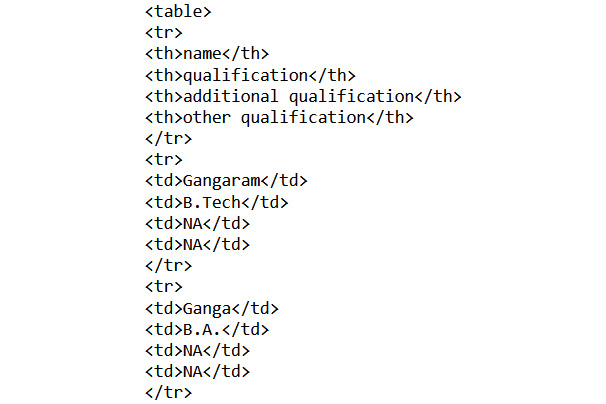

Lab 4. Collecting Text Data with Web Scraping and APIs
==================================================

#### Overview

This lab introduces you to the concept of web scraping. You will
first learn how to extract data (such as text, images, lists, and
tables) from pages that are written using HTML. You will then learn
about the various types of semi-structured data used to create web pages
(such as JSON and XML) and extract data from them. Finally, you will use
APIs for data extraction from Twitter, using the `tweepy`
package.


#### Collecting Data by Scraping Web Pages

The basic building block of any web page is HTML (Hypertext Markup Language) a markup language that specifies the structure of your
content. HTML is written using a series of tags, combined with optional
content. The basic HTML structure and commonly used tags are shown and explained as follows:


Exercise 4.01: Extraction of Tag-Based Information from HTML Files
------------------------------------------------------------------

In this exercise, we will extract addresses, quotes, text written in
bold, and a table present in an HTML file.

Follow these steps to implement this exercise:

1.  Open a Jupyter Notebook.

2.  Insert a new cell and add the following code to import the
    `BeautifulSoup` library:

    ```
    from bs4 import BeautifulSoup
    ```

    `BeautifulSoup` is a Python library for pulling data out
    of HTML and XML files. It provides a parser for HTML/XML formats,
    allowing us to navigate, search, and modify the parsed tree.

3.  Create an object of the `BeautifulSoup` class and pass the
    location of the HTML file to it:

    ```
    soup = BeautifulSoup(open('../data/sample_doc.html'), \
                         'html.parser')
    ```

    In the preceding line, `html.parser` is Python\'s built-in
    standard library parser. `BeautifulSoup` also supports
    third-party parsers such as `html5lib`, `lxml`,
    and others.

4.  Add the following code to check the text contents of the
    `sample_doc.html` file:

    ```
    soup.text
    ```

    
The preceding code generates the following output:


5.  Similarly, to see the contents, you can simply write the following
    code:

    ```
    soup.contents
    ```


6.  To find the addresses from the document, insert a new cell and add
    the following code:

    ```
    soup.find('address')
    ```

    
The preceding code generates the following output:

    ```
    <address> Mess on No. 72, Banamali Naskar Lane, Kolkata.</address>
    ```

7.  To locate all the `address` tags within the given content,
    write the following code:

    ```
    soup.find_all('address')
    ```

    
The preceding code generates the following output:

    ```
    [<address> Mess on No. 72, Banamali Naskar Lane, Kolkata.</address>,
     <address>221B, Baker Street, London, UK.</address>]
    ```

8.  To find the quotes in the document, add the following code:

    ```
    soup.find_all('q')
    ```

    
The preceding code generates the following output:

    ```
    [<q> There are more things in heaven and earth, Horatio, <br/> 
     Than are dreamt of in your philosophy. </q>]
    ```

9.  To check all the bold items, write the following command:

    ```
    soup.find_all('b')
    ```

    
The preceding code generates the following output:

    ```
    [<b>Sherlock </b>, <b>Hamlet</b>, <b>Horatio</b>]
    ```

10. Write the following command to extract the tables in the document:

    ```
    table = soup.find('table')
    table
    ```

    
The preceding code generates the following output:



11. You can also view the contents of `table` by looping
    through it. Insert a new cell and add the following code to
    implement this:

    ```
    for row in table.find_all('tr'):
        columns = row.find_all('td')
        print(columns)
    ```

    
The preceding code generates the following output:

    ```
    [ ]
    [<td>Gangaram</td>, <td>B.Tech</td>, <td>NA</td>, <td>NA</td>]
    [<td>Ganga</td>, <td>B.A.</td>, <td>NA</td>, <td>NA</td>]
    [<td>Ram</td>, <td>B.Tech</td>, <td>M.Tech</td>, <td>NA</td>]
    [<td>Ramlal</td>, <td>B.Music</td>, <td>NA </td>, <td>Diploma in Music</td>]
    ```

12. You can also locate specific content in the table. To locate the
    value at the intersection of the third row and the second column,
    write the following command:

    ```
    table.find_all('tr')[3].find_all('td')[2]
    ```

    
The preceding code generates the following output:

    ```
    <td>M.Tech</td>
    ```

We have learned how to extract tag-based information from an HTML file.


#### Requesting Content from Web Pages

To fetch content, you can use the `get()` method, which, as
the name suggests, sends a `GET` request to the web page from
which you want to fetch data. Let\'s perform a simple exercise now to
get a better idea of how we can implement this in Python.

Exercise 4.02: Collecting Online Text Data
------------------------------------------

In this exercise, we will be fetching the web content with the help of
`requests`. We will be pulling a text file from *Project
Gutenberg*, the free e-book website, specifically, from the text file
for Charles Dickens\' famous book, *David Copperfield*. Follow these
steps to complete this exercise:

1.  Use the `requests` library to request the content of a
    book available online with the following set of commands:

    ```
    import requests
    """"
    Let's read the text version of david copper field 
    available online
    """
    r = requests.get('https://www.gutenberg.org/files/766/766-0.txt')
    r.status_code
    ```

    
The preceding code generates the following output:

    ```
    200
    ```

    When the browser visits the website, it fetches the content of the
    specified URL. Similarly, using `requests`, we get the
    content from the specified URL and all the information gets stored
    in the `r` object. `200` indicates that we
    received the right response from the URL.

2.  Locate the text content of the fetched file by using the
    `requests` object `r` and referring to the
    `text` attribute. Write the following code for this:

    ```
    r.text[:1000]
    ```

    
The preceding code generates the following output:


3.  Now, write the fetched content into a text file. To do this, add the
    following code:

    ```
    from pathlib import Path
    open(Path("../data/David_Copperfield.txt"),'w',\
         encoding='utf-8').write(r.text)
    ```

    
The preceding code generates the following output:

    ```
    2033139
    ```


We have just learned how to collect data from online sources with the
help of the `requests` library.


Now, let\'s look at analyzing HTML content from Jupyter Notebooks.

Exercise 4.03: Analyzing the Content of Jupyter Notebooks (in HTML Format)
--------------------------------------------------------------------------

In this exercise, we will analyze the content of a Jupyter Notebook. We
will count the number of images, list the packages that have been
imported, and check the models and their performance.


Follow these steps to complete this exercise:

1.  Import `BeautifulSoup` and pass the location of the given
    HTML file using the following commands:

    ```
    from bs4 import BeautifulSoup
    soup = BeautifulSoup(open('../data/text_classifier.html'), \
                         'html.parser')
    soup.text[:100]
    ```

    Here, we are loading HTML using `BeautifulSoup` and
    printing parsed content. The preceding code generates the following
    output:

    ```
    '\n\n\nCh3_Activity7_Developing_end_to_end_Text_Classifiers\n\n\n\n    /*!\n*\n* Twitter Bootstrap\n*\n*/\n/*!\n*'
    ```

2.  Use the `img` tag to count the number of images:

    ```
    len(soup.find_all('img'))
    ```

    The output shows that there are three `img` tags:

    ```
    3
    ```

3.  If you open the HTML file in the text editor or your web browser\'s
    console, you will see all `import` statements have the
    `class` attribute set to `nn`. So, to list all
    the packages that are imported, add the following code, referring to
    finding the `span` element with an `nn` class
    attribute:

    ```
    [i.get_text() for i in soup.find_all\
    ('span',attrs={"class":"nn"})]
    ```

    The preceding code generates the following
    output:


4.  To extract the models and their performance, look at the HTML
    document and see which `class` attribute the models and
    their performance belong to. You will see the `h2` and
    `div` tags with the `class` attribute
    `output_subarea output_stream output_stdout output_text`.
    Add the following code to extract the models:

    ```
    for md,i in zip(soup.find_all('h2'), \
    soup.find_all('div',\
    attrs={"class":"output_subarea output_stream "\
           "output_stdout output_text"})):
        print("Model: ",md.get_text())
        print(i.get_text())
        print("---------------------------------------------------------\n\n\n")
    ```

    
The preceding code generates the following output:


So, in the preceding output, we have extracted a classification report
from the HTML file using `BeautifulSoup` by referring to the
`<h2>` and `<div>` tags.


Activity 4.01: Extracting Information from an Online HTML Page
--------------------------------------------------------------

In this activity, we will extract data about Rabindranath Tagore from
the Wikipedia page about him.

After extracting the data, we will analyze information from the page.
This should include the list of headings in the *Works* section, the
list of his works, and the list of universities named after him. Follow
these steps to implement this activity:

1.  Open a Jupyter Notebook.
2.  Import the requests and `BeautifulSoup` libraries.
3.  Fetch the Wikipedia page from
    <https://en.wikipedia.org/wiki/Rabindranath_Tagore> using the
    `get` method of the `requests` library.
4.  Convert the fetched content into HTML format using an HTML parser.
5.  Print the list of headings in the *Works* section.
6.  Print the list of original works written by Tagore in Bengali.
7.  Print the list of universities named after Tagore.

    Note: The solution to this activity in the current directory.

We are now well-versed in extracting generic data from HTML pages.
Let\'s perform another activity now, where we\'ll be using regular
expressions.


### Dealing with Semi-Structured Data

A dataset is said to be semi-structured if it is not in
a row-column format but, if required, can be converted into a structured
format that has a definite number of rows and columns. JSON and XML are the most
popularly used instances of semi-structured data.


JSON
----

JSON files are used for storing and exchanging data. JSON is
human-readable and easy to interpret. The datatype
of values of JSON objects must be any of the following:

-   A string
-   A number
-   Another JSON object
-   An array
-   A boolean
-   Null

NoSQL databases (such as MongoDB) store data in the form of JSON
objects. Most APIs return JSON objects. The following figure depicts
what a JSON file looks like:


Exercise 4.04: Working with JSON Files
--------------------------------------

In this exercise, we will extract details such as the names of students,
their qualifications, and additional qualifications from a JSON file.

Follow these steps to complete this exercise:

1.  Open a Jupyter Notebook.

2.  Insert a new cell and import `json`. Pass the location of
    the file mentioned using the following commands:

    ```
    import json
    from pprint import pprint
    data = json.load(open('../data/sample_json.json'))
    pprint(data)
    ```

    In the preceding code, we are importing Python\'s built-in
    `json` module and loading the local JSON file using the
    standard I/O operation of Python. This turns JSON into the Python
    `dict` object. The preceding code generates the following
    output:


3.  To extract the names of the students, add the following code:

    ```
    [dt['name'] for dt in data['students']]
    ```

    
The preceding code generates the following output:

    ```
    ['Gangaram', 'Ganga', 'Ram', 'Ramlal']
    ```

4.  To extract their respective qualifications, enter the following
    code:

    ```
    [dt['qualification'] for dt in data['students']]
    ```

    
The preceding code generates the following output:

    ```
    ['B.Tech', 'B.A.', 'B.Tech', 'B.Music']
    ```

5.  To extract their additional qualifications, enter the following
    code. Remember, not every student will have additional
    qualifications. Thus, we need to check this separately. Add the
    following code to implement this:

    ```
    [dt['additional qualification'] if 'additional qualification' \
    in dt.keys() else None for dt in data['students']]
    ```

    
The preceding code generates the following output:

    ```
    [None, None, 'M.Tech', None]
    ```

As JSON objects are similar to the dictionary data structure of Python,
they are widely used on the web to send and receive data across web
applications.


#### XML

Just like HTML, XML is another kind of markup language that stores data
in between tags. It is human-readable and extensible; that is, we have
the liberty to define our own tags. The following figure depicts what an XML file looks like:


The following figure clearly differentiates between an original XML file and a tree representation of an XML file:


Exercise 4.05: Working with an XML File
---------------------------------------

In this exercise, we will parse an XML file and print the details from
it, such as the names of employees, the organizations they work for, and
the total salaries of all employees.


Follow these steps to complete this exercise:

1.  Open a Jupyter Notebook.

2.  Insert a new cell, import `xml.etree.ElementTree`, and
    pass the location of the XML file using the following code:

    ```
    import xml.etree.ElementTree as ET
    tree = ET.parse('../data/sample_xml_data.xml')
    root = tree.getroot()
    root
    ```

    
The preceding code generates the following output:

    ```
    <Element 'records' at 0.112291710>
    ```

3.  To check the tag of the fetched element, type the following code:

    ```
    root.tag
    ```

    
The preceding code generates the following output:

    ```
    'records'
    ```

4.  Look for the `name` and `company` tags in the
    XML and print the data enclosed within them:

    ```
    for record in root.findall('record')[:20]:
        print(record.find('name').text, "---",\
              record.find('company').text)
    ```

    
The preceding code generates the following output:


5.  To find the sum of the salaries, create a list consisting of the
    salaries of all employees by iterating over each record and finding
    the `salary` tag in it. Next, remove the `$` and
    `,` from the string of salary content, and finally, type
    cast into the integer to get the sum at the end. Add the following
    code to do so:

    ```
    sum([int(record.find('salary').text.replace('$','').\
    replace(',','')) for record in root.findall('record')])
    ```

    
The preceding code generates the following output:

    ```
    745609
    ```

Thus, we can see that the sum of all the salaries is \$745,609. We just
learned how to extract data from a local XML file. When we request data,
many URLs return an XML file.

**Note**

In the next section, we will look at how APIs can be used to retrieve
real-time data.

Using APIs to Retrieve Real-Time Data
-------------------------------------

**API** stands for **Application Programming Interface**. To understand
what an API is, let\'s consider a real-life example. Suppose you have a
socket plug in the wall, and you need to charge your cellphone using it.
How will you do it? You will have to use a charger/adapter, which will
enable you to connect the cellphone to the socket. Here, this adapter is
acting as a mediator that connects the cellphone and the socket, thus
enabling the smooth transfer of electricity between them.


Exercise 4.06: Collecting Data Using APIs
-----------------------------------------

In this exercise, we will use the Currency Exchange Rates API to convert
USD to another currency rate. Follow these steps to implement this
exercise:

1.  Open a Jupyter Notebook.

2.  Import the necessary packages. Add the following code to do so:

    ```
    import json 
    import pprint 
    import requests 
    import pandas as pd
    ```

3.  Load the `json` data. Add the following code to do this:

    ```
    r = requests.get("https://api.exchangerate-api.com/"\
                     "v4/latest/USD")
    data = r.json()
    pprint.pprint(data)
    ```

    
The preceding code generates the following output:


4.  To create the DataFrame of the fetched data and print it, add the
    following code:

    ```
    df = pd.DataFrame(data)
    df.head()
    ```

    
The preceding code generates the following output:


**Note** that you will get a different output depending on the present
currency exchange rates. We just learned how to collect data using APIs.


Extracting data from Twitter Using the OAuth API
------------------------------------------------

The Twitter API requires authentication and authorization
to interact with its services using the `OAuth` method. To access Twitter data and
services using an API, you would need to register using a Twitter
developer account.

You can collect data from Twitter using their Python module, named
`Tweepy`. `Tweepy` is a Python library for accessing
the Twitter API. It is great for simple automation and creating Twitter
bots. It provides abstraction to communicate with Twitter and use its
API to ease interactions, which makes this approach more efficient than
using the `requests` library and Twitter API endpoints.

To use the `Tweepy` library, simply go to
<https://dev.twitter.com/apps/new> and fill in the form; you\'ll need to
complete the necessary fields, such as `App Name`,
`Website URL`, `Callback URL`, and
`App Usage`. Once you\'ve done this, submit and receive the
keys and tokens, which you can use for extracting tweets and more.
However, before you do any of this, you\'ll first need to import the
`tweepy` library.

Your Python code should look like this:

```
import tweepy
consumer_key = 'your consumer key here'
consumer_secret = 'your consumer secret key here'
access_token = 'your access token here'
access_token_secret = 'your access token secret here'
auth = tweepy.OAuthHandler(consumer_key, consumer_secret)
auth.set_access_token(access_token, access_token_secret)
api = tweepy.API(auth)
```


The preceding code uses `auth` instantiation from
`OAuthHandler`, which takes in our consumer token and secret
keys that were obtained during app registration.
`OAuthHandler` handles interaction with Twitter\'s
`OAuth` system.

To search for a query named `randomquery` using
`tweepy`, you can use the `Cursor` object as
follows:

```
tweepy.Cursor(api.search, q='randomquery', lang="en")
```


`Cursor` handles all the iterating-over-pages work for us
behind the scenes, whereas the `api.search` method provides
tweets that match a specified query given with the `q`
parameter.

Let\'s do an activity now, to put our knowledge into practice.

Activity 4.02: Extracting Data from Twitter
-------------------------------------------

In this activity, you will extract 100 tweets containing the hashtag
*\#climatechange* from Twitter, using the Twitter API via the tweepy
library, and load them into a pandas DataFrame. The following steps will
help you implement this activity:

1.  Log in to your Twitter account with your credentials.
2.  Visit <https://dev.twitter.com/apps/new> and fill in the form by
    completing the necessary fields, such as `App Name`,
    providing `Website URL`, `Callback URL`, and
    `App Usage`.
3.  Submit the form and receive the keys and tokens.
4.  Use these keys and tokens in your application when making an API
    call for *\#climatechange*.
5.  Import the necessary libraries.
6.  Fetch the data using the keys and tokens.
7.  Create a DataFrame consisting of tweets.

    Note: The full solution to this activity can be found in the current directory.


#### Summary

In this lab, we have learned various ways to collect data by
scraping web pages. We also successfully scraped data from
semi-structured formats such as JSON and XML and explored different
methods of retrieving data in real time from a website without
authentication. In the next lab, you will learn about topic
modeling an unsupervised natural language processing technique that
helps group documents according to the topics that it detects in them.
