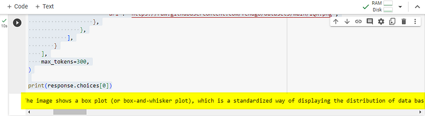
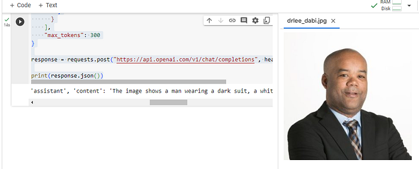

# Lab: OpenAI Vision APIs


In the ever-evolving landscape of artificial intelligence, OpenAI's
GPT-4 Vision (GPT-4V) emerges as a groundbreaking innovation, blending
the advanced capabilities of GPT-4 with the ability to interpret and
analyze visual information. This integration marks a significant leap
forward, transcending the traditional text-only limitations of language
models. In this detailed exploration, we'll delve into the practical
applications of GPT-4V, showcasing how it can be used to unlock new
dimensions of image understanding in Python.

# Introduction: A New Frontier in AI

GPT-4 with Vision, colloquially known as GPT-4V or gpt-4-vision-preview
in the API, represents a monumental step in AI's journey. This model
transcends the boundaries of traditional language models by
incorporating the ability to process and interpret images, thereby
broadening the scope of potential applications. GPT-4V is available
through the gpt-4-vision-preview model and the Chat Completions API,
which now supports image inputs, expanding the horizons of what AI can
achieve.

# Key Points about GPT-4V:

- Augmentative Capabilities: GPT-4V enhances the already robust GPT-4
    model by adding visual understanding without compromising its
    textual proficiency.
- Image Processing: The model can process images in two primary ways ---
    through direct URL links or by handling base64 encoded
    images.
-  Limitations and Use Cases: While GPT-4V excels at general image
    understanding and object relationships, it is not optimized for
    precise spatial localization tasks.

# Lab Solution

Solution notebook for this lab can be found at `~/work/nlp-generative-ai-bootcamp/Lab04/openai_gpt4_vision.ipynb`

# Using GPT-4V: From URLs to Local Images

# Analyzing Images from URLs

One of the most straightforward methods to leverage GPT-4V is by using
image URLs. This approach is ideal for easily accessible images hosted
on platforms like GitHub or Wikimedia Commons. Here's how you can use
it:

```
import os

# Prompt for the API key
api_key = input("Enter your OpenAI API key: ")

# Set the environment variable
os.environ["OPENAI_API_KEY"] = api_key
```

Then call the API:

```
from openai import OpenAI

client = OpenAI()

response = client.chat.completions.create(
    model="gpt-4-vision-preview",
    messages=[
        {
            "role": "user",
            "content": [
                {"type": "text", "text": "What’s in this image?"},
                {
                    "type": "image_url",
                    "image_url": {
                        "url": "https://raw.githubusercontent.com/fenago/nlp-generative-ai-bootcamp/main/IQR.png",
                    },
                },
            ],
        }
    ],
    max_tokens=300,
)

print(response.choices[0])
```

Replace `"https://your-image-url.jpg"` with your
image URL to get insights about the image.

Here is the image:


Here is the analysis:




# Uploading and Analyzing Local Images

For local images, GPT-4V can analyze them using base64 encoding. This
method is particularly useful for personal or sensitive images that are
not hosted online:

```
import base64
import requests

# Function to encode the image
def encode_image(image_path):
    with open(image_path, "rb") as image_file:
        return base64.b64encode(image_file.read()).decode('utf-8')

# Path to your image
image_path = "./drlee_dabi.jpg"

# Getting the base64 string
base64_image = encode_image(image_path)

headers = {
    "Content-Type": "application/json",
    "Authorization": f"Bearer {api_key}"
}

payload = {
    "model": "gpt-4-vision-preview",
    "messages": [
      {
        "role": "user",
        "content": [
          {
            "type": "text",
            "text": "What’s in this image?"
          },
          {
            "type": "image_url",
            "image_url": {
              "url": f"data:image/jpeg;base64,{base64_image}"
            }
          }
        ]
      }
    ],
    "max_tokens": 300
}

response = requests.post("https://api.openai.com/v1/chat/completions", headers=headers, json=payload)

print(response.json())
```



In this script, replace `"path_to_your_image.jpg"` with the path to your local image.

# Understanding the Limitations and Strengths

While GPT-4V opens new avenues in AI, it's crucial to recognize its
limitations. For instance, it's not suitable for interpreting
specialized medical images or understanding text in non-Latin alphabets.
Additionally, it may struggle with tasks requiring detailed spatial
reasoning or interpreting complex visual elements like graphs.

On the flip side, GPT-4V excels in general image understanding,
recognizing relationships between objects, and generating creative
responses based on visual inputs. Its ability to process multiple images
and understand their context collectively is particularly notable.

# Conclusion

OpenAI's GPT-4 Vision model represents a significant stride in AI,
bridging the gap between visual and textual understanding. Whether
you're analyzing images from the web or local storage, GPT-4V offers a
versatile tool for a wide range of applications.

Embrace this new era of AI with OpenAI's GPT-4 Vision, where images and
text converge to create a richer, more comprehensive understanding of
the world around us.
