Lab 5. Topic Modeling
=================

Introduction
============

In this lab, we will focus on **topic modeling**, which is an important area within natural language
processing. 

- Topic modeling is a simple way to capture the sense of what
a document or a collection of documents is about.
- Topic modeling is mostly done using unsupervised learning algorithms that detect topics on their own.
- Topic-modeling algorithms operate by performing statistical analysis on
words or tokens in documents and using those statistics to automatically
assign each document to multiple topics.
- Topic modeling is often used as a first step to explore textual data in
order to get a feel for the content of the text.


Topic-Modeling Algorithms
=========================

Topic-modeling algorithms operate on the following assumptions:

-   Topics contain a set of words.
-   Documents are made up of a set of topics.

In the upcoming sections, we will cover in detail three topic-modeling algorithms namely LSA, LDA, and HDP. 

**Note** The LDA algorithm builds on the LSA algorithm. In this case, similar acronyms are indicative of this association.

Latent Semantic Analysis (LSA)
------------------------------

Consider that we have a collection of documents, and these documents are
made up of words. Our goal is to discover the latent topics in the
documents. So, in the beginning, we have a collection of documents that
we can represent as a term-to-document matrix. This term-to-document
matrix has terms as rows and documents as columns. The following table
gives a simplified illustration of a term-to-document matrix:

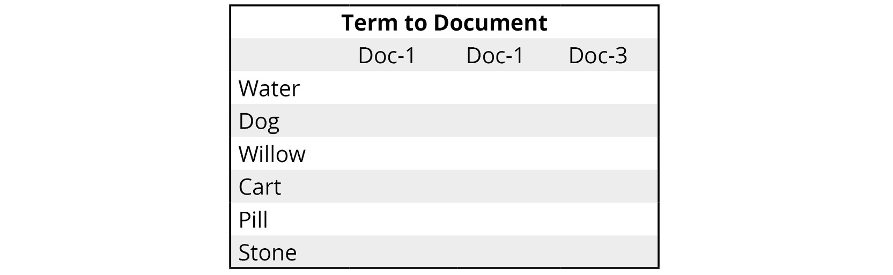


Now, we break this matrix down into three separate matrix factors,
namely a term-to-topics matrix, a topic-importance matrix, and a
topic-to-documents matrix. Let\'s consider the matrix shown on the
left-hand side and the corresponding factor matrices on the right-hand
side:

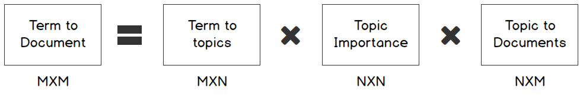


As we can see in this diagram, the rectangular matrix is separated into
the product of other matrices. The process takes a matrix, *M*, and
splits it, as shown in the following formula:


Exercise 5.01: Analyzing Wikipedia World Cup Articles with Latent Semantic Analysis
-----------------------------------------------------------------------------------

In this exercise, you will perform topic modeling using LSA on a
Wikipedia World Cup dataset. For this, you will make use of the
`LsiModel` class provided by the gensim library. You will use
the Wikipedia library to fetch articles, the spaCy engine for the
tokenization of the text, and the newline character to separate
documents within an article.


Follow these steps to complete this exercise:

1.  Open a Jupyter Notebook.

2.  Insert a new cell and add the following code to import the necessary
    libraries:


    ```
    import numpy as np
    import matplotlib.pyplot as plt
    %matplotlib inline
    import pandas as pd
    from gensim import corpora
    from gensim.models import LsiModel
    from gensim.parsing.preprocessing import preprocess_string
    ```

3.  To clean the text, define a function to remove the non-alphanumeric
    characters and replace numbers with the `#` character.
    Replace instances of multiple newline characters with a single
    newline character. Use the newline character to separate out the
    documents in the corpus. Insert a new cell and add the following
    code to implement this:


    ```
    import re
    HANDLE = '@\w+'
    LINK = 'https?://t\.co/\w+'
    SPECIAL_CHARS = '&lt;|&lt;|&amp;|#'
    PARA='\n+'
    def clean(text):
        text = re.sub(LINK, ' ', text)
        text = re.sub(SPECIAL_CHARS, ' ', text)
        text = re.sub(PARA, '\n', text)
        return text
    ```

4.  Insert a new cell and add the following code to find Wikipedia
    articles related to the World Cup:

    ```
    import wikipedia
    wikipedia.search('Cricket World Cup'),\
    wikipedia.search('FIFA World Cup')
    ```

    The code generates the following output:
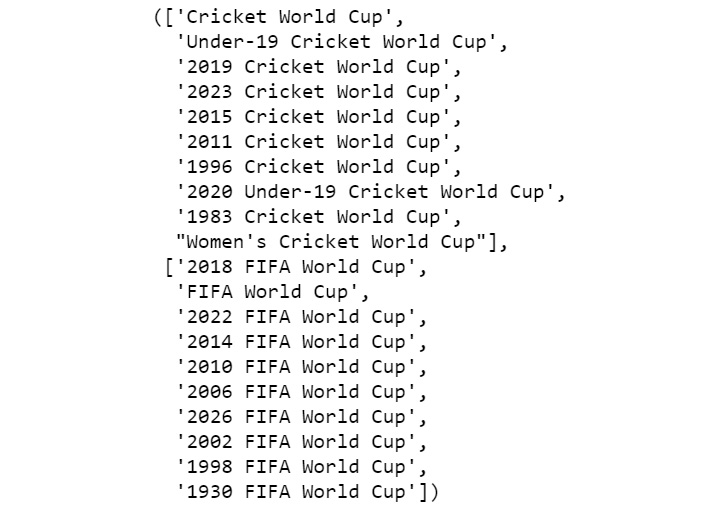


5.  Insert a new cell and add the following code fetch the Wikipedia
    articles about the 2018 FIFA World Cup and the 2019 Cricket World
    Cup, concatenate them, and show the result:

    ```
    latest_soccer_cricket=['2018 FIFA World Cup',\
                           '2019 Cricket World Cup']
    corpus=''
    for cup in latest_soccer_cricket:
        corpus=corpus+wikipedia.page(cup).content
    corpus
    ```

    The code generates the following output:
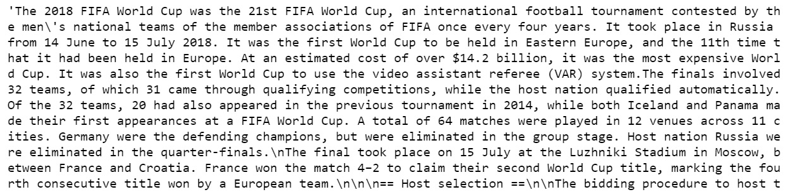


6.  Insert a new cell and add the following code to clean the text,
    using the spaCy English language model to tokenize the corpus and
    exclude all tokens that are not detected as nouns:

    ```
    text=clean(corpus)
    import spacy
    nlp = spacy.load('en_core_web_sm')
    doc=nlp(text)
    pos_list=['NOUN']
    preproc_text=[]
    preproc_sent=[]
    for token in doc:
        if token.text!='\n':
            if not(token.is_stop) and not(token.is_punct) \
            and token.pos_ in pos_list:
                preproc_sent.append(token.lemma_)
        else:
            preproc_text.append(preproc_sent)
            preproc_sent=[]
    #last sentence
    preproc_text.append(preproc_sent) 
    print(preproc_text)
    ```

    The code generates the following output:
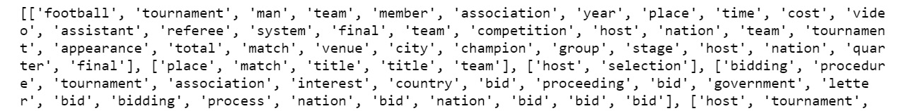


7.  Insert a new cell and add the following code to convert the corpus
    into a list in which each token corresponds to a number for more
    efficient representation, as gensim requires it in this form. Then,
    find the topics in the corpus:

    ```
    dictionary = corpora.Dictionary(preproc_text)
    corpus = [dictionary.doc2bow(text) for text in preproc_text]
    NUM_TOPICS=3
    lsamodel=LsiModel(corpus, num_topics=NUM_TOPICS, \
                      id2word = dictionary)
    lsamodel.print_topics()
    ```

    The code generates the following output:
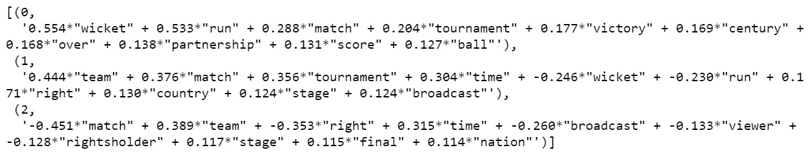


    To create our `LsiModel`, we had to decide up front how
    many topics we wanted. This would not necessarily match the number
    of topics that are actually in the corpus.

8.  To determine which topics have the highest weight for a document,
    insert a new cell and add the following code:

    ```
    model_arr = np.argmax(lsamodel.get_topics(),axis=0)
    y, x = np.histogram(model_arr, bins=np.arange(NUM_TOPICS+1))
    fig, ax = plt.subplots()
    plt.xticks(ticks=np.arange(NUM_TOPICS),\
               labels=np.arange(NUM_TOPICS+1))
    ax.plot(x[:-1], y)
    fig.show()
    ```

    The code generates the following output:
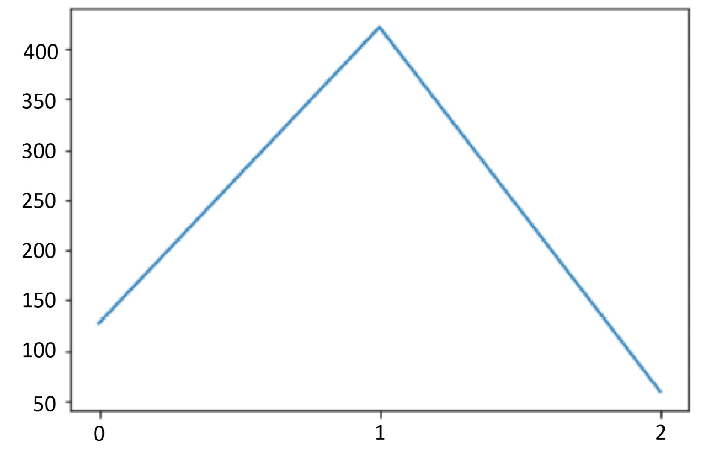


We can see that topic `1` and topic `0` have the highest weight in almost all the documents.


Dirichlet Process and Dirichlet Distribution
--------------------------------------------

The Dirichlet distribution is a special case of the Dirichlet process,
in which the number of topics needs to be specified explicitly. It is
used for the LDA topic-modeling algorithm.


Latent Dirichlet Allocation (LDA)
---------------------------------

To understand how LDA works, let\'s look at a simple example. We have
four documents that contain only three unique words: **Cat**, **Dog**,
and **Hippo**. The following figure shows the documents and the number
of times each word is found in each document:


As we can see in the figure, the word **Cat** is found **10** times in
**Document 1** and **Document 4** and **0** times in documents **2** and
**3**. **Document 4** contains all three words **10** times each. For
its analysis, LDA maintains two probability tables. The first table
tracks the probability of selecting a specific word when sampling a
specific topic. The second table keeps track of the probability of
selecting a specific topic when sampling a particular document:

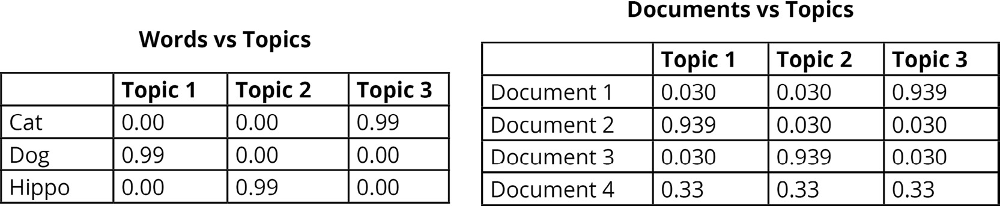


The parameters that we use for tomotopy are as follows:

-   `corpus`: This refers to text that we want to analyze.
-   Number of topics: This is the number of topics that the corpus
    contains.
-   `iter`: This refers to the number of iterations that the
    model considers the corpus.
-   `α`: This is associated with document generation.
-   `η`: This is associated with topic generation.
-   `seed`: This helps with fixing the initial randomization.


Measuring the Predictive Power of a Generative Topic Model
----------------------------------------------------------

The predictive power of a generative topic model can be measured by
analyzing the distribution of the generated corpus. Perplexity is a
measure of how close the distribution of the words in the generated
corpus is to reality. Log perplexity is a more convenient measure for
this closeness. The formula for log perplexity is as follows:


Exercise 5.02: Finding Topics in Canadian Open Data Inventory Using the LDA Model
---------------------------------------------------------------------------------

In this exercise, we will use the tomotopy LDA model to analyze the
Canadian Open Data Inventory. For simplicity, we will consider that the
corpus has twenty topics.


The following steps will help you complete this exercise:

1.  Open a Jupyter Notebook.

2.  Insert a new cell and add the following code to import the necessary
    libraries:


    ```
    import pandas as pd
    pd.set_option('display.max_colwidth', 800)
    import numpy as np
    import matplotlib.pyplot as plt
    %matplotlib inline
    ```

3.  Insert a new cell and add the following code to read from a download
    of the Canadian Open Data Inventory, and clean the text:


    ```
    OPEN_DATA_URL = '../data/canada-open-data/inventory.csv'
    import re
    HANDLE = '@\w+'
    LINK = 'https?://t\.co/\w+'
    SPECIAL_CHARS = '&lt;|&lt;|&amp;|#'
    PARA='\n+'
    def clean(text):
        text = re.sub(LINK, ' ', text)
        text = re.sub(SPECIAL_CHARS, ' ', text)
        text = re.sub(PARA, '\n', text)
        return text
    catalog['description_en'].sample(frac=0.25,replace=False,\
                                     random_state=0).to_c \
                                     sv(OPEN_DATA_URL,\
                                     encoding='utf-8')
    file='../data/canada-open-data/catalog.txt'
    f=open(file,'r',encoding='utf-8')
    text=f.read()
    f.close()
    text = clean(text)
    ```

4.  Insert a new cell and add the following code to clean the text,
    using the spaCy English language model to tokenize the corpus and to
    exclude all tokens that are not detected as nouns:

    ```
    import spacy
    nlp = spacy.load('en_core_web_sm')
    doc=nlp(text)
    pos_list=['NOUN']
    preproc_text=[]
    preproc_sent=[]
    for token in doc:
        if token.text!='\n':
            if not(token.is_stop) and not(token.is_punct) \
            and token.pos_ in pos_list:
                preproc_sent.append(token.lemma_)
        else:
            preproc_text.append(preproc_sent)
            preproc_sent=[]
    #last sentence
    preproc_text.append(preproc_sent) 
    print(preproc_text)
    ```

    The code generates the following output:
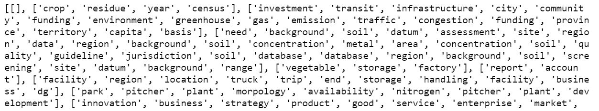


    The pandas DataFrame was sampled. 25% of the dataset has been
    considered so that the memory restrictions related to spaCy can be
    addressed, since this is a fairly large sample.

5.  Insert a new cell and add the following code to see how the negative
    log likelihood varies by the number of iterations:

    ```
    import tomotopy as tp
    NUM_TOPICS=20
    mdl = tp.LDAModel(k=NUM_TOPICS,seed=1234)
    for line in preproc_text:
        mdl.add_doc(line)
    for i in range(0, 110, 10):
        mdl.train(i)
        print('Iteration: {}\tLog-likelihood: {}'.\
              format(i, mdl.ll_per_word))
    ```

    The code generates the following output:
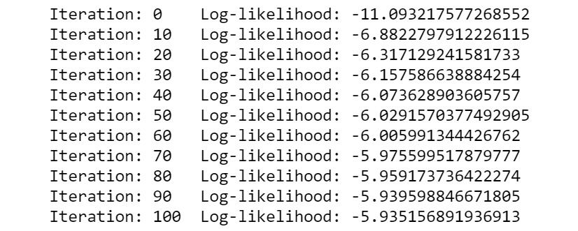

    iterations

6.  Insert a new cell and add the following code to train a topic model
    with ten iterations and to show the inferred topics:

    ```
    mdl.train(10)
    for k in range(mdl.k):
        print('Top 10 words of topic #{}'.format(k))
        print(mdl.get_topic_words(k, top_n=7))
    ```

    The code generates the following output:

    ```
    Top 10 words of topic #0
    [('polygon', 0.36050185561180115), ('dataset', 0.0334757782722234726), ('information', 0.03004324994981289), ('soil', 0,029185116291046143), ('area', 0,026610717177391052), ('surface', 0.025752583518624306), ('map', 0.024036318063735962)]
    ```

7.  Insert a new cell and add the following code to
    see the probability distribution of topics if you consider the
    entire dataset as a single document:

    ```
    bag_of_words=[word for sent in preproc_text for word in sent]
    doc_inst = mdl.make_doc(bag_of_words)
    mdl.infer(doc_inst)[0]
    np.argsort(np.array(mdl.infer(doc_inst)[0]))[::-1]
    ```

    The code generates the following output:

    ```
    array([11,17,14,19,12,  7,  4, 13, 10,  2,  3, 15,  1, 18, 16,  9,  0,
            6,  8,  5], dtype=int64)
    ```

8.  Insert a new cell and add the following code to see the probability
    distribution of topic 11:

    ```
    print(mdl.get_topic_words(11, top_n=7))
    ```

    The code generates the following output

    ```
    [('table', 0.24849626421928406), ('census', 0.1265643984079361), ('level', 0.06526772677898407), ('series', 0.06306280940771103), ('topic', 0.062401335686445236), ('geography', 0.062401335686445236), ('country', 0.06218084320425987)]
    ```

9.  Insert a new cell and add the following code to see the probability
    distribution of topic 17:

    ```
    print(mdl.get_topic_words(17, top_n=7))
    ```

    The code generates the following output:

    ```
    [('datum', 0.0603327676653862), ('information', 0.057247743010520935), ('year', 0.03462424501776695), ('dataset', 0.03291034325957298), ('project', 0.017828006289734993), ('website', 0.014057422056794167), ('activity', 0.012000739574432373)]
    ```

10. Insert a new cell and add the following code to see the probability
    distribution of topic 5:

    ```
    print(mdl.get_topic_words(5, top_n=7))
    ```

    The code generates the following output:

    ```
    [('survey', 0.04966237023472786), ('catch', 0.03862873837351799), ('sponge', 0.0364220105111599), ('sea', 0.0342152863740921), ('datum', 0.028698472306132317), ('fishing', 0.02759511023759842), ('matter', 0.026491746306419373)]
    ```

Topic 11, topic 17, and topic 5 seem to be interpretable. One could say
that topic 11, topic 17, and topic 5 seem to be broadly about
geographical data, internet data, and marine life data respectively.

**Note**

In general, the topics found are extremely sensitive to randomization in
both gensim and tomotopy. While setting a `random_state` in
gensim could help in reproducibility, in general, the topics found using
tomotopy are superior from the perspective of interpretability.


Activity 5.01: Topic-Modeling Jeopardy Questions
------------------------------------------------

Jeopardy is a popular TV show that covers a variety of topics. In this
show, participants are given answers and then asked to frame questions.
The purpose of this activity is to give a real-world feel to some of the
complexity associated with topic modeling. In this activity, you will do
topic modeling on a dataset of Jeopardy questions.

**Note**

The dataset to be used for this activity can be found at


Follow these steps to complete this activity:

1.  Open a Jupyter Notebook.
2.  Insert a new cell and import pandas and other necessary libraries.
3.  Load the dataset into a pandas DataFrame.
4.  Clean the data by dropping the DataFrame rows where the
    `Question` column has empty cells.
5.  Find the unique number of categories based on the
    `Category` column.
6.  Randomly select 4% of the questions. Tokenize the text using spaCy.
    Select tokens that are nouns/verbs/adjectives or a combination.
7.  Train a tomotopy LDA model with 1,000 topics.
8.  Print the log perplexity.
9.  Find the probability distribution on the entire dataset.
10. Sample a few topics and check for interpretability.


#### Hierarchical Dirichlet Process (HDP)

HDP is a non-parametric variant of LDA. It is called \"non-parametric\"
since the number of topics is inferred from the data, and this parameter
isn\'t provided by us. This means that this parameter is learned and can
increase (that is, it is theoretically unbounded).


The gensim and the scikit-learn libraries use variational inference,
while the tomotopy library uses collapsed Gibbs sampling.For the tomotopy library, the following
parameters are used:

`iter`: This refers to the number of iterations that the model
considers the corpus.

`α`: This concentration parameter is associated with document
generation.

`η`: This concentration parameter is associated with topic
generation.

`seed`: This fixes the initial randomization.

`min_cf`: This helps eliminate those words that occur fewer
times than the frequency specified by us.

To get a better understanding of this, let\'s perform some simple
exercises.

Exercise 5.03: Topics in Around the World in Eighty Days
--------------------------------------------------------

In this exercise, we will make use of the tomotopy HDP model to analyze
the text file for Jules Verne\'s *Around the World in Eighty Days*,
available from the Gutenberg Project. We will use the `min_cf`
hyperparameter that is used to ignore words that occur fewer times than
the specified frequency and discuss its impact on the interpretability
of topics.

1.  Open a Jupyter Notebook.

2.  Insert a new cell and add the following code to import the necessary
    libraries:


    ```
    import pandas as pd
    pd.set_option('display.max_colwidth', 800)
    import numpy as np
    import matplotlib.pyplot as plt
    %matplotlib inline
    ```

3.  Insert a new cell and add the following code to read from a download
    of the Gutenberg Project\'s *Around the World in Eighty Days* by
    Jules Verne, and clean the text:

    ```
    OPEN_DATA_URL = '../data/aroundtheworld/pg103.txt'
    f=open(OPEN_DATA_URL,'r',encoding='utf-8')
    text=f.read()
    f.close()
    import re
    HANDLE = '@\w+'
    LINK = 'https?://t\.co/\w+'
    SPECIAL_CHARS = '&lt;|&lt;|&amp;|#'
    PARA='\n+'
    def clean(text):
        text = re.sub(LINK, ' ', text)
        text = re.sub(SPECIAL_CHARS, ' ', text)
        text = re.sub(PARA, '\n', text)
        return text
    text = clean(text)
    text
    ```

    The code generates the following output:
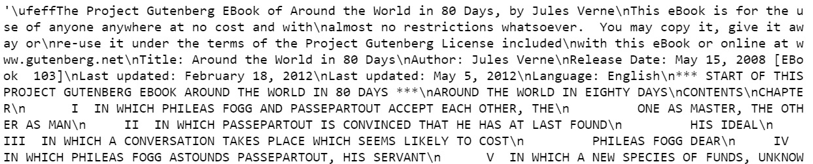


4.  Insert a new cell and add the following code to import the necessary
    libraries, clean the text (using the spaCy English language model to
    tokenize the corpus), and exclude all tokens that are not detected
    as nouns:

    ```
    import spacy
    nlp = spacy.load('en_core_web_sm')
    doc=nlp(text)
    pos_list=['NOUN']
    preproc_text=[]
    preproc_sent=[]
    for token in doc:
        if token.text!='\n':
            if not(token.is_stop) and not(token.is_punct) \
            and token.pos_ in pos_list:
                preproc_sent.append(token.lemma_)
        else:
            preproc_text.append(preproc_sent)
            preproc_sent=[]
    preproc_text.append(preproc_sent) #last sentence
    print(preproc_text)
    ```

    The code generates the following output:
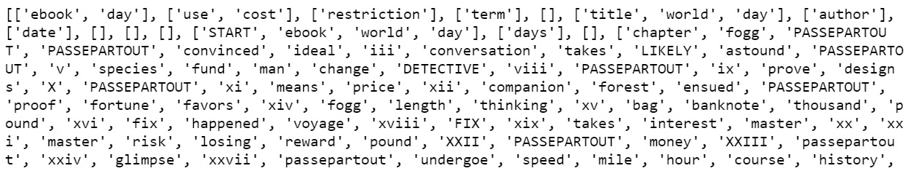


5.  Insert a new cell and add the following code to create HDP models in
    which tokens that occur fewer than five times are ignored, and then
    show how the negative log likelihood varies according to the number
    of iterations:

    ```
    import tomotopy as tp
    mdl = tp.HDPModel(min_cf=5,seed=0)
    for line in preproc_text:
        mdl.add_doc(line)
    for i in range(0, 100, 10):
        mdl.train(i)
        print('Iteration: {}\tLog-likelihood: {}'.\
              format(i, mdl.ll_per_word))
    for k in range(mdl.k):
        print('Top 10 words of topic #{}'.format(k))
        print(mdl.get_topic_words(k, top_n=7))
    ```

    The code generates the following output:
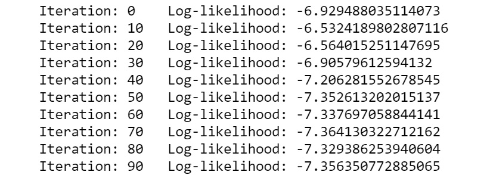

    iterations

6.  Insert a new cell and add the following code to see the probability
    distribution of topics if you consider the entire dataset as a
    single document:

    ```
    bag_of_words=[word for sent in preproc_text for word in sent]
    doc_inst = mdl.make_doc(bag_of_words)
    np.argsort(np.array(mdl.infer(doc_inst)[0]))[::-1]
    ```

    The code generates the following output:
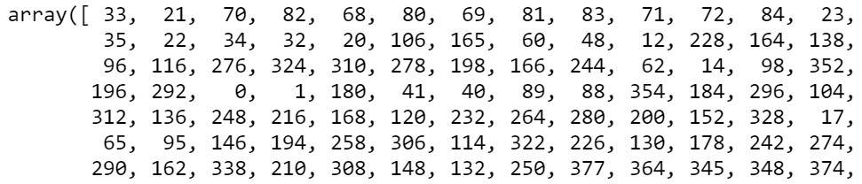

    dataset is considered

7.  Insert a new cell and add the following code to see the probability
    distribution of topic 33:

    ```
    print(mdl.get_topic_words(33, top_n=7))
    ```

    The code generates the following output:

    ```
    [('danger', 0.1534954458475113), ('hour', 0.0015197568573057652), ('time', 0.0015197568573057652), ('train', 0.0015197568573057652), ('master', 0.0015197568573057652), ('man', 0.0015197568573057652), ('steamer', 0.0015197568573057652)]
    ```

8.  Insert a new cell and add the following code to see the probability
    distribution of topic 21:

    ```
    print(mdl.get_topic_words(21, top_n=7))
    ```

    The code generates the following output:

    ```
    [('hour', 0.1344495415687561), ('minute', 0.1232500821352005), ('day', 0.08405196666717529), ('quarter', 0.07285250723361969), ('moment', 0.07285250723361969), ('clock', 0.005605331063270569), ('card', 0.039254117757081985)]
    ```

9.  Insert a new cell and add the following code to see the probability
    distribution of topic 70:

    ```
    print(mdl.get_topic_words(70, top_n=7))
    ```

    The code generates the following output:

    ```
    [('event', 0.12901155650615692), ('midnight', 0.12901155650615692), ('detective', 0.06482669711112976), ('bed', 0.06482669711112976), ('traveller', 0.06482669711112976), ('watch', 0.06482669711112976), ('clown', 0.06482669711112976)]
    ```

10. Insert a new cell and add the following code to see the probability
    distribution of topic 4:

    ```
    print(mdl.get_topic_words(4, top_n=7))
    ```

    The code generates the following output:

    ```
    [('house', 0.20237493515014648), ('opium', 0.10131379961967468), ('town', 0.07604850828647614), ('brick', 0.07604850828647614), ('mansion', 0.07604850828647614), ('glimpse', 0.50783220678567886), ('ball', 0.050783220678567886)]
    ```

We can see that ignoring tokens that occur fewer than five times
significantly improves the interpretability of the topic model. Also, we
have 378 topics in all, many of which are not likely to be
interpretable. So, what does this mean? Let\'s analyze a corpus from
another classic and then return to these questions.


Exercise 5.04: Topics in The Life and Adventures of Robinson Crusoe by Daniel Defoe
-----------------------------------------------------------------------------------

In this exercise, we will make use of the tomotopy HDP model to analyze
a text corpus taken from the text file for Daniel Defoe\'s *The Life and
Adventures of Robinson Crusoe*, available on the Gutenberg Project
website. Here, we will take the value of `α` as 0.8 and
experiment with selecting tokens based on different combinations of
parts of speech, before training the model.


1.  Open a Jupyter Notebook.

2.  Insert a new cell and add the following code to import the necessary
    libraries:


    ```
    import pandas as pd
    pd.set_option('display.max_colwidth', 800)
    import numpy as np
    import matplotlib.pyplot as plt
    %matplotlib inline
    ```

3.  Insert a new cell and add the following code to read from a download
    of the Gutenberg Project\'s *The Life and Adventures of Robinson
    Crusoe* by Daniel Defoe, and clean the text:

    ```
    OPEN_DATA_URL = '../data/robinsoncrusoe/521-0.txt'
    f=open(OPEN_DATA_URL,'r',encoding='utf-8')
    text=f.read()
    f.close()
    import re
    HANDLE = '@\w+'
    LINK = 'https?://t\.co/\w+'
    SPECIAL_CHARS = '&lt;|&lt;|&amp;|#'
    PARA='\n+'
    def clean(text):
        text = re.sub(LINK, ' ', text)
        text = re.sub(SPECIAL_CHARS, ' ', text)
        text = re.sub(PARA, '\n', text)
        return text
    text = clean(text)
    text
    ```

    The code generates the following output:
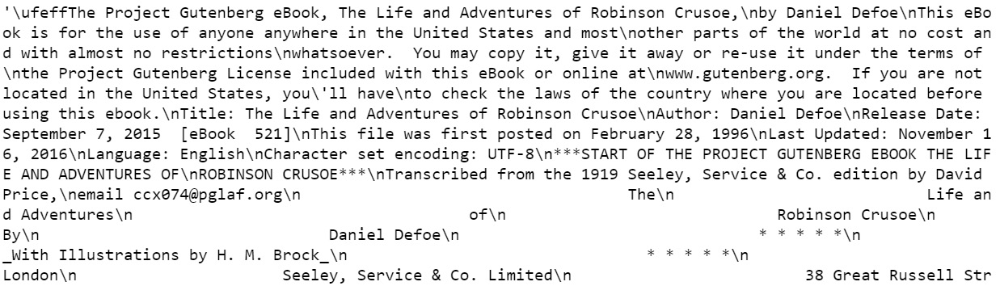


4.  Insert a new cell and add the following code to import the necessary
    libraries. Clean the text using the spaCy English language model to
    tokenize the corpus and to exclude all tokens that are not detected
    as nouns:

    ```
    import spacy
    nlp = spacy.load('en_core_web_sm')
    doc=nlp(text)
    """
    We can experiment with other or a combinations of parts of speech ['NOUN','ADJ','VERB','ADV'] #['NOUN','ADJ']
    """
    pos_list=['NOUN'] 
    preproc_text=[]
    preproc_sent=[]
    for token in doc:
        if token.text!='\n':
            if not(token.is_stop) and not(token.is_punct) \
            and token.pos_ in pos_list:
                preproc_sent.append(token.lemma_)
        else:
            preproc_text.append(preproc_sent)
            preproc_sent=[]
    preproc_text.append(preproc_sent) #last sentence
    print(preproc_text)
    ```

    The code generates the following output:
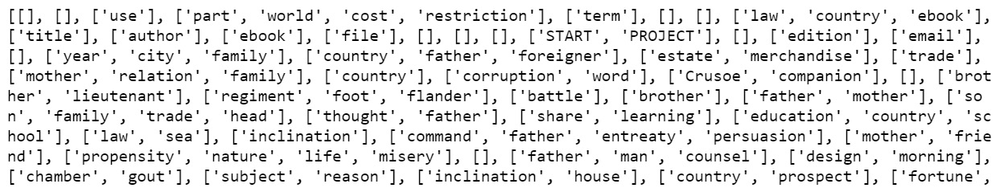


5.  Insert a new cell and add the following code to import the necessary
    libraries. Create an HDP model with the `α` concentration
    parameter as `0.8` and see how the negative log likelihood
    varies with the number of iterations:

    ```
    import tomotopy as tp 
    mdl = tp.HDPModel(alpha=0.8,seed=0)
    for line in preproc_text:
        mdl.add_doc(line)
    for i in range(0, 110, 10):
        mdl.train(i)
        print('Iteration: {}\tLog-likelihood: {}'.\
              format(i, mdl.ll_per_word))
    for k in range(mdl.k):
        print('Top 10 words of topic #{}'.format(k))
        print(mdl.get_topic_words(k, top_n=7))
    ```

    The code generates the following output:


6.  Insert a new cell and add the following code to save the topic
    model:


    ```
    mdl.save('../data/robinsoncrusoe/hdp_model.bin')
    ```

7.  Insert a new cell and add the following code to load the topic
    model:


    ```
    mdl = tp.HDPModel.load('../data/robinsoncrusoe/'\
                           'hdp_model.bin')
    ```

8.  Insert a new cell and add the following code to see the probability
    distribution of topics if you consider the entire dataset as a
    single document:

    ```
    bag_of_words=[word for sent in preproc_text for word in sent]
    doc_inst = mdl.make_doc(bag_of_words)
    mdl.infer(doc_inst)[0]
    np.argsort(np.array(mdl.infer(doc_inst)[0]))[::-1]
    ```

    The code generates the following output:
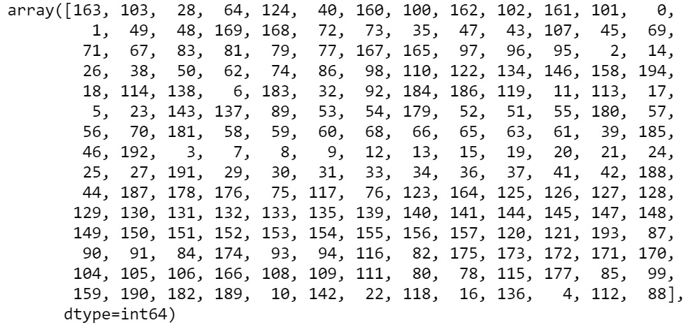

    considered

9.  Insert a new cell and add the following code to see the probability
    distribution of topic 163:

    ```
    print(mdl.get_topic_words(163, top_n=7))
    ```

    The code generates the following output:

    ```
    [('horse', 0.13098040223121643), ('way', 0.026405228301882744), ('mankind', 0.26405228301882744), ('fire', 0.026405228301882744), ('object', 0.026405228301882744), ('bridle', 0.026405228301882744), ('distress', 0.026405228301882744)]
    ```

10. Insert a new cell and add the following code to see the probability
    distribution of topic 103:

    ```
    print(mdl.get_topic_words(103, top_n=7))
    ```

    The code generates the following output:

    ```
    [('manor', 0.03706422075629234), ('inheritance', 0.03706422075629234), ('lord', 0.03706422075629234), ('man', 0.0003669724682377309), ('shore', 0.0003669724682377309), ('ship',0.0003669724682377309)]
    ```

11. Insert a new cell and add the following code to see the probability
    distribution of topic 28:

    ```
    print(mdl.get_topic_words(28, top_n=7))
    ```

    The code generates the following output:

    ```
    [('thought', 0.07716038823127747), ('mind', 0.045609116554260254), ('word', 0.038597721606492996), ('face', 0.03509202599525452), ('terror', 0.03509202599525452), ('tear', 0.3158633038401604), ('apprehension', 0.3158633038401604)]
    ```


Activity 5.02: Comparing Different Topic Models
-----------------------------------------------

The **Consumer Financial Protection Bureau** (**CFPB**) publishes
consumer complaints made against organizations in the financial sector.
This original dataset is available at
<https://www.consumerfinance.gov/data-research/consumer-complaints/#download-the-data>.
In this activity, you will qualitatively compare how HDP and LDA models
perform on the interpretability of topics by analyzing student loan
complaints.

Follow these steps to complete this activity:

1.  Open a Jupyter Notebook.

2.  Import the `pandas` library and load the dataset from a
    text file produced by partially processing the dataset from the CFPB
    website mentioned at the beginning of this section.

3.  Tokenize the text using spaCy. Select tokens that may be a part of
    speech (noun/verb/adjective or a combination).

4.  Train an HDP model.

5.  Save and load the HDP model. To save a topic model, use the
    following line of code:

    ```
    mdl.save('../data/consumercomplaints/hdp_model.bin')
    ```

    To load a topic model, use the following:

    ```
    mdl = tp.HDPModel.load('../data/consumercomplaints/hdp_model.bin')
    ```

6.  Determine the topics in the entire set of complaints. Sample a few
    topics and check for interpretability.

7.  Repeat steps 3-8 for an LDA model instead of an HDP model. Consider
    the number of topics in the LDA model to around the number of topics
    found in the HDP model.

8.  Select the qualitatively better model from the HDP and LDA models
    trained in this activity. Also, compare these two models
    quantitatively.

    Note: The full solution to this activity in the current directory

#### Summary

In this lab, we discussed topic modeling in detail. Without delving
into advanced statistics, we reviewed various topic-modeling algorithms
(such as LSA, LDA, and HDP) and how they can be used for topic modeling
on a given dataset. We explored the challenges involved in topic
modeling, how experimentation can help address those challenges, and,
finally, broadly discussed the current state-of-the-art approaches to
topic modeling.

In the next lab, we will learn about vector representation of text,
which helps us convert text into a numerical format to make it more
easily understandable by machines.
