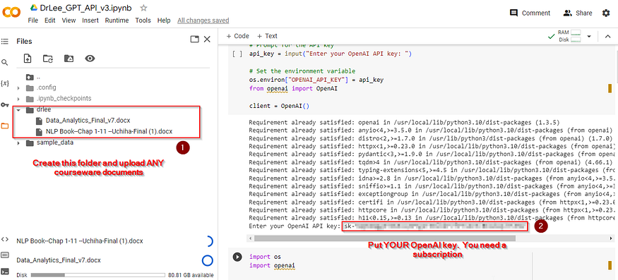
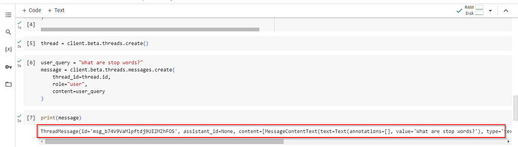
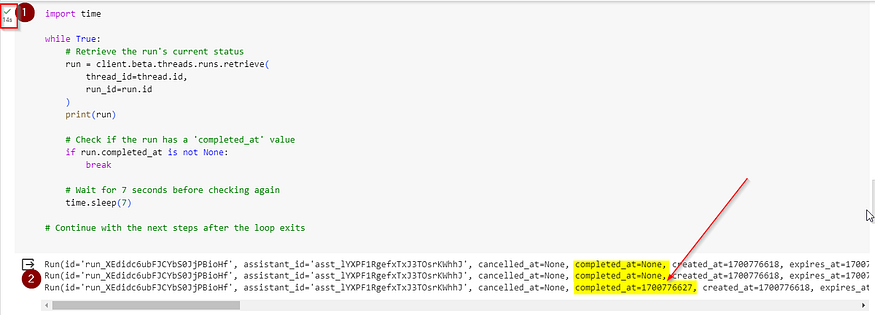
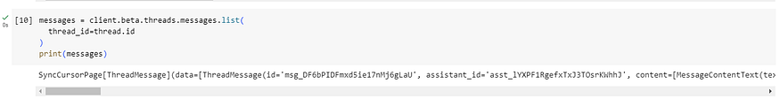
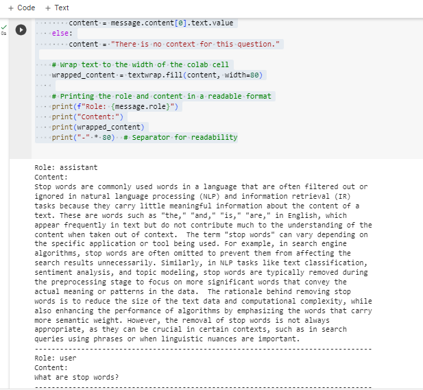

# Lab: Creating Assistants Using OpenAI APIs


# Unleashing the Power of AI in Learning Environments 

In the swiftly advancing realm of education and corporate training,
Artificial Intelligence (AI) emerges as a transformative force. With its
unparalleled ability to process and analyze vast amounts of data, AI is
reshaping how knowledge is delivered and absorbed. This article delves
into the integration of OpenAI's advanced AI technologies in educational
settings, illustrating how educators and trainers can create AI
Assistants. These Assistants are not mere digital tools but intelligent
entities capable of enhancing learning experiences through personalized
and interactive engagement. We explore how AI can be a powerful ally in
the journey of knowledge impartation, making learning more adaptive,
engaging, and effective.

# The AI Advantage in Education and Training 

AI's integration into educational tools represents more than just a
technological upgrade; it's a paradigm shift in teaching and learning
methodologies. AI Assistants can offer instant, accurate, and
personalized responses to learners' queries, making education more
accessible and tailored to individual needs. In corporate training
scenarios, these Assistants can simulate real-world challenges, provide
situational analysis, and assist in skill development. The value lies in
AI's ability to create a more engaging, interactive, and adaptive
learning environment, bridging gaps in traditional educational methods.


# Lab Solution

Solution notebook for this lab can be found at `~/work/nlp-generative-ai-bootcamp/Lab05/creating_assistants.ipynb`


## Code Breakdown: Environment Setup 

First, upload your documents. Sample book has been provided already in following path:
`~/work/nlp-generative-ai-bootcamp/Lab05/content/drlee/Data_Analytics_Final_v7.docx`




```
import os

# Prompt for the API key
api_key = input("Enter your OpenAI API key: ")

# Set the environment variable
os.environ["OPENAI_API_KEY"] = api_key
from openai import OpenAI

client = OpenAI()
```

*Explanation*: Here, we're installing the OpenAI package and configuring
it with our unique API key. This key is crucial as it serves as our
access point to the OpenAI platform, enabling us to utilize its
extensive capabilities. The `client` object
created is the primary tool through which we\'ll interact with the
OpenAI services.

# Creating a Knowledge Base: Uploading Course Materials 

The effectiveness of an AI Assistant in an educational setting hinges on
its access to relevant, comprehensive knowledge. This is achieved by
uploading course or training materials to the OpenAI system.

## Code Breakdown: Uploading Files 

```
import os
import openai

# Directory containing the files
directory_path = './content/drlee'

# List all files in the directory
all_file_names = [os.path.join(directory_path, f) for f in os.listdir(directory_path) if os.path.isfile(os.path.join(directory_path, f))]

# Initialize OpenAI client (ensure you have set your API key)
client = openai.OpenAI()

# Upload files and collect file IDs
file_ids = []
for file_name in all_file_names:
    with open(file_name, 'rb') as file:
        response = client.files.create(file=file, purpose='assistants')
        file_ids.append(response.id)  # Access the id attribute

# Now file_ids contains the IDs of all uploaded files
```

*Explanation*: This segment of code is about building the AI's database.
By iterating over a directory of educational materials and uploading
each file to OpenAI, we create a repository of knowledge that the AI can
draw from. Each file's ID is stored, linking the content directly to our
upcoming AI Assistant.

# Bringing the AI Assistant to Life 

With our knowledge base ready, the next step is to create the AI
Assistant itself. This involves configuring the Assistant's capabilities
to ensure it can effectively utilize the knowledge we've provided.

## Code Breakdown: Creating the AI Assistant 

```
# Create the Assistant
assistant2 = client.beta.assistants.create(
    name="Academic Co-Pilot",
    instructions="You are an AI assistant tailored to a Professor's expertise in [Subject Area]: AI and Data Analytics. Provide detailed and accurate information based on the provided resources ONLY.  If there is no context in the resources then provide a blank response",
    tools=[{"type": "retrieval"}],  # You can specify the 'code_interpreter' tool if needed
    model="gpt-4-1106-preview",
    file_ids=file_ids  # Assuming 'file_ids' is a list of IDs from previously uploaded files
)
```

Here is another option for the assistant:

```
# Create the Assistant with both Retrieval and Code Interpreter tools
assistant = client.beta.assistants.create(
    name="Academic Co-Pilot",
    instructions="You are an AI assistant tailored to a Professor's expertise in [Subject Area]: AI and Data Analytics. Provide detailed and accurate information based on the provided resources ONLY.  If there is no context in the resources then provide a blank response.  Please provide citations for the documents and page numbers",
    tools=[
        {"type": "retrieval"},
        {"type": "code_interpreter"}
    ],
    model="gpt-4-1106-preview",
    file_ids=file_ids  # Assuming 'file_ids' is a list of IDs from previously uploaded files
)
```

*Explanation*: This code initiates the creation of our AI Assistant.
Named "Educational Assistant," it is equipped with a retrieval tool,
allowing it to search and present information from the uploaded
documents. The use of OpenAI's GPT-4 model ensures that the responses
are not only relevant but also contextually nuanced, making the
Assistant a valuable tool for educational purposes.

# Interactive Learning: Engaging with the AI 

The real power of an AI Assistant in education lies in its ability to
interact and respond to queries. This is where we set up a system for
engaging in a dialogue with the Assistant.

## Code Breakdown: Interactive Dialogue with AI 

thread will create a conversation with the AI.

```
thread = client.beta.threads.create()
```

Now that thread represents the conversation, let's initiate the
conversation:

```
user_query = "What are stop words?"
message = client.beta.threads.messages.create(
    thread_id=thread.id,
    role="user",
    content=user_query
)
print(message)
```



Finally, let's kick off the conversation so that it actually starts:

```
run = client.beta.threads.runs.create(
  thread_id=thread.id,
  assistant_id=assistant.id,
  instructions='''Please address the user as MDC Student X. If there is no context for the answer in the documents then don't return anything'''
)
```

Now that the conversation has been sent to the API, we must wait for it
to response. The best way is to put a timer on the response and just
keep checking to see when it is finished:

```
import time

while True:
    # Retrieve the run's current status
    run = client.beta.threads.runs.retrieve(
        thread_id=thread.id,
        run_id=run.id
    )
    print(run)

    # Check if the run has a 'completed_at' value
    if run.completed_at is not None:
        break

    # Wait for 7 seconds before checking again
    time.sleep(7)

# Continue with the next steps after the loop exits
```



When it finally ends, we can view the results:

```
messages = client.beta.threads.messages.list(
  thread_id=thread.id
)
print(messages)
```



Let's look at this in a clean and formatted manner:

```
import textwrap

# Formatting and displaying the results
for message in messages.data:
    # Extracting the message content
    if message.content and message.content[0].text.value.strip():
        content = message.content[0].text.value
    else:
        content = "There is no context for this question."

    # Wrap text to the width of the colab cell
    wrapped_content = textwrap.fill(content, width=80)
    
    # Printing the role and content in a readable format
    print(f"Role: {message.role}")
    print("Content:")
    print(wrapped_content)
    print("-" * 80)  # Separator for readability
```




*Explanation*: In this section, we establish a 'thread' --- a continuous
stream of interaction between the user and the AI. The user's query is
sent to the AI, and the AI, utilizing its knowledge base and the
instructions provided, generates a response. This interactive feature
simulates a real-world educational dialogue, enhancing the learning
experience.

# Conclusion

In conclusion, the utilization of OpenAI's APIs to create AI Assistants
is a testament to the transformative power of AI in the realm of
education and training. It's a step towards a future where learning is
more dynamic, responsive, and aligned with the evolving needs of
learners and the demands of a rapidly changing world. As we embrace
these technological advancements, we open up new possibilities for
growth, understanding, and innovation in the field of education. The
journey into AI-assisted learning is not just about embracing new
technology; it's about opening doors to a world of limitless educational
possibilities.
