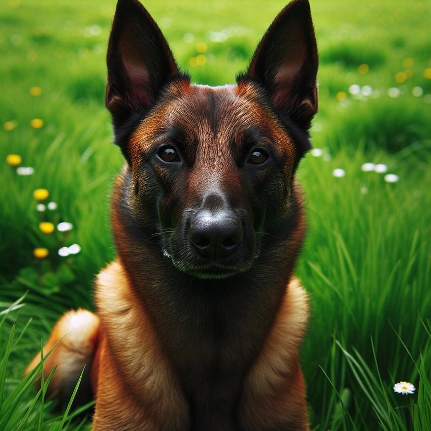
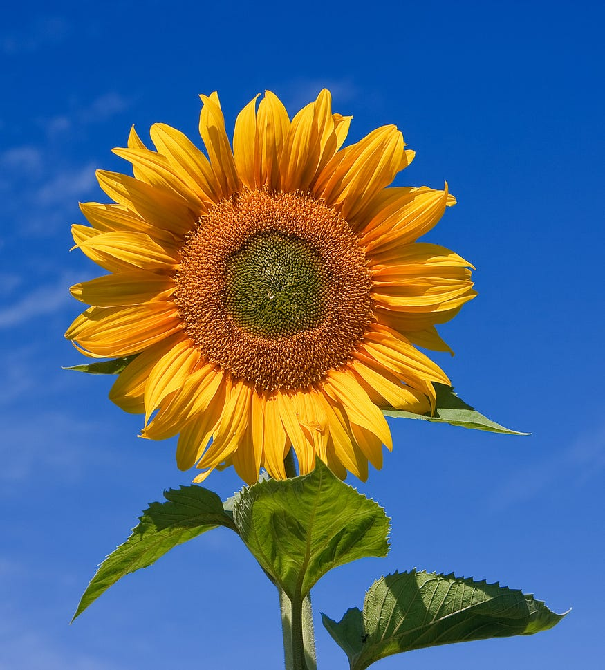
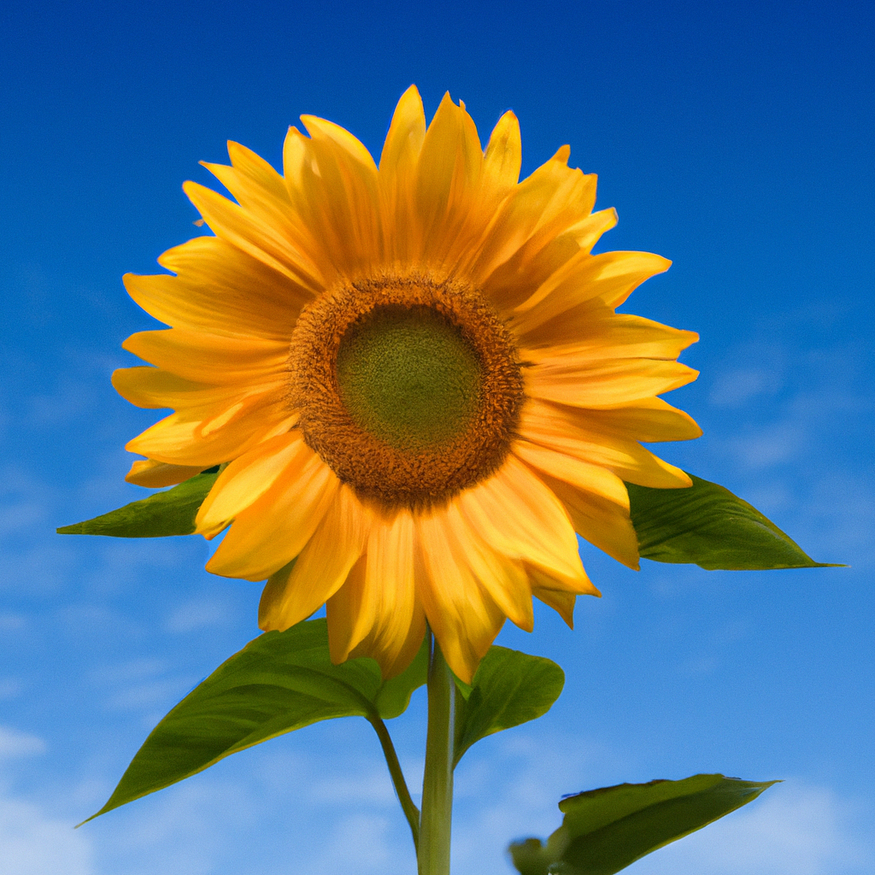
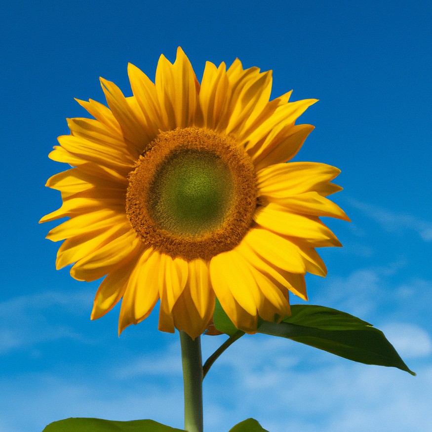
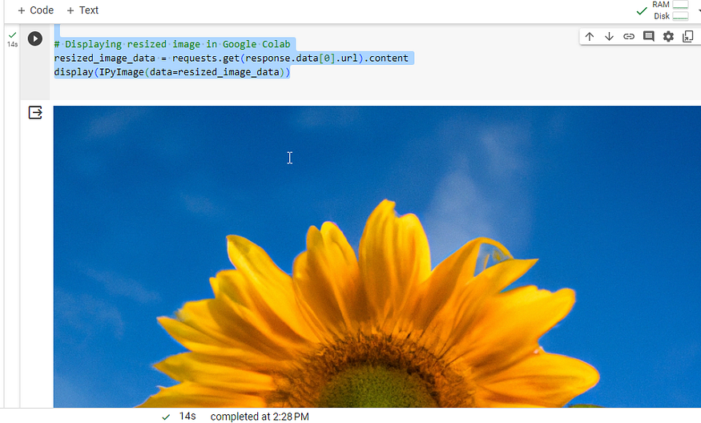

# Lab: Creativity with AI - Creating Images with DALL·E APIs

Welcome to the mesmerizing world of AI-generated art! Today, we're going
to explore how we can use OpenAI's DALL·E APIs to create, edit, and
manipulate images directly from our notebooks. We'll focus
on a Belgian Malinois named Daisy to illustrate our examples. Let's dive
into how we can integrate DALL·E's capabilities into our Python code.


# Lab Solution

Solution notebook for this lab can be found at `~/work/nlp-generative-ai-bootcamp/Lab05/creating-images-with-dall-e.ipynb`

# Setting Up the OpenAI API

First things first, we need to set up our environment to communicate
with OpenAI's API:

```
import os

# Prompt for the API key
api_key = input("Enter your OpenAI API key: ")

# Set the environment variable
os.environ["OPENAI_API_KEY"] = api_key
```

This snippet installs the OpenAI Python package and sets an environment
variable using the API key you provide. The API key is essential for
authentication when making requests to OpenAI's services.

# 1. Generate a New Image with DALL-E 3 

Now, let's generate an original image of Daisy, our Belgian Malinois.
We'll use a simple prompt and request the API to conjure up an image:

```
from openai import OpenAI
client = OpenAI()

response = client.images.generate(
  model="dall-e-3",
  prompt="a Belgian Malinois named Daisy sitting on the grass",
  size="1024x1024",
  quality="standard",
  n=1,
)

# To display the image in Google Colab, we'll use the following:
from IPython.display import Image
import requests

# Fetch the image from the URL
image_data = requests.get(response.data[0].url).content
display(Image(image_data))
```



This code sends a request to generate an image of Daisy. We then fetch
the image from the provided URL and display it in the notebook.

# 2. Create a Variation 

Maybe we want to see different versions of a sunflower in various
settings. This is where it starts:



To do this, we'll use the image variation endpoint:

```
from PIL import Image as PILImage
import io
import requests
from IPython.display import Image as IPyImage, display

# Load the JPEG image and ensure it's less than 4 MB as a PNG
with PILImage.open("./Sunflower_sky_backdrop.jpg") as img:
    img = img.convert("RGBA")
    img_byte_arr = io.BytesIO()
    img.save(img_byte_arr, format='PNG')

    # If the image is too large, reduce its size
    while len(img_byte_arr.getvalue()) > 4 * 1024 * 1024:
        img = img.resize((int(img.width * 0.75), int(img.height * 0.75)))
        img_byte_arr = io.BytesIO()
        img.save(img_byte_arr, format='PNG')
        if img.width < 200 or img.height < 200:  # Avoid making the image too small
            break

# Call the API to create image variations
response = client.images.create_variation(
  image=img_byte_arr.getvalue(),
  n=2,
  size="1024x1024"
)

# Displaying variations in Google Colab
for data in response.data:
    variation_image_data = requests.get(data.url).content
    display(IPyImage(variation_image_data))
```





These are the two variations that were created from the original.

# 3. Operating on Image Data 

Before you send an image to DALL·E, you might want to resize or process
it. Here's how you can do that:

```
from PIL import Image as PILImage
from IPython.display import Image as IPyImage, display
import requests
from io import BytesIO

# Let's resize an image of Daisy
original_image = PILImage.open("./Sunflower_sky_backdrop.jpg")
new_size = (256, 256)
resized_image = original_image.resize(new_size)

resized_image_stream = BytesIO()
resized_image.save(resized_image_stream, format='PNG')

# Convert the BytesIO stream to bytes for the API call
resized_image_bytes = resized_image_stream.getvalue()

# Now, let's send this resized image to DALL·E
response = client.images.create_variation(
  image=resized_image_bytes,
  n=1,
  size="1024x1024"
)

# Displaying resized image in Google Colab
resized_image_data = requests.get(response.data[0].url).content
display(IPyImage(data=resized_image_data))
```



# 4. Error Handling 

When dealing with API requests, we must be prepared for potential
errors. Here's how to handle them:

```
from openai import OpenAIError
from PIL import Image
import io

# Convert the image to PNG and ensure it's less than 4 MB
with Image.open("./Sunflower_sky_backdrop.jpg") as img:
    img = img.convert("RGBA")  # Convert to RGBA to support transparency in PNG
    img_byte_arr = io.BytesIO()
    img.save(img_byte_arr, format='PNG', optimize=True)  # PNG format and optimization
    img_byte_arr.seek(0)  # Reset the stream position to the beginning

# Now attempt to create a variation with the converted image
try:
    response = client.images.create_variation(
      image=img_byte_arr,
      n=1,
      size="1024x1024"
    )
except OpenAIError as e:  # Corrected to catch OpenAIError directly
    print("An error occurred:", e.http_status)
    print("Details:", e.error)
```

This try-except block will catch any exceptions thrown by the API call
and print out details for debugging.


With these exercises, you now have a guide to generating and manipulating
images with DALL·E in Jupyter, all featuring Daisy, our Belgian
Malinois or a Sunflower. Remember, while the code provided here is for
illustrative purposes, actual implementation may require further tweaks,
especially when dealing with image files and API responses. Happy coding
and enjoy the creative journey with AI!
