Lab 7. Text Generation and Summarization
====================================


#### Introduction

The ability to express thoughts in words (sentence generation), the
ability to replace a piece of text with different but equivalent text
(paraphrasing), and the ability to find the most important parts of a
piece of text (summarization) are all key elements of using language.
Although sentence generation, paraphrasing, and summarization are
challenging tasks in NLP, there have been great strides recently that
have made them considerably more accessible. In this lab, we explore
them in detail and see how we can implement them in Python.


#### Generating Text with Markov Chains

A state space defines all possible states that can exist. A Markov chain
consists of a state space and a specific type of successor function. For
example, in the case of the simplified state space to describe the
weather, the states could be Sunny, Cloudy, or Rainy. The successor
function describes how a system in its current state can move to a
different state or even continue in the same state. To better understand
this, consider the following diagram:

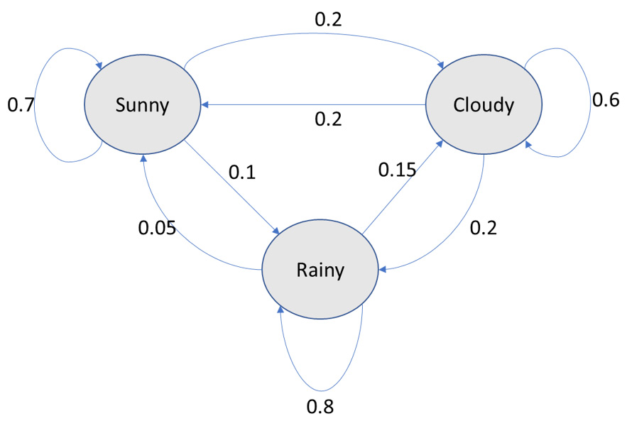


Exercise 7.01: Text Generation Using a Random Walk over a Markov Chain
----------------------------------------------------------------------

In this exercise, we will generate text with the help of Markov chains.
We will use Robert Frost\'s collection of poems, *North of Boston*,
available from Project Gutenberg, to specify the successor state(s) for
each state using a dictionary. We\'ll use a list to specify the
successor state(s) for any state so that the number of times a successor
state occurs in that list is directly proportional to the probability of
transitioning to that successor state.

Then, we will generate 10 phrases with three words in addition to an
initial word, and then generate another 10 phrases with four words in
addition to an initial word. The initial state or initial word will be
randomly selected from among these words: \"the,\" \"a,\" \"I,\" \"he,\"
\"she,\" \"if,\" \"this,\" \"why,\" and \"where.\" 


Follow these steps to complete this exercise:

1.  Open a Jupyter notebook.

2.  Insert a new cell and add the following code to import the necessary
    libraries and read the dataset:


    ```
    import re
    import random
    OPEN_DATA_URL = '../data/robertfrost/pg3026.txt'
    f=open(OPEN_DATA_URL,'r',encoding='utf-8')
    text=f.read()
    f.close()
    ```

3.  Insert a new cell and add the following code to preprocess the text
    using regular expressions:


    ```
    HANDLE = '@\w+\n'
    LINK = 'https?://t\.co/\w+'
    SPECIAL_CHARS = '&lt;|&lt;|&amp;|#'
    PARA='\n+'
    def clean(text):
        #text = re.sub(HANDLE, ' ', text)
        text = re.sub(LINK, ' ', text)
        text = re.sub(SPECIAL_CHARS, ' ', text)
        text = re.sub(PARA, '\n', text)
        return text
    text = clean(text)
    ```

4.  Split the corpus into a list of words. Show the number of words in
    the corpus:

    ```
    corpus=text.split()
    corpus_length=len(corpus)
    corpus_length
    ```

    
The preceding code generates the following output:

    ```
    19985
    ```

5.  Insert a new cell and add the following code to define the successor
    states for each state. Use a dictionary for this:

    ```
    succ_func={}
    corpus_counter=0
    for token in corpus:
        corpus_counter=corpus_counter+1
        if corpus_counter<corpus_length:
            if token not in succ_func.keys():
                succ_func[token]=[corpus[corpus_counter]]
            else:
                succ_func[token].append(corpus[corpus_counter])
    succ_func
    ```

    The preceding code generates an output as follows. **Note** that we\'re
    only displaying a part of the output here.
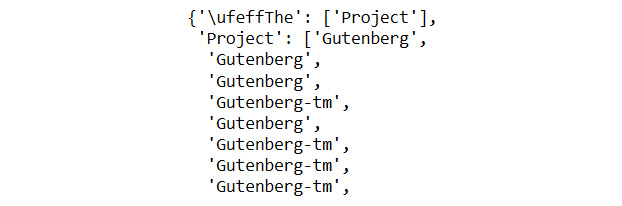


    We find that \"he\" is shown as a successor of \"who\" more than
    once. This is because this occurs more than once in the dataset. In
    effect, the number of times the successors occur in the list is
    proportional to their respective probabilities. Though it is not the
    only method, this is a convenient way to represent the successor
    function.

6.  Define the list of initial states. Then, define a function to select
    a random initial state from these and concatenate it with successor
    states. These successor states are randomly selected from the list
    containing successor states for a specific current state. Add the
    following code to do this:


    ```
    initial_states=['The','A','I','He','She','If',\
                    'This','Why','Where']
    def generate_words(k=5):
        initial_state=random.choice(initial_states)
        current_state=initial_state
        text=current_state+' '
        for i in range(k):
            succ_state=random.choice(succ_func[current_state])
            text=text+succ_state+' '
            current_state=succ_state
        print(text.split('.')[0])
    ```

7.  Insert a new cell and add the following code to generate text
    containing 10 phrases of four words (including the initial word) and
    10 phrases of five words (including the initial word):

    ```
    for k in range(3,5):
        for j in range(10):
            generate_words(k)
    ```

    
The preceding code generates the following output:
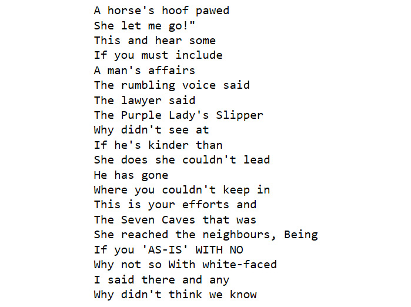


Text Summarization
==================

Automated text summarization is the process of using NLP tools to
produce concise versions of text that preserve the key information
present in the original content. Good summaries can communicate the
content with less text by retaining the key information while filtering
out other information and noise (or useless text, if any). A shorter
text may often take less time to read, and thus summarization
facilitates more efficient use of time.

- Abstractive summarization as a combination of understanding the meaning
and expressing it in fewer sentences. It is usually considered as a
supervised learning problem as the original text and the summary are
both required.
- Extractive summarization: Parts of the text are extracted to form a summary. There is no
paraphrasing in this form of summarization.


TextRank
--------

TextRank is a graph-based algorithm (developed by Rada Mihalcea and Paul
Tarau) used to find the key sentences in a piece of text. As we already
know, in graph theory, a graph has nodes and edges. In the TextRank
algorithm, we estimate the importance of each sentence and create a
summary with the sentences that have the highest importance.

The TextRank algorithm works as follows:

1.  Represent a unit of text (say, a sentence) as a node.

2.  Each node is given an arbitrary importance score.

3.  Each edge has a weight that corresponds to the similarity between
    two nodes (for instance, the sentences `Sx` and
    `Sy`). The weight could be the number of common words
    (say, *w*[k]{.subscript}) in the two sentences divided by the sum of
    the number of words in the two sentences. This can be represented as
    follows:


4.  For each node, we compute a new importance score, which is a
    function of the importance score of the neighboring nodes and the
    edge weights (*w*[ji]{.subscript}) between them. Specifically, the
    function (*f*) could be the edge-weighted average score of all the
    neighboring nodes that are directed toward that node that is
    adjusted by all the outward edge weights (*w*[jk]{.subscript}) and
    the damping factor (*d*). This can be represented as follows:


5.  We repeat the preceding step until the importance score varies by
    less than a pre-defined tolerance level in two consecutive
    iterations.

6.  Sort the nodes in decreasing order of the importance scores.

7.  The top *n* nodes give us a summary.


### Key Input Parameters for TextRank


We\'ll be using the gensim library to implement TextRank. The following
are the parameters required for this:

-   `text`: This is the input text.
-   `ratio`: This is the required ratio of the number of
    sentences in the summary to the number of sentences in the input
    text.


Exercise 7.02: Performing Summarization Using TextRank
------------------------------------------------------

In this exercise, we will use the classic short story, *After Twenty Years* by O. Henry, which is available on Project Gutenberg, and the
first section of the Wikipedia article on Oscar Wilde. We will summarize
each text separately so that we have 20% of the sentences in the
original text and then have 25% of the sentences in the original text
using the gensim implementation of the TextRank algorithm. In all, we
shall extract and print four summaries.

In addition to these libraries, you will need to import the following:

```
from gensim.summarization import summarize
summarize(text,ratio=0.20)
```

In the preceding code snippet, `ratio=0.20` means that 20% of
the sentences from the original text will be used to create the summary.


Complete the following steps to implement this exercise:

1.  Open a Jupyter notebook.

2.  Insert a new cell and add the following code to import the necessary
    libraries and extract the required text from *After Twenty Years*:

    ```
    from gensim.summarization import summarize
    import wikipedia
    import re
    file_url_after_twenty=r'../data/ohenry/pg2776.txt'
    with open(file_url_after_twenty, 'r') as f:
            contents = f.read()
    start_string='AFTER TWENTY YEARS\n\n\n'
    end_string='\n\n\n\n\n\nLOST ON DRESS PARADE'
    text_after_twenty=contents[contents.find(start_string):\
                               contents.find(end_string)]
    text_after_twenty=text_after_twenty.replace('\n',' ')
    text_after_twenty=re.sub(r"\s+"," ",text_after_twenty)
    text_after_twenty
    ```

    
The preceding code generates the following output:
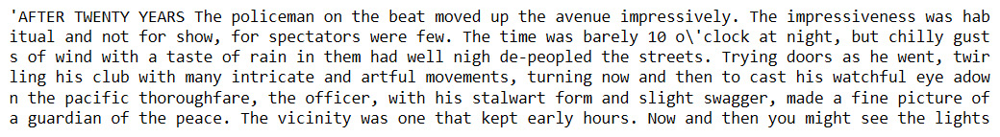


3.  Add the following code to extract the required text and print the
    summarized text, with the `ratio` parameter set to
    `0.2`:

    ```
    summary_text_after_twenty=summarize(text_after_twenty, \
                                        ratio=0.2)
    print(summary_text_after_twenty)
    ```

    
The preceding code generates the following output:
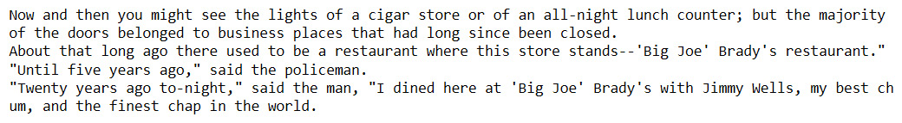


4.  Insert a new cell and add the following code to summarize the text
    and print the summarized text, with the `ratio` parameter
    set to `0.25`:

    ```
    summary_text_after_twenty=summarize(text_after_twenty, \
                                        ratio=0.25)
    print(summary_text_after_twenty)
    ```

    
The preceding code generates the following output:
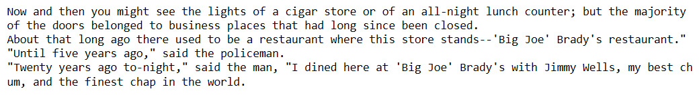


5.  Insert a new cell and add the following code to extract the required
    text from the Wikipedia page for Oscar Wilde:

    ```
    #text_wiki_oscarwilde=wikipedia.summary("Oscar Wilde")
    file_url_wiki_oscarwilde=r'../data/oscarwilde/'\
                              'ow_wikipedia_sum.txt'
    with open(file_url_wiki_oscarwilde, 'r', \
              encoding='latin-1') as f:
            text_wiki_oscarwilde = f.read()
    text_wiki_oscarwilde=text_wiki_oscarwilde.replace('\n',' ')
    text_wiki_oscarwilde=re.sub(r"\s+"," ",text_wiki_oscarwilde)
    text_wiki_oscarwilde
    ```

    
The preceding code generates the following output:
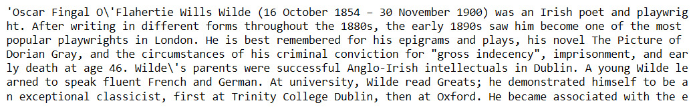


6.  Insert a new cell and add the following code to summarize the text
    and print the summarized text using `ratio=0.2`:

    ```
    summary_wiki_oscarwilde=summarize(text_wiki_oscarwilde, \
                                      ratio=0.2)
    print(summary_wiki_oscarwilde)
    ```

    
The preceding code generates the following output:
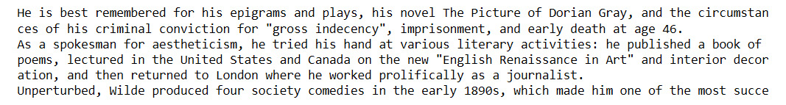


7.  Add the following code to summarize the text and print the
    summarized text using `ratio=0.25`:

    ```
    summary_wiki_oscarwilde=summarize(text_wiki_oscarwilde, \
                                      ratio=0.25)
    print(summary_wiki_oscarwilde)
    ```

    
The preceding code generates the following output:
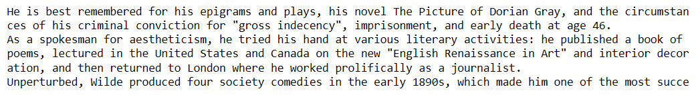


**Note:** We find that the summary for the Wikipedia article is much more coherent
than the short story. We can also see that the summary with a
`ratio` of `0.20` is a subset of a summary with a
`ratio` of `0.25`. Would extractive summarization
work better for a children\'s fairytale than it does for an O. Henry
short story? Let\'s explore this in the next exercise.


Exercise 7.03: Summarizing a Children\'s Fairy Tale Using TextRank
------------------------------------------------------------------

In this exercise, we consider the fairy tale *Little Red Riding Hood* in
two variations for the input texts. The first variation is from
*Children\'s Hour with Red Riding Hood and Other Stories*, edited by
Watty Piper, while the second variation is from *The Fairy Tales of
Charles Perrault*, both of which are available on Project Gutenberg\'s
website. The aim of this exercise is to explore how TextRank (gensim)
performs on this summarization.


Complete the following steps to implement this exercise:

1.  Open a Jupyter notebook.

2.  Insert a new cell and add the following code to import the required
    libraries:


    ```
    from gensim.summarization import summarize
    import re
    ```

3.  Insert a new cell and add the following code to fetch Watty Piper\'s
    version of *Little Red Riding Hood*:

    ```
    file_url_grimms=r'../data/littleredrh/pg11592.txt'
    with open(file_url_grimms, 'r') as f:
            contents_grimms = f.read()
    start_string_grimms='LITTLE RED RIDING HOOD\n\n\n'
    end_string_grimms='\n\n\n\n\nTHE GOOSE-GIRL'
    text_grimms=contents_grimms[contents_grimms.find(\
                                start_string_grimms):\
                                contents_grimms.find(\
                                end_string_grimms)]
    text_grimms=text_grimms.replace('\n',' ')
    text_grimms=re.sub(r"\s+"," ",text_grimms)
    text_grimms
    ```

    
The preceding code generates the following output:
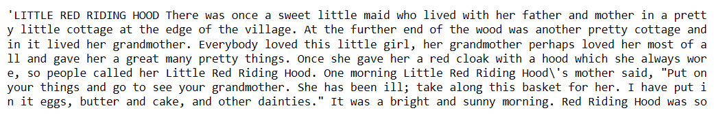

    Riding Hood

4.  Insert a new cell, add the following code, and fetch the Perrault
    fairy tale version of *Little Red Riding Hood*:

    ```
    file_url_perrault=r'../data/littleredrh/pg29021.txt'
    with open(file_url_perrault, 'r') as f:
            contents_perrault = f.read()
    start_string_perrault='Little Red Riding-Hood\n\n'
    end_string_perrault='\n\n_The Moral_'
    text_perrault=contents_perrault[contents_perrault.find(\
                                    start_string_perrault):\
                                    contents_perrault.find(\
                                    end_string_perrault)]
    text_perrault=text_perrault.replace('\n',' ')
    text_perrault=re.sub(r"\s+"," ",text_perrault)
    text_perrault
    ```

    
The preceding code generates the following output:
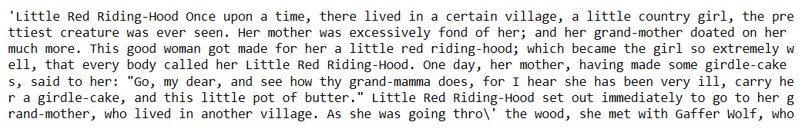

    Hood

5.  Insert a new cell and add the following code to generate the two
    summaries with a `ratio` of `0.20`:


    ```
    llrh_grimms_textrank=summarize(text_grimms,ratio=0.20)
    llrh_perrault_textrank=summarize(text_perrault,ratio=0.20)
    ```

6.  Insert a new cell and add the following code to print the TextRank
    summary (`ratio` of `0.20`) of Grimm\'s version
    of *Little Red Riding Hood*:

    ```
    print(llrh_grimms_textrank)
    ```

    
The preceding code generates the following output:
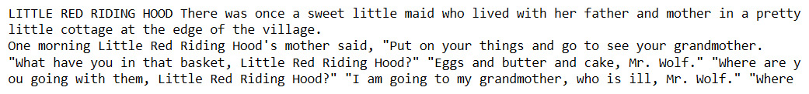

    variation

7.  Insert a new cell and add the following code to print the TextRank
    summary (`ratio` of `0.20`) of Perrault\'s
    version of *Little Red Riding Hood*:

    ```
    print(llrh_perrault_textrank)
    ```

    
The preceding code generates the following output:
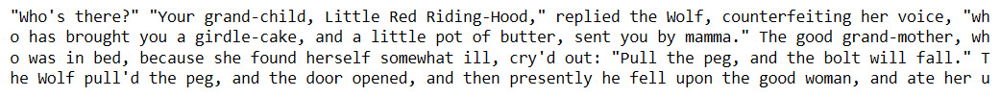

    version

8.  Add the following code to generate two summaries with a
    `ratio` of `0.5`:


    ```
    llrh_grimms_textrank=summarize(text_grimms,ratio=0.5)
    llrh_perrault_textrank=summarize(text_perrault,ratio=0.5)
    ```

9.  Add the following code to print a TextRank summary
    (`ratio` of `0.5`) of Piper\'s version of
    *Little Red Riding Hood*:

    ```
    print(llrh_grimms_textrank)
    ```

    
The preceding code generates the following output:
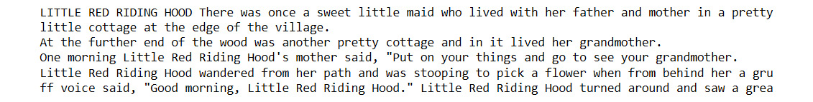

10. Add the following code to print a TextRank summary
    (`ratio` of `0.5`) of Perrault\'s version of
    *Little Red Riding Hood*:

    ```
    print(llrh_perrault_textrank)
    ```

    
The preceding code generates the following output:
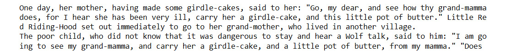


Activity 7.01: Summarizing Complaints in the Consumer Financial Protection Bureau Dataset
-----------------------------------------------------------------------------------------

The Consumer Financial Protection Bureau publishes consumer complaints
made against organizations in the financial sector. This original
dataset is available at
<https://www.consumerfinance.gov/data-research/consumer-complaints/#download-the-data>.
To complete this activity, you will summarize a few complaints using TextRank.

**Note**

To complete the activity, you will need the `.csv` file in the `data` folder for this lab in your localdirectory.

Follow these steps to implement this activity:

1.  Import the summarization libraries and instantiate the summarization
    model.
2.  Load the dataset from a `.csv` file into a pandas
    DataFrame. Drop all columns other than `Product`,
    `Sub-product`, `Issue`, `Sub-issue`,
    and `Consumer complaint narrative`.
3.  Select 12 complaints corresponding to the rows `242830`,
    `1086741`, `536367`, `957355`,
    `975181`, `483530`, `950006`,
    `865088`, `681842`, `536367`,
    `132345`, and `285894` from the 300,000 odd
    complaints with a narrative. **Note** that since the dataset is an
    evolving dataset, the use of a version that\'s different from the
    one in the `data` folder could give different results
    because the input texts could be different.
4.  Add a column with the TextRank summary. Each element of this column
    corresponds to a summary, using TextRank, of the complaint narrative
    in the corresponding column. Use a `ratio` of
    `0.20`. Also, use a `try-except` clause since
    the gensim implementation of the TextRank algorithm throws
    exceptions with summaries that have very few sentences.
5.  Show the DataFrame. You should get an output similar to the
    following figure:

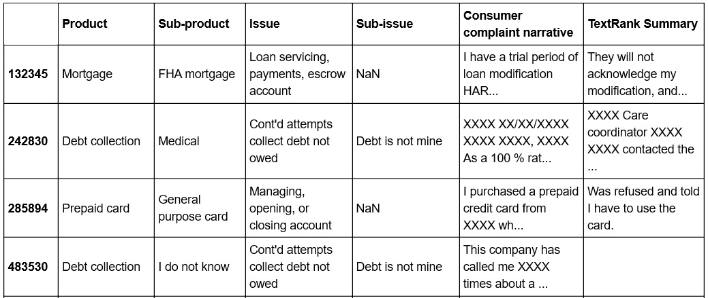


Summary
=======

In this lab, we learned about text generation using Markov chains
and extractive summarization using the TextRank algorithm. We also
explored both the power and limitations of various advanced approaches.
In the next lab, we will learn about sentiment analysis.

