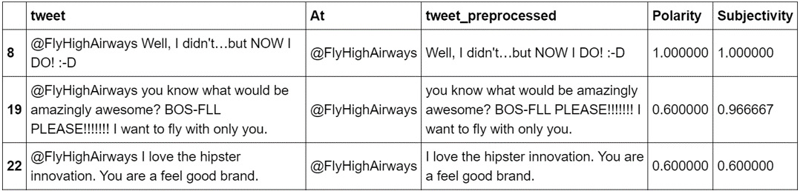
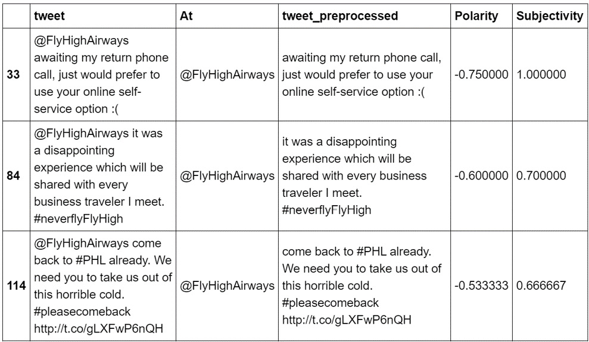
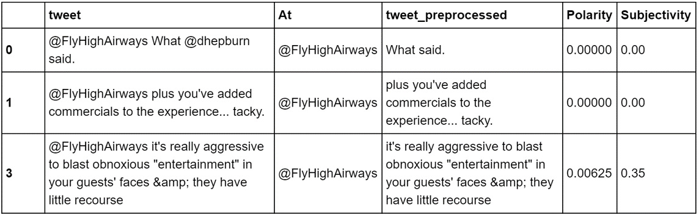
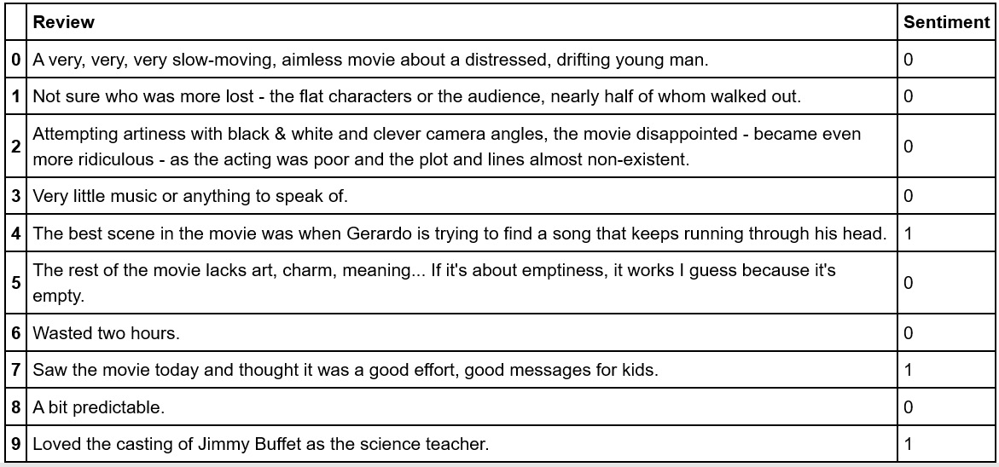
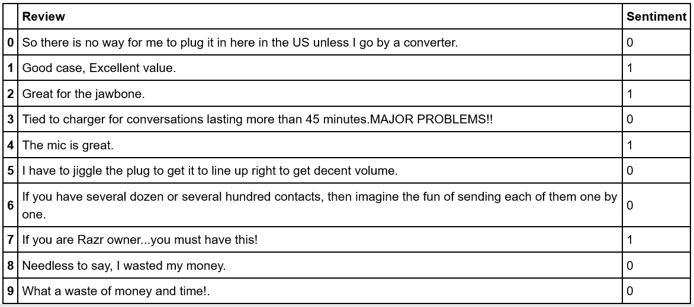
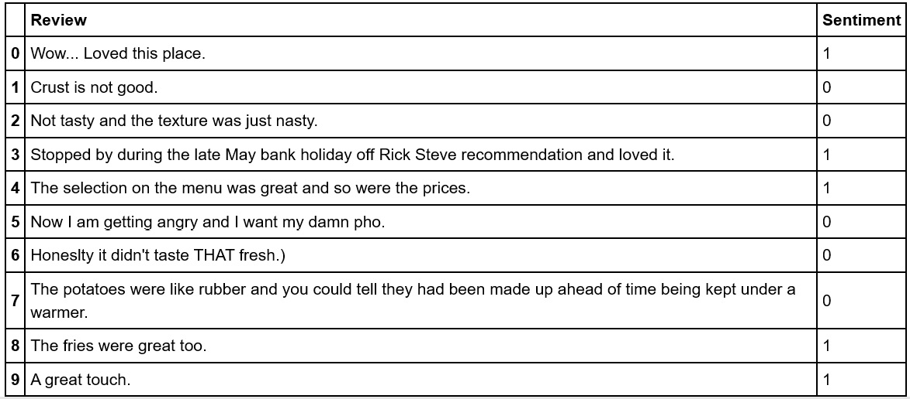

Lab 8. Sentiment Analysis
==========================

Overview

This lab introduces you to one of the most exciting applications of
natural language processing that is, sentiment analysis. You will
explore the various tools used to perform sentiment analysis, such as
popular NLP libraries and deep learning frameworks. You will then
perform sentiment analysis on given text data using the powerful
`textblob` library. You will load textual data and perform
preprocessing on it to fine-tune the results of your sentiment analysis
program. By the end of the lab, you will be able to train a
sentiment analysis model.


#### Types of Sentiments

There are various sentiments that we can try to detect in language
sources. Let\'s discuss a few of them in detail.

**Emotion**

Sentiment analysis is often used to detect the emotional state of a
person. It checks whether the person is happy or sad, or content or
discontent. Businesses often use it to improve customer satisfaction.

**Action Orientation versus Passivity**

This is about whether a person is prone to action or not. This is often
used to determine how close a person is to making a choice.

**Tone**

Speech and text are often meant to convey certain impressions that are
not necessarily factual and not entirely emotional. Examples of this are
sarcasm, irony, and humor.

**Subjectivity versus Objectivity**

You might want to detect whether a person has
issued and expressed an opinion, or whether their statement reads more
like a fact and can only be true or false.

Applications of Sentiment Analysis
----------------------------------

There are various applications of sentiment analysis.

- Financial Market Sentiment
- Product Satisfaction
- Social Media Sentiment
- Brand Monitoring
- Customer Interaction


Exercise 8.01: Basic Sentiment Analysis Using the textblob Library
------------------------------------------------------------------

In this exercise, we will perform sentiment analysis on a given text.
For this, we will be using the `TextBlob` class of the
`textblob` library. Follow these steps to complete this
exercise:

1.  Open a Jupyter notebook.

2.  Insert a new cell and add the following code to implement to import
    the `TextBlob` class from the `textblob`
    library:


    ```
    from textblob import TextBlob
    ```

3.  Create a variable named `sentence` and assign it a string.
    Insert a new cell and add the following code to implement this:


    ```
    sentence = "but you are Late Flight again!! "\
               "Again and again! Where are the  crew?" 
    ```

4.  Create an object of the `TextBlob` class. Add
    `sentence` as a parameter to the `TextBlob`
    container. Insert a new cell and add the following code to implement
    this:


    ```
    blob = TextBlob(sentence)
    ```

5.  In order to view the details of the `blob` object, insert
    a new cell and add the following code:

    ```
    print(blob)
    ```

    The code generates the following output:

    ```
    but you are Late Flight again!! Again and again! Where are the crew?
    ```

6.  To use the `sentiment` property of the
    `TextBlob` class (which returns a tuple), insert a new
    cell and add the following code:

    ```
    blob.sentiment
    ```

    The code generates the following output:

    ```
    Sentiment(polarity=—0.5859375, subjectivity=0.6
    ```

    Note:

    

In the code, we can see the `polarity` and
`subjectivity` scores for a given text. The output indicates a
polarity score of -0.5859375, which means that negative sentiment has
been detected in the text. The subjectivity score means that the text is
somewhat on the subjective side, though not entirely subjective. We have
performed sentiment analysis on a given text using the
`textblob` library. In the next section, we will perform
sentiment analysis on tweets about airlines.

Activity 8.01: Tweet Sentiment Analysis Using the textblob library
------------------------------------------------------------------

In this activity, you will perform sentiment analysis on tweets related
to airlines. You will also be providing condition for determining
positive, negative, and neutral tweets, using the `textblob`
library.

**Note**

You can find the data to be used for this activity here:


Follow these steps to implement this activity:

1.  Import the necessary libraries.
2.  Load the CSV file.
3.  Fetch the `text` column from the DataFrame.
4.  Extract and remove the handles from the fetched data.
5.  Perform sentiment analysis and get the new DataFrame.
6.  Join both the DataFrames.
7.  Apply the appropriate conditions and view positive, negative, and
    neutral tweets.

After executing those steps, the output for positive tweets should be as
follows:




As you can see from the preceding output, the `Polarity`
column shows a positive integer. This implies that the tweet displays
positive sentiment. The `Subjectivity` column indicates that
most tweets are found to be of a subjective nature.

The output for negative tweets is as follows:




The preceding output shows a `Polarity` column with a negative
integer, implying that the tweet displays negative sentiment, while the
`Subjectivity` column shows a positive integer, which implies
the same as before personal opinion or feeling.

The output for neutral tweets should be as follows:




The preceding output has a `Polarity` column and a
`Subjectivity` column with a zero or almost zero value. This
implies the tweet has neither positive nor negative sentiment, but
neutral; moreover, no subjectivity is detected for these tweets.


**Note** The solution to this activity in the current directory.


Understanding Data for Sentiment Analysis
=========================================


Sentiment analysis is a type of **text classification**. Sentiment
analysis models are usually trained using **supervised datasets**.
Supervised datasets are a kind of dataset that is labeled with the
target variable, usually a column that specifies the sentiment value in
the text. This is the value we want to predict in the unseen text.

Exercise 8.02: Loading Data for Sentiment Analysis
--------------------------------------------------

In this exercise, we will load data that could be used to train a
sentiment analysis model. For this exercise, we will be using three
datasets namely Amazon, Yelp, and IMDb.

**Note**

You can find the data being used in this exercise here:


Follow these steps to implement this exercise:

1.  Open a Jupyter notebook.

2.  Insert a new cell and add the following code to import the necessary
    libraries:

    ```
    import pandas as pd
    pd.set_option('display.max_colwidth', 200)
    ```

    This imports the `pandas` library. It also sets the
    display width to `200` characters so that more of the
    review text is displayed on the screen.

3.  To specify where the sentiment data is located, first load three
    different datasets from Yelp, IMDb, and Amazon. Insert a new cell
    and add the following code to implement this:

    ```
    DATA_DIR = 'data/sentiment_labelled_sentences/'
    IMDB_DATA_FILE = DATA_DIR + 'imdb_labelled.txt'
    YELP_DATA_FILE = DATA_DIR + 'yelp_labelled.txt'
    AMAZON_DATA_FILE = DATA_DIR + 'amazon_cells_labelled.txt'
    COLUMN_NAMES = ['Review', 'Sentiment']
    ```

    Each of the data files has two columns: one for the review text and
    a numeric column for the sentiment.

4.  To load the IMDb reviews, insert a new cell and add the following
    code:

    ```
    imdb_reviews = pd.read_table(IMDB_DATA_FILE, names=COLUMN_NAMES)
    ```

    In this code, the `read_table()` method loads the file
    into a DataFrame.

5.  Display the top `10` records in the DataFrame. Add the
    following code in the new cell:

    ```
    imdb_reviews.head(10)
    ```

    The code generates the following output:



    In the preceding figure, you can see that the negative reviews have
    sentiment scores of `0` and positive reviews have
    sentiment scores of `1`.

6.  To check the total number of records of the IMDb review file, use
    the `value_counts()` function. Add the following code in a
    new cell to implement this:

    ```
    imdb_reviews.Sentiment.value_counts()
    ```

    The expected output with total reviews should be as follows:

    ```
    1          386
    0          362
    Name:    Sentiment, dtype: int64
    ```

    In the preceding figure, you can see that the data file contains a
    total of `748` reviews, out of which `362` are
    negative and `386` are positive.

7.  Format the data by adding the following code in a new cell:

    ```
    imdb_counts = imdb_reviews.Sentiment.value_counts().to_frame()
    imdb_counts.index = pd.Series(['Positive', 'Negative'])
    imdb_counts
    ```

    The code generates the following output:


    We called `value_counts()`, created a DataFrame, and
    assigned `Positive` and `Negative` as index
    labels.

8.  To load the Amazon reviews, insert a new cell and add the following
    code:

    ```
    amazon_reviews = pd.read_table(AMAZON_DATA_FILE, \
                                   names=COLUMN_NAMES)
    amazon_reviews.head(10)
    ```

    The code generates the following output:



9.  To load the Yelp reviews, insert a new cell and add the following
    code:

    ```
    yelp_reviews = pd.read_table(YELP_DATA_FILE, \
                                 names=COLUMN_NAMES)
    yelp_reviews.head(10)
    ```

    The code generates the following output:



Activity 8.02: Training a Sentiment Model Using TFIDF and Logistic Regression
-----------------------------------------------------------------------------

To complete this activity, you will build a sentiment analysis model
using the Amazon, Yelp, and IMDb datasets that you used in the previous
exercise. Use the TFIDF method to extract features from the text and use
logistic regression for the learning algorithm. The following steps will
help you complete this activity:

1.  Open a Jupyter notebook.
2.  Import the necessary libraries.
3.  Load the Amazon, Yelp, and IMDb datasets.
4.  Concatenate the datasets and take out a random sample of 10 items.
5.  Create a function for preprocessing the text, that is, convert the
    words into lowercase and normalize them.
6.  Apply the function created in the previous step on the dataset.
7.  Use `TfidfVectorizer` to convert the review text into
    TFIDF vectors and use the `LogisticRegression` class to
    create a model that uses logistic regression for the model. These
    should be combined into a `Pipeline` object.
8.  Now split the data into train and test sets, using 70% to train the
    data and 30% to test the data.
9.  Use the `fit()` function to fit the training data on the
    pipeline.
10. Print the accuracy score.
11. Test the model on these sentences: *\"I loved this place\"* and *\"I
    hated this place\"*.


#### Summary

We started our journey into NLP with basic text analytics and text
preprocessing techniques, such as tokenization, stemming, lemmatization,
and lowercase conversion, to name a few. We then explored ways in which
we can represent our text data in numerical form so that it can be
understood by machines in order to implement various algorithms. After
getting some practical knowledge of topic modeling, we moved on to text
vectorization, and finally, in this lab, we explored various
applications of sentiment analysis. This included different tools that
use sentiment analysis, from technologies available from online
marketplaces to deep learning frameworks. More importantly, we learned
how to load data and train our model to use it to predict sentiment.
